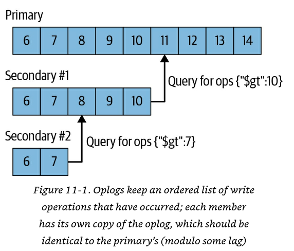

# Admin

## Monitorando operações correntes
```js
db.currentOp()

db.currentOp(
  {
    active: true,
    secs_running: { $gt: 3 },
    ns: /^db-name\./
  }
)
```

O comando acima irá retornar algumas informações, como:

- `opid`: Identificador único da operação;

- `active`: Se a operação está em execução. Se este campo retornar falso, significa que a operação cedeu ou está esperando por um bloqueio;

- `secs_running`: A duração da operação em segundos;

- `op`: Tipo de operação;

- `locks`: Uma descrição dos tipos de bloqueios obtidos pela operação;

- `waitingForLock`: Se a operação está aguardando para adquirir um bloqueio;

- `lockstats.timeAcquiringMicros`: Quanto tempo levou essa operação para adquirir os bloqueios necessários.

## Monitorando operações de gravação à espera de bloqueio
```js
db.currentOp(
   {
     waitingForLock: true,
     $or: [
        { op: { $in: [ "insert", "update", "remove" ] } },
        { "command.findandmodify": { $exists: true } }
    ]
   }
)
```

O comando acima pode ser útil para diagnosticar problemas de desempenho ou concorrência no MongoDB, onde bloqueios de operações de escrita podem estar causando gargalos.

## Monitorando operações ativas sem rendimentos (Que não foram interrompidas para liberar recursos e não estão aguardando por um bloqueio)
```js
db.currentOp(
   {
     active: true,
     numYields: 0,
     waitingForLock: false
   }
)
```

O comando acima pode ser útil para identificar operações que estão ativamente consumindo recursos do sistema sem serem afetadas por bloqueios ou yield.

## Finalizando operações
```js
db.killOp(opid)
```

# Profiler

## Ativando o Profiler para avaliação de operações lentas
```js
// Identificando o atual nível do profiler
db.getProfilingLevel()

// Ajustando o nível do profiler, de modo que somente operações lentas acima de 1s serão auditadas
db.setProfilingLevel(1, 1000)

// Avaliando as operações coletadas pelo profiler, após sua ativação
db.system.profile.find()

db.system.profile.find(
  {
    ts: {
      $gt: new ISODate("2011-07-12T03:00:00Z"),
      $lt: new ISODate("2011-07-12T03:40:00Z")
    }
  }, { query: 1 } ).sort( { millis: -1 } )
```

## Desativando o Profiler
```js
db.setProfilingLevel(0, 100)
```

# Usuários

## Criação de usuário
```js
db.createUser(
   {
     user: "user-name",
     pwd: passwordPrompt(),  // Or  "<cleartext password>"
     roles: [ { role: "userAdmin", db: "db-name" } ]
   }
)
```

## Redefinição de senha
```js
db.changeUserPassword("user-name", passwordPrompt())
```

## Redefinição de permissões pro usuário
```js
db.getSiblingDB("admin").runCommand(
  {
    grantRolesToUser: "user-name",
    roles: [ { role: "readWrite", db: "database-name" }, { role: "read", db: "db-name" } ]
  }
)
```

Obs.: O comando acima especifica o banco de dados admin, pois nesse contexto os usuários foram centralizados nesse banco. Ajuste o valor conforme necessário.

## Remoção de usuário
```js
db.dropUser("user-name")
```

# Índices
Regra de ouro: *"Ao criar índices compostos, adotar o padrão ESR (Equality, Sort and Range) tende a ser uma ótima prática"*.

Além disso, quanto maior a seletividade, maior a eficiência do índice.

## Monitorando criação de índices
```js
db.adminCommand(
    {
      currentOp: true,
      $or: [
        { op: "command", "command.createIndexes": { $exists: true } },
        { op: "none", "msg" : /^Index Build/ }
      ]
    }
)
```

## Avaliação de índices contidos na coleção
```js
db.coll.getIndexes()
```

## Avaliação de índices não utilizados
```js
db.coll.aggregate( [ { $indexStats: {} } ] )
```

## Exemplo do uso de hint
```js
db.coll.find( { key1: { $gt: 10 }, key2: 20 } ).sort( { key1: 1 } ).hint( { key2: 1 } )
```

# Plano de execução
O comando abaixo irá gerar o plano de execução da consulta:
```js
db.coll.explain("executionStats").find( { key: "value" } )
```

O comando acima irá retornar algumas informações, como:

- `totalKeysExamined`: Número de chaves que o MongoDB analisou;

- `totalDocsExamined`: Número de documentos que o MongoDB analisou;

- `executionTimeMillis`: Tempo em ms necessário para execução da consulta;

- `nReturned`: Número de documentos devolvidos;

- `needYield`: Número de vezes que a consulta pausou para permitir que uma solicitação de gravação procedesse;

- `indexBounds`: Descrição de como o índice foi usado, dando faixas de como o índice percorreu.


Obs.: Quanto mais próximo o `totalKeysExamined` de `nReturned`, melhor.

# ReplicaSet
A replicação está preocupada em manter uma cópia idêntica de dados em vários servidores. A maneira como o MongoDB realiza isso é mantendo um registro de operações (Oplog), contendo cada gravação que um primário realiza. Esta é uma coleção limitada ([Capped Collection](https://www.mongodb.com/pt-br/docs/manual/core/capped-collections/)) que vive no banco de dados local no primário. Os secundários consultam esta coleção para que as operações se repliquem. Cada secundário mantém seu próprio oplog, registrando cada operação que replica do primário. Isso permite que qualquer membro seja usado como uma fonte de sincronização para qualquer outro membro. Os secundários buscam operações do membro de onde estão sincronizando, aplicam as operações ao seu conjunto de dados e, em seguida, escrevem as operações em seu oplog.

Se a aplicação de uma operação falhar (o que só deve acontecer se os dados subjacentes foram corrompidos ou de alguma forma diferirem do primário), o secundário sairá.



## Monitorando a replicação
```js
db.hello() //For old versions, rs.isMaster()
rs.status()
rs.printReplicationInfo()
rs.printSecondaryReplicationInfo()
```

## Atualizando replicaSet com keyfile
1. Criação do keyfile

```bash
cd /data
mkdir mongo-key
chown mongodb:mongodb mongo-key/
openssl rand -base64 756 > /data/mongo-key/keyfile
cd mongo-key
chmod 400 keyfile
chown mongodb:mongodb keyfile
```

2. Envie o keyfile para cada membro do replicaSet

Obs.: Todos os membros do replicaSet devem contar com a mesma estrutura de diretório, arquivo e permissionamento do passo anterior.

3. Desligue todos os membros do replicaSet

Obs.: Desligue cada mongod do replicaSet, começando com os secundários. Continue até que todos os membros do replicaSet estejam off-line, inclusive árbitros. O primário deve ser o último membro desligado para evitar possíveis reversões.

4. Ajuste o arquivo de configuração de todos os membros do replicaSet (O trecho abaixo foca somente na opção keyFile)
```bash
vi /etc/mongod.conf
..
security:
  keyFile: /data/mongo-key/keyfile
:wq
```

5. Iniciar todos os membros do replicaSet

## Reconfigurando replicaSet
Quando você perde permanentemente a maioria de um conjunto, você pode querer reconfigurar o conjunto enquanto ele não tem um primário. Isso é um pouco complicado, pois normalmente você enviaria a reconfiguração para o primário. Neste caso, você pode forçar a reconfiguraração do conjunto enviando um comando `reconfig` com a opção `"force": true` para um secundário. Para maiores detalhes, consulte a [documentação](https://www.mongodb.com/pt-br/docs/manual/tutorial/reconfigure-replica-set-with-unavailable-members/).

Quando o secundário receber a reconfiguração, ele atualizará sua configuração e passará a nova configuração para os demais membros. Os demais membros do conjunto só captarão a mudança de configuração se reconhecerem o servidor de envio como membro de sua configuração atual. Assim, se alguns de seus membros mudarem os nomes do host, será necessário forçar a reconfiguração de um membro que manteve seu antigo nome de host. Se cada membro tiver um novo nome de host, será necessário desligar cada membro do conjunto, iniciar um novo no modo autônomo, alterar manualmente seu documento `local.system.replset` e reiniciar o membro.

# Transações

## Opções do servidor

- `transactionLifetimeLimitSeconds`: Especifica o tempo de vida das transações. As transações que excedem esse limite são consideradas expiradas e serão abortadas por um processo de limpeza periódica.

```js
db.adminCommand( { setParameter: 1, transactionLifetimeLimitSeconds: 60 } )
```

- `maxTransactionLockRequestTimeoutMillis`: A quantidade máxima de tempo em milissegundos que as transações devem esperar para adquirir os bloqueios exigidos pelas operações na transação. Se a transação não puder adquirir os bloqueios após esperar `maxTransactionLockRequestTimeoutMillis`, a transação será abortada.

```js
db.adminCommand( { setParameter: 1, maxTransactionLockRequestTimeoutMillis: 5 } )
```

## Exemplo de uma transação
```js
const session = db.getMongo().startSession()
session.startTransaction()
const account = session.getDatabase("db-name").getCollection("coll")
account.updateOne( { account_id: "MDB740836066" }, { $inc: { balance: -30 } } )
account.updateOne( { account_id: "MDB963134500" }, { $inc: { balance: 30 } } )
session.commitTransaction()
```

Para interromper e reverter uma transação, o método seria o seguinte: `session.abortTransacion()`.

# Outros

## Capturando métricas básicas da instância
```js
db.serverStatus().extra_info.page_faults // Indica a frequência com que os dados não são localizados na memória RAM pelo MongoDB (Consequentemente há necessidade de acessar o disco)
db.serverStatus().connections // Indica o número de conexões
db.serverStatus().opcounters // Indica o número total de operações
db.serverStatus().metrics.document // Indica o número total de documentos
db.serverStatus().opLatencies // Estatísticas de latência
```

## Detectando tamanho de um documento
```js
Object.bsonsize(db.coll.findOne())
```

## Estatísticas de uma coleção
```js
db.coll.stats()
```

## Checando integridade de uma coleção
```js
db.collection.validate( { full: true } )
```

O comando acima tende a gerar alto custo computacional, podendo afetar o desempenho da instância, já que o método obtém um bloqueio exclusivo (Bloqueia leituras e gravações até que a operação termine). Para maiores informações, consulte sempre a [documentação](https://www.mongodb.com/pt-br/docs/manual/reference/method/db.collection.validate/).

## Bloqueando/Desbloqueando gravações na instância
```js
db.fsyncLock()
db.fsyncUnlock()
```

## Informações sobre o cluster (Sharding)
```js
sh.status()
```

# Leitura adicional
- https://www.mongodb.com/pt-br/docs/manual/tutorial/change-oplog-size/

- https://www.percona.com/blog/mongodb-converting-replica-set-to-standalone/

- https://studio3t.com/knowledge-base/articles/mongodb-query-performance/

# Referências
- Livro MongoDB: The Definitive Guide - 3ª Edição, por Shannon Bradshaw, Eoin Brazil e Kristina Chodorow. Páginas 390; 428-429.

- https://www.mongodb.com/pt-br/docs/manual/tutorial/enforce-keyfile-access-control-in-existing-replica-set/