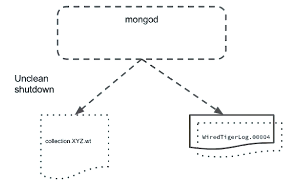

# Estrutura de arquivos no MongoDB
Este documento abordará a estrutura de arquivos de um servidor MongoDB Standalone.

Esta é uma lista dos arquivos encontrados em um diretório de dados de um servidor MongoDB:

- WiredTiger;
- WiredTiger.lock;
- WiredTiger.turtle;
- WiredTiger.wt;
- WiredTigerLAS.wt;
- _mdb_catalog.wt;
- collection-n.wt;
- diagnostic.data;
- index-n.wt;
- journal;
- mongod.lock;
- sizeStorer.wt;
- storage.bson.

Não haverá necessidade de interagir com os arquivos deste diretório, a menos que seja orientado pela equipe de suporte do MongoDB ou por meio de um procedimento detalhado na documentação.
Nenhum desses arquivos foi projetado para acesso ou modificação do usuário, e modificá-los pode causar falhas ou perda de dados. Caso queira explorar, reserve um tempo para garantir que você execute apenas funções de leitura.

O grupo de arquivos WiredTiger está relacionado a como o mecanismo de armazenamento WiredTiger controla informações, como metadados de cluster e opções de configuração específicas do WiredTiger.
O arquivo WiredTiger.lock atua como uma segurança. Se você executou um segundo processo simultâneo do MongoDB e apontou para esta pasta, o arquivo de bloqueio ajuda a impedir que o segundo processo do MongoDB seja iniciado.
Se você enfrentar um desligamento inesperado, como a máquina host perdendo energia ou qualquer tipo de crash, poderá descobrir que o processo `mongod` não será iniciado devido a esse arquivo de bloqueio. Você pode ser instruído a excluir arquivos de bloqueio antes de reiniciar o `mongod`.
Lembre-se de que, se você não for guiado pelo suporte do MongoDB ou por um procedimento documentado, não interaja com nenhum desses arquivos (WiredTiger, WiredTiger.lock, WiredTiger.turtle, WiredTiger.wt, WiredTigerLAS.wt e _mdb_catalog.wt).

O próximo grupo de arquivos que termina em .wt está relacionado à coleção e indexação dos próprios dados. Esses são seus dados de coleção (collection-n.wt) e esses são seus dados de índice (index-n.wt). O MongoDB WiredTiger armazena dados de índice como uma estrutura separada dos dados de coleção.
Mesmo em uma nova implantação do MongoDB, normalmente possuímos alguns bancos de dados e coleções por padrão, portanto sempre deve ter alguma coleção com índice nos arquivos .wt.
Se tentarmos examinar esses arquivos de dados usando um editor de texto, observaremos que os mesmos não são legíveis. Esses arquivos foram projetados para serem interagidos através do processo do servidor MongoDB, em vez de uma ferramenta de terceiros. A modificação dessas ferramentas pode levar à perda de dados e falhas.

Agora, a pasta diagnostic.data vale a pena ser conferida. Os dados contidos nesse diretório contêm informações de diagnóstico capturadas para uso específico pelo suporte do MongoDB. Para ser bem claro, não estão capturando nenhum dos nossos dados particulares reais. Os dados de diagnóstico são capturados pelo módulo Full Time Data Capture, ou FTDC. O FTDC coleta dados dos seguintes comandos: `db.serverStatus({tcmalloc: true})`, `rs.status()`, `db.getSiblingDB('local').oplog.rs.status()`, `db.adminCommand({getCmdLineOpts: true})`, `db.adminCommand({buildInfo: true})`, `db.adminCommand({hostInfo: true})`, etc..
Se tentarmos dar uma olhada nos dados produzidos pelo módulo FTDC usando algum editor de texto, veremos que não são legíveis para humanos. Esses dados são usados ​​apenas para fins de diagnóstico pelos engenheiros de suporte do MongoDB. E eles só podem ver esses dados se nós fornecermos explicitamente.

Avançando, vamos dar uma olhada em nossos arquivos de journal. Cada um desses arquivos de journal faz parte do sistema de diário WiredTiger. Com o MongoDB WiredTiger, as operações de gravação são armazenadas em buffer na memória e liberadas a cada 60 segundos, criando um checkpoint. O WiredTiger também usa um sistema de log de gravação antecipada em um arquivo de journal em disco.
As entradas de journal são primeiramente armazenadas em buffer na memória e, em seguida, o WiredTiger sincroniza o journal em disco a cada 50 milissegundos. Cada arquivo de journal é limitado a 100 megabytes de tamanho.

O WiredTiger usa um método de rotação de arquivos para sincronizar dados no disco. No caso de uma falha, o WiredTiger pode usar o journal para recuperar dados que ocorreram entre os checkpoints.
Por exemplo, durante operações normais, o WiredTiger libera os dados para o disco a cada 60 segundos ou quando o arquivo de journal possuir 2 gigabytes de dados. Essas descargas criam novamente um checkpoint durável.

Se o `mongod` travar entre os checkpoints, é possível que os dados não tenham sido escritos totalmente com segurança.

Quando o MongoDB ficar on-line novamente, o WiredTiger pode verificar se há alguma recuperação a ser feita. Caso existam gravações incompletas, o WiredTiger examinará os arquivos de dados existentes para encontrar o identificador do último checkpoint. Em seguida, ele pesquisa nos arquivos de journal o registro que corresponde ao identificador do último checkpoint. Por fim, aplica operações nos arquivos do journal desde o último checkpoint.

No final, o servidor MongoDB pode retomar a execução normal.

Vamos dar uma olhada no último grupo de arquivos.
O arquivo mongod.lock tem uma função semelhante ao arquivo WiredTiger.lock. Se esse arquivo não estiver vazio, significa que um processo do MongoDB está atualmente ativo neste diretório.
Qualquer outro processo do MongoDB que tente acessar esse diretório falhará ao inicializar nesse evento. Se esse arquivo estiver vazio, tudo ficará bem.
Em algumas situações incomuns, como um desligamento inesperado, o arquivo mongod.lock não estará vazio, mesmo que o `mongod` não esteja mais em execução. Pode ser necessário excluir o arquivo mongod.lock, se solicitado pelo suporte ou pela documentação oficial.

Esses dois arquivos restantes (sizeStorer.wt e storage.bson) são mais arquivos de suporte e metadados para o WiredTiger.
Lembre-se de que nunca precisaremos interagir com nenhum desses arquivos e modificá-los pode resultar em falhas ou perda de dados.

Além dos arquivos mantidos aqui, no diretório de dados, também há o arquivo de log. Conforme usamos o servidor MongoDB, o arquivo de log será preenchido com informações adicionais. Esses arquivos de log são vitais para o diagnóstico pós-falha e devem ser tratados com cuidado também.

Há mais um arquivo sobre o qual é importante falarmos, mas não está em nenhum dos dois diretórios sobre os quais falamos até o momento. O arquivo /tmp/mongodb-27017.sock é um arquivo de soquete usado pelo MongoDB para criar uma conexão de soquete na porta especificada. O MongoDB precisa usar soquetes para comunicações entre processos. Sem esse arquivo, o MongoDB não pode funcionar. Este arquivo é criado na inicialização e permite que o servidor MongoDB possua essa porta. Se houver uma falha ou outro desligamento inesperado, você poderá encontrar um erro na inicialização relacionado a este arquivo. Você pode excluí-lo com segurança, se solicitado pelo suporte ou por nossa documentação nesse evento.

# Referência
https://learn.mongodb.com/courses/m103-basic-cluster-administration