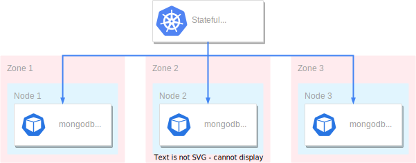
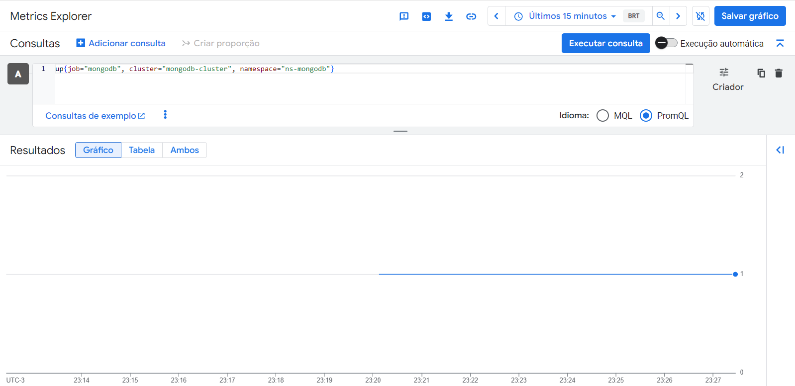
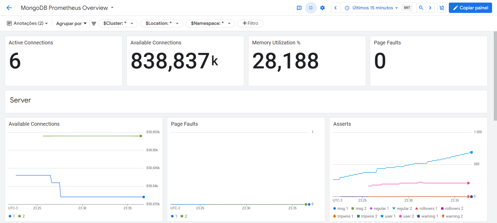
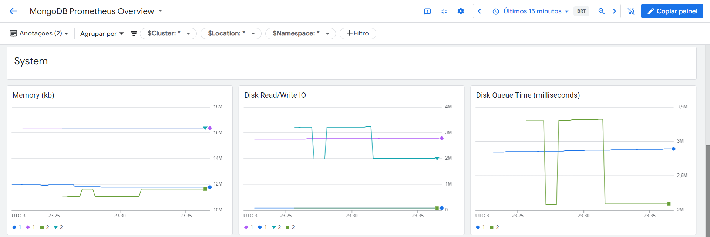
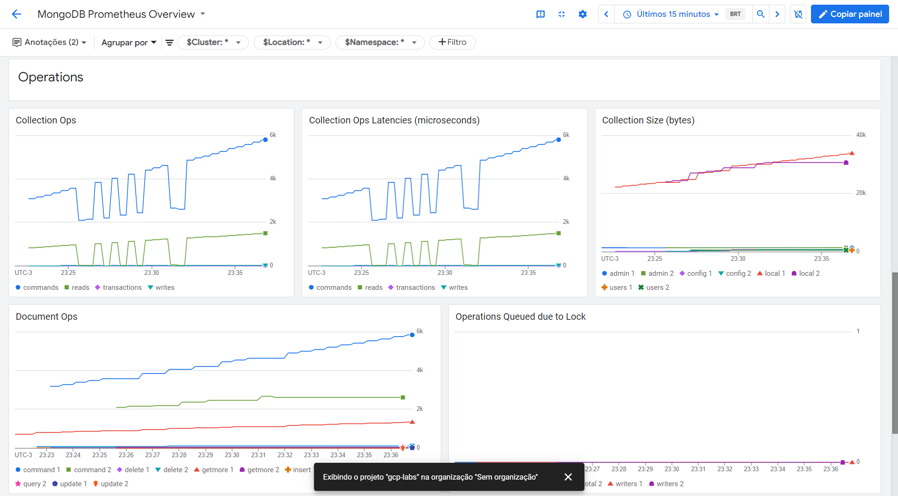
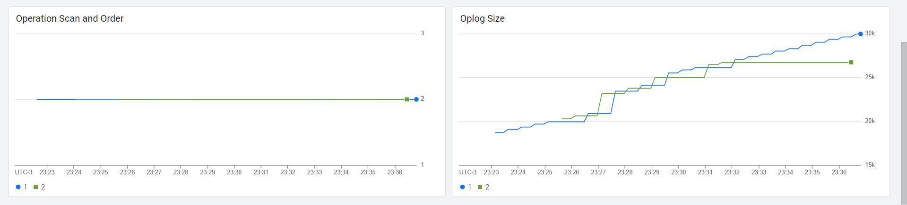

# Arquitetura de implantação
Vamos implantar e configurar um MongoDB altamente disponível no GKE (Google Kubernetes Engine) com um nó primário e dois secundários.

Também vamos implantar um cluster regional do GKE altamente disponível para o MongoDB, com vários nós do Kubernetes espalhados por várias zonas de disponibilidade. Essa configuração ajuda a garantir tolerância a falhas, escalabilidade e redundância geográfica.

O diagrama a seguir mostra como o MongoDB será executado em vários nós e zonas em um cluster do GKE:



Para controlar como o GKE implanta o StatefulSet em nós e zonas, foi definida [topology spread constraints](https://kubernetes.io/docs/concepts/scheduling-eviction/topology-spread-constraints/) na especificação dos pods.

Importante: O tutorial não aborda todas as questões relacionadas a ambiente produtivo. Sendo assim, pense criticamente antes de cogitar a adoção desse procedimento.

# Configuração inicial do ambiente
Execute os seguintes comandos no Cloud Shell:

```bash
gcloud services enable compute.googleapis.com iam.googleapis.com container.googleapis.com cloudresourcemanager.googleapis.com

export PROJECT_ID=$(gcloud config get-value core/project)
export KUBERNETES_CLUSTER_PREFIX=mongodb
export REGION=us-central1

git clone https://github.com/tavaresdb/db
cd db/mongodb/k8s
```

# Criação da infraestrutura do cluster
O diagrama a seguir mostra um cluster privado regional standard do GKE implantado em três zonas diferentes:


Para implantar essa infraestrutura, execute os seguintes comandos no Cloud Shell:
```bash
export GOOGLE_OAUTH_ACCESS_TOKEN=$(gcloud auth print-access-token)
terraform -chdir=manifests/iac/gke-standard init
terraform -chdir=manifests/iac/gke-standard apply -var project_id=${PROJECT_ID} \
  -var region=${REGION} \
  -var cluster_prefix=${KUBERNETES_CLUSTER_PREFIX}
```

O Terraform criará os seguintes recursos:

• Uma rede VPC e uma sub-rede privada para os nós do Kubernetes.

• Um roteador para acessar a internet usando NAT.

• Um cluster privado do GKE na região us-central1.

• Node pool com escalonamento automático ativado (de um a dois nós por zona, sendo no mínimo um nó por zona).

• Uma ServiceAccount com permissões de registro e monitoramento.

• Google Cloud Managed Service for Prometheus para monitoramento de clusters.

Concluída a criação dos recursos, recupere as credencias do cluster conforme comando abaixo:

```bash
gcloud container clusters get-credentials ${KUBERNETES_CLUSTER_PREFIX}-cluster --region ${REGION}
```

# Implantação do MongoDB com estado no cluster

## Criação do namespace
```bash
export NAMESPACE=ns-mongodb
kubectl create ns ${NAMESPACE}
kubectl config set-context --current --namespace=${NAMESPACE}
```

## Criação do Secret
```bash
bash -c "openssl rand -base64 756 > mongodb-keyfile"
chmod 400 mongodb-keyfile

kubectl create secret generic mongodb-keyfile-secret --from-file=mongodb-keyfile

kubectl get secret
```

Configurar a autenticação para o conjunto de réplicas usando keyfile é crucial para proteger a comunicação entre membros. Dessa forma evitamos acesso não autorizado e garantimos que somente nós confiáveis possam ingressar no conjunto de réplicas, mantendo assim a integridade e a segurança dos dados no MongoDB. Tal arquivo será direcionado para um Secret.

## Criação do StorageClass
```bash
kubectl apply -f manifests/sts/sc.yaml
kubectl get sc
```

Essa classe de armazenamento usa o tipo de disco permanente `pd-standard` (Para produção pode ser necessário alterar o tipo; Como desempenho não é uma premissa para este tutorial, o custo foi priorizado). O campo `volumeBindingMode` está definido como `WaitForFirstConsumer`, o que significa que o GKE atrasa o provisionamento de um PersistentVolume até que o pod seja criado. Essa configuração garante que o disco seja provisionado na mesma zona em que o pod está programado. O campo `reclaimPolicy` está definido como `Retain`, o que significa que quando o PersistentVolumeClaim for excluído, o PersistentVolume permanecerá, possibilitando a recuperação manual do recurso. E o campo `allowVolumeExpansion` definido como `true` possibilitará a expansão do PersistentVolume.

## Criação do StatefulSet
```bash
kubectl apply -f manifests/sts/sts.yaml
kubectl get sts --watch
```

Essa implantação contará com os seguintes componentes:

• Três réplicas, sendo que uma irá manter o nó PRIMARY e duas irão manter o nó SECONDARY, formando o quórum.

• As `topologySpreadConstraints` configuradas irão garantir a distribuição adequada entre os nós do Kubernetes em diferentes zonas de disponibilidade.

• Ao especificar a solicitação de recurso para contêineres em um pod, o kube-scheduler usará essas informações para decidir em qual nó o pod será alocado. Ao especificar um limite de recurso para um contêiner, o kubelet aplicará esse limite para que o contêiner não tenha permissão para usar mais desse recurso do que o limite definido.

Além do StatefulSet, esse manifesto implementa um [Headless Service](https://kubernetes.io/docs/concepts/services-networking/service/#headless-services) para gerenciar identidades de redes estáveis para os pods MongoDB.

## Configuração do replicaSet
```bash
kubectl exec -it mongodb-0 -- mongosh

use admin
rs.initiate({
  _id: "k8s_rs",
  members: [
    { _id: 0, host: "mongodb-0.mongodb-service:27017", priority: 2 },
    { _id: 1, host: "mongodb-1.mongodb-service:27017", priority: 1 },
    { _id: 2, host: "mongodb-2.mongodb-service:27017", priority: 1 }
  ]
})

rs.status()
```

## Configuração de usuários
```bash
db.createUser(
   {
     user: "admin",
     pwd: passwordPrompt(),
     roles: [ { role: "root", db: "admin" } ]
   }
)

db.auth( "admin", passwordPrompt() )
db.createUser( { user: "mongodb-exporter",
                 pwd: passwordPrompt(),
                 roles: [ { role: "clusterMonitor", db: "admin" },
                          { role: "read", db: "local" }
                        ] } )

show users

exit
```

## Criação do PDB
```bash
kubectl apply -f manifests/sts/pdb.yaml
kubectl get pdb
```

Quando o MongoDB está em execução no GKE, é preciso ter um número suficiente de instâncias em execução a qualquer momento para atender ao requisito de quórum.

Neste tutorial, considerando um conjunto de réplicas de três instâncias, duas instâncias precisam estar disponíveis para formar um quórum. Com uma policy `PodDisruptionBudget`, é possível limitar o número de pods que podem ser encerrados a qualquer momento.

Para garantir que um número limitado de pods seja interrompido simultaneamente, foi definido o PDB como `maxUnavailable: 1`.

# Coleta de métricas com o Prometheus
O diagrama a seguir mostra como funcionará a coleta de métricas com o Prometheus:


No diagrama, o cluster privado do GKE contém os seguintes componentes:

• Um pod que coleta métricas no caminho / e na porta 9216.

• Coletores baseados em Prometheus que processam as métricas do pod.

• Um recurso de PodMonitoring que envia métricas ao Cloud Monitoring.

O Google Cloud Managed Service for Prometheus é compatível com a coleta de métricas no formato do Prometheus. O Cloud Monitoring usa um [painel integrado](https://cloud.google.com/stackdriver/docs/managed-prometheus/exporters/mongodb?hl=pt-br)) para métricas do MongoDB.

1. Colete as métricas no formato do Prometheus usando o [mongodb_exporter](https://github.com/percona/mongodb_exporter).
```bash
kubectl apply -f manifests/sts/exporter.yaml
```

2. Crie o recurso PodMonitoring para coletar métricas por labelSelector.
```bash
kubectl apply -f manifests/sts/pod-monitoring.yaml
```

3. Conecte-se ao MongoDB.
```bash
kubectl exec -it mongodb-0 -- mongosh
```

4. Crie novos documentos.
```bash
db.auth( "admin", passwordPrompt() )

use users

db.coll.insertOne({ name: "Jane Doe", age: 30, email: "jane.doe@example.com" })
db.coll.insertOne({ name: "Mary Smith", age: 25, email: "mary.smith@example.com" })
db.coll.insertOne({ name: "Alice Johnson", age: 28, email: "alice.johnson@example.com" })
db.coll.insertOne({ name: "Emily Davis", age: 32, email: "emily.davis@example.com" })
db.coll.insertOne({ name: "Sarah Brown", age: 27, email: "sarah.brown@example.com" })

db.coll.find()
exit
```

Obs.: Os dados inseridos serão suficientes para refletir no painel, conforme detalhado à seguir.

5. Para verificar se o MongoDB Exporter foi configurado corretamente, verifique o [Metrics Explorer](https://console.cloud.google.com/monitoring/metrics-explorer?hl=pt-br). Na barra de ferramentas do painel do criador de consultas, selecione o botão `<> MQL` ou `<> PromQL`. Em seguida, execute a consulta à seguir (O painel mostrará uma taxa de ingestão de métricas diferente de 0.).
```bash
up{job="mongodb", cluster="mongodb-cluster", namespace="ns-mongodb"}
```



6. Para verificar o painel e as respectivas métricas, acesse a página [Painéis](https://console.cloud.google.com/monitoring/dashboards?hl=pt-br), selecione a guia *Lista de painéis*, escolha a categoria *Integrações* e clique no nome do painel (*MongoDB Prometheus Overview*). Observe que os gráficos refletem o estado real do banco de dados.









# Backup e Restore
Existem algumas formas de fazer backup e restauração dos dados. Nesse tutorial não irei entrar em detalhes, mas uma alternativa seria o [Backup for GKE](https://cloud.google.com/kubernetes-engine/docs/add-on/backup-for-gke/concepts/backup-for-gke?hl=pt-br).

# Atualização de versão
O Kubernetes e o GKE oferecem recursos para facilitar os upgrades para o binário do MongoDB. No entanto, é necessário realizar algumas operações para se preparar para os upgrades.

Lembre-se das seguintes considerações antes de iniciar o processo de upgrade:

• Considere a natureza efêmera dos pods do Kubernetes. Todo estado de configuração armazenado pelo pod que não está no volume permanente será perdido quando o pod for reimplantado.

• Os upgrades devem ser realizados primeiro em um ambiente de teste. Para sistemas de produção, é preciso realizar mais testes em um ambiente de pré-produção.

• Faça um backup completo do banco de dados antes de implantar a versão atualizada.

• À partir da versão 7.0, os downgrades não são mais suportados para o MongoDB Community Edition. Dedique um tempo para entender as implicações de um upgrade.

• Inicie o upgrade nos pods que hospedam os nós secundários do MongoDB. Concluído, convoque uma eleição, de modo que o atual primário torne-se secundário e seja possível concluir a atualização do conjunto de réplicas (Optei por configurar o `updateStrategy` como `OnDelete` para ter maior controle de como ocorrerá a atualização dos binários).


Para manter este tutorial simples, foi adotado o seguinte procedimento:

```bash
# Atualização da imagem
kubectl set image statefulset/mongodb mongodb=mongo:7.0.1

kubectl get sts -o wide

# Remoção do pod que hospeda um dos nós secundários
kubectl delete pod mongodb-1

# Verificação do status
kubectl get pods --selector=app=mongodb

# Inspeção do MongoDB
kubectl exec -it mongodb-1 -- mongosh

use admin
db.auth( "admin", passwordPrompt() )
db.version()
rs.status()

exit

# Remoção do pod que hospeda um dos nós secundários
kubectl delete pod mongodb-2

# Verificação do status
kubectl get pods --selector=app=mongodb

# Inspeção do MongoDB
kubectl exec -it mongodb-2 -- mongosh

use admin
db.auth( "admin", passwordPrompt() )
db.version()
rs.status()

exit

# Eleição de um novo nó primário no conjunto de réplicas do MongoDB
kubectl exec -it mongodb-0 -- mongosh

use admin
db.auth( "admin", passwordPrompt() )
rs.stepDown()
rs.status()

exit

# Remoção do pod que hospeda o antigo nó primário
kubectl delete pod mongodb-0

# Verificação do status
kubectl get pods --selector=app=mongodb

# Inspeção do MongoDB e definição da versão de compatibilidade
kubectl exec -it mongodb-0 -- mongosh

use admin
db.auth( "admin", passwordPrompt() )
db.version()
rs.status()

db.adminCommand( { getParameter: 1, featureCompatibilityVersion: 1 } )
db.adminCommand( { setFeatureCompatibilityVersion: "7.0", confirm: true } )
db.adminCommand( { getParameter: 1, featureCompatibilityVersion: 1 } )

exit
```

# Exclusão dos recursos
```bash
terraform -chdir=manifests/iac/gke-standard destroy -var project_id=${PROJECT_ID} \
  -var region=${REGION} \
  -var cluster_prefix=${KUBERNETES_CLUSTER_PREFIX}

export disk_list=$(gcloud compute disks list --filter="-users:* AND labels.goog-k8s-cluster-name=${KUBERNETES_CLUSTER_PREFIX}-cluster" --format "value[separator=|](name,zone)")

for i in $disk_list; do
  disk_name=$(echo $i| cut -d'|' -f1)
  disk_zone=$(echo $i| cut -d'|' -f2|sed 's|.*/||')
  echo "Deleting $disk_name"
  gcloud compute disks delete $disk_name --zone $disk_zone --quiet
done
```

# Referências
- https://www.mongodb.com/developer/products/mongodb/mongodb-with-kubernetes/

- https://cloud.google.com/stackdriver/docs/managed-prometheus/exporters/mongodb?hl=pt-br

- https://www.mongodb.com/pt-br/docs/manual/release-notes/7.0-upgrade-replica-set/