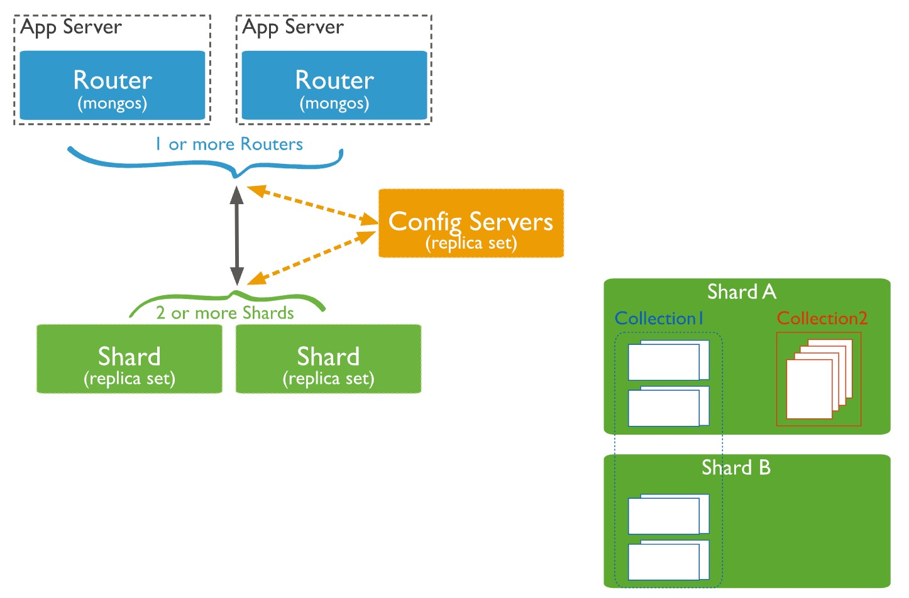
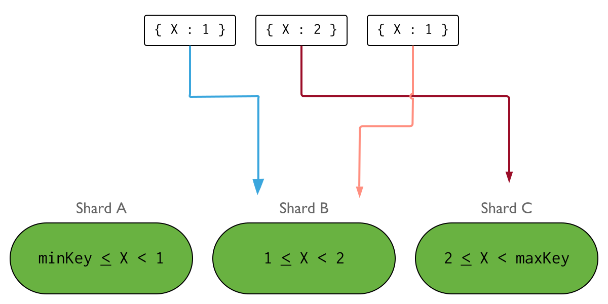
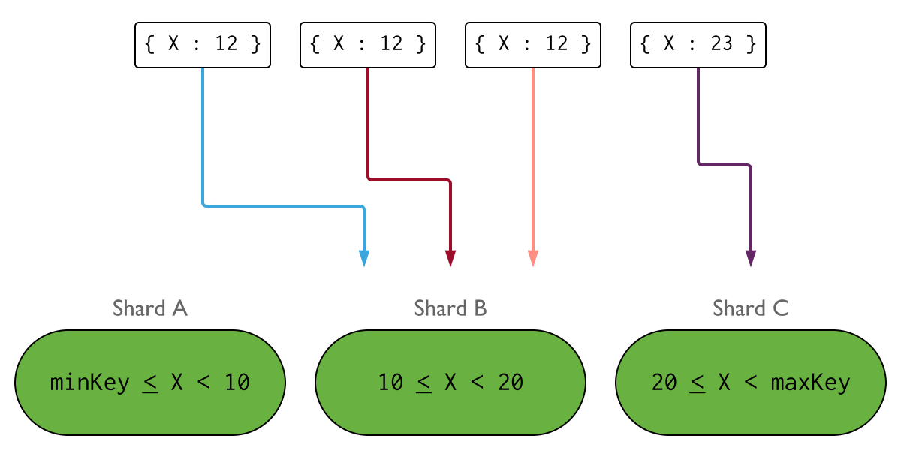
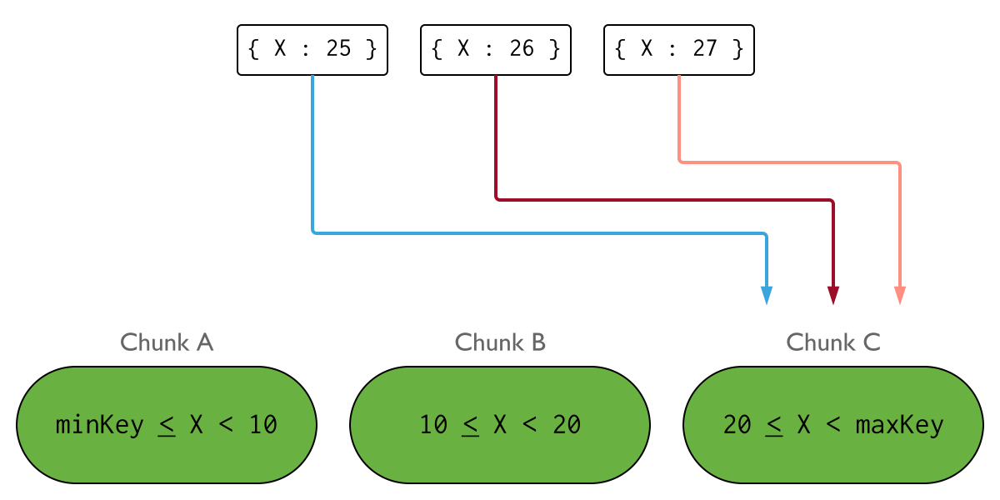
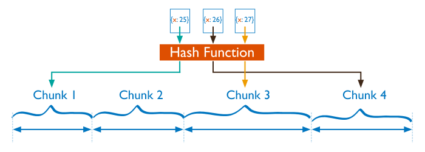
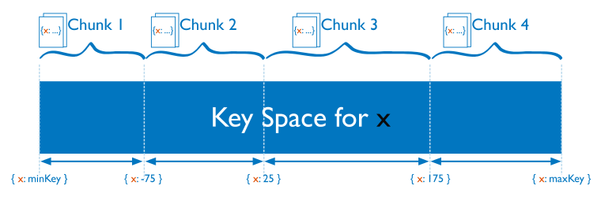
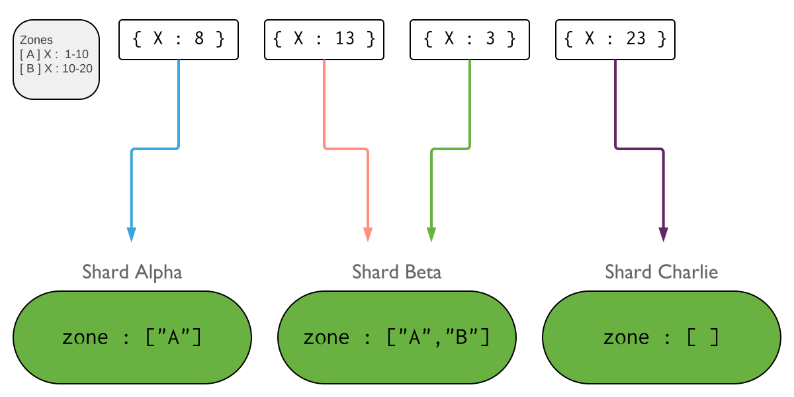

# MongoDB Sharding

## Termos
**Chunks, o que são?**

As partições do MongoDB distribuem os dados em chunks. Cada chunk tem uma faixa inferior inclusiva e uma faixa superior exclusiva com base na chave do sharding.

**Balancer, o que é?**

Em uma tentativa de obter uma distribuição uniforme de dados em todos os shards no cluster, um balanceador é executado em segundo plano para migrar faixas entre os shards.

## Arquitetura

Como implementar um Sharding? Consulte a [documentação](https://www.mongodb.com/pt-br/docs/manual/tutorial/deploy-shard-cluster/).

## Estratégia
**Como escolher a melhor chave?**

A escolha da Shard Key afetará a criação e a distribuição de chunks entre os shards disponíveis. A distribuição de dados afeta a eficiência e o desempenho das operações dentro do cluster. A Shard Key ideal permite que o MongoDB distribua documentos uniformemente em todo o cluster, ao mesmo tempo em que facilita padrões de consultas comuns.

Ao escolher a sua chave, considere:

- Cardinalidade

- Frequência

- Crescimento monotônico

- Query Patterns

**Cardinalide**
A cardinalidade de uma Shard Key determina o número máximo de chunks que o balanceador pode criar. Sempre que possível, escolha uma Shard Key com alta cardinalidade. Uma Shard Key com baixa cardinalidade reduz a eficácia do dimensionamento horizontal no cluster. Cada valor de Shard Key exclusivo não pode existir em mais do que um único bloco (Chunk) em um determinado momento.

Se o seu modelo dedados exigir uma Shard Key com baixa cardinalidade, considere criar uma chave/índice composta(o).

Importante: Isso por si só não garante a distribuição uniforme dos dados no cluster. A frequência e o crescimento monotônico também são fatores que precisam ser considerados.

**Frequência**
A frequência de uma Shard Key indica a constância com que um determinado valor aparece nos dados. Se a maioria dos documentos contiver apenas um subconjunto dos possíveis valores da Shard Key, os chunks que armazenam esses documentos podem se tornar um gargalo no cluster. Além disso, à medida que esses chunks crescem, eles podem se tornar [indivisíveis](https://www.mongodb.com/pt-br/docs/manual/core/sharding-data-partitioning/#std-label-jumbo-chunks). Isso reduzi a eficácia do dimensionamento horizontal do cluster.

Se o seu modelo de dados exigir que uma Shard Key com alta frequência, considere criar uma chave/índice composta(o).

Importante: Isso por si só não garante a distribuição uniforme dos dados no cluster. A cardinalidade e o crescimento monotônico também são fatores que precisam ser considerados.

**Crescimento monotônico**
Uma Shard Key em m valores que aumenta ou diminui monotonomicamente tem maior probabilidade de distribuir inserções para um único chunk em um cluster.

Se o seu modelo de dados exigir uma Shard Key cujo valor mude monotonomicamente, considere utilizar Hashed Sharding.

Importante: Isso por si só não garante a distribuição uniforme dos dados no cluster. A cardinalidade e a frequência também são fatores que precisam ser considerados.

**Query Patterns**
A Shard Key ideal distribui os dados uniformemente pelo cluster e, ao mesmo tempo, facilita os padrões de query comuns. Ao escolher uma Shard Key, considere seus padrões de query mais comuns e se uma determinada Shard Key os abrange.

Em um cluster, o mongos encaminha as queries somente para os shards que contêm os dados relevantes (De acordo com a chave especificada). Quando as queries não contêm a Shard Key, elas são transmitidas para todos os shards para avaliação. Esses tipos de queries são chamados de queries dispersas. As queries que envolvem vários shards para cada solicitação são menos eficientes e não são dimensionadas linearmente quando mais shards são adicionados ao cluster.

**Hashed Sharding**
Cenário ideal:

- Alta cardinalidade

- Mudanças são monotônicas

**Ranged Sharding (Default)**
Cenário ideal:

- Alta cardinalidade

- Baixa frequência

- Mudanças não são monotônicas

**Zones**
Podemos associar cada zona a um ou mais shards no cluster. Um shard pode se associar a qualquer número de zonas. Em um cluster balanceado, o MongoDB migra os chunks cobertos por uma zona seomente para os shards associados à zona.

Padrões de sistemas comuns onde zonas podem ser aplicadas:

- Isole um subconjunto específico de dados em um conjunto específico de shards

- Garanta que os dados mais relevantes residam em shards geograficamente mais próximos dos servidores de aplicativos

- Direcione dados para os shards com base no hardware do shard

Para maiores informações, consulte a [documentação](https://www.mongodb.com/pt-br/docs/manual/tutorial/sharding-segmenting-shards/).

## Vantagens e desvantagens
**Vantagens**

- Maior desempenho (Distribuição de leituras e gravações)

- Maior capacidade de armazenamento

**Desvantagens**

- Complexidade da infraestrutura

- Manutenção da implementação (Por exemplo, backup, restore, criação de índices, etc.)

- [Limitações](https://www.mongodb.com/pt-br/docs/manual/reference/limits/#sharded-clusters)