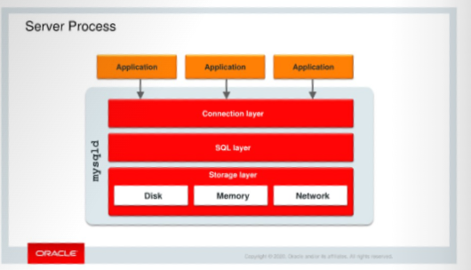

# Server Process
O processo `mysqld` é composto por três camadas:

- **Camada de conexão:** Gerencia as conexões.
- **Camada SQL:** Processa as consultas SQL enviadas pelas aplicações conectadas.
- **Camada de armazenamento:** Gerencia o armazenamento de dados em vários formatos e estruturas, utilizando diferentes tipos de mídia física, como disco, memória e rede.

## Camada de conexão
A camada de conexão mantém uma thread por conexão. Essa thread é responsável pela execução das consultas. Antes que uma conexão possa começar a enviar consultas SQL, ela é autenticada por meio da verificação do nome do usuário, senha e host do cliente.

A camada de conexão aceita conexões de aplicações por meio de diversos protocolos de conexão:

|Protocolo     |Conexão       |Suporte              | Sistemas Operacionais     |
|--------------|--------------|---------------------|---------------------------|
|TCP/IP        |Local, remota |Classic e X Protocol |Todos                      |
|Socket UNIX   |Local         |Classic e X Protocol |Sistemas derivados de UNIX |
|Shared memory |Local         |Classic Protocol     |Windows                    |
|Named pipes   |Local         |Classic Protocol     |Windows                    |

> O MySQL X Protocol pode ser configurado usando variáveis e opções com o prefixo `mysqlx`. Exemplos: `mysqlx`, `mysqlx_bind_address`, `mysqlx_max_connections`, `mysqlx_port` e `mysqlx_socket`.

## Camada SQL
Após uma conexão ser estabelecida, o MySQL processa cada consulta na camada SQL, que é composta pelos seguintes componentes:

- **Parser:** Valida a sintaxe e a semântica da consulta SQL e a converte para uma forma padrão.
- **Authorization:** Verifica se o usuário conectado tem permissão para executar a consulta e acessar os objetos referenciados por ela.
- **Optimizer:** Cria um plano de execução ideal para cada consulta. Isso envolve escolher quais índices usar e em qual ordem as tabelas devem ser processadas.
- **Query execution:** Executa o plano de execução gerado pelo otimizador.
- **Query logging (Opcional):** Registra as consultas recebidas ou executadas pelo servidor.

## Camada de armazenamento
Ao realizar uma transação, o cliente escreve alterações nos dados no log buffer, que reside na memória. O InnoDB grava esse conteúdo em disco no redo log quando a transação é confirmada, no entanto essa gravação pode ser configurada para ocorrer com menos frequência, através da variável `sync_binlog` - consulte [esse](https://github.com/tavaresdb/db/blob/main/mysql/04_config/02_db/02_variables.md) artigo para maiores detalhes sobre a variável. Se ocorrer uma falha enquanto as tabelas estão sendo modificadas, os arquivos de redo log serão usados para recuperação automática. Quando o servidor MySQL é reiniciado, ele reaplica as alterações registradas nos logs para garantir que as tabelas reflitam todas as transações que foram efetivadas.

# Referência
- Curso MySQL 8.0 for Database Administrators, https://mylearn.oracle.com/ou/course/mysql-80-for-database-administrators/76889