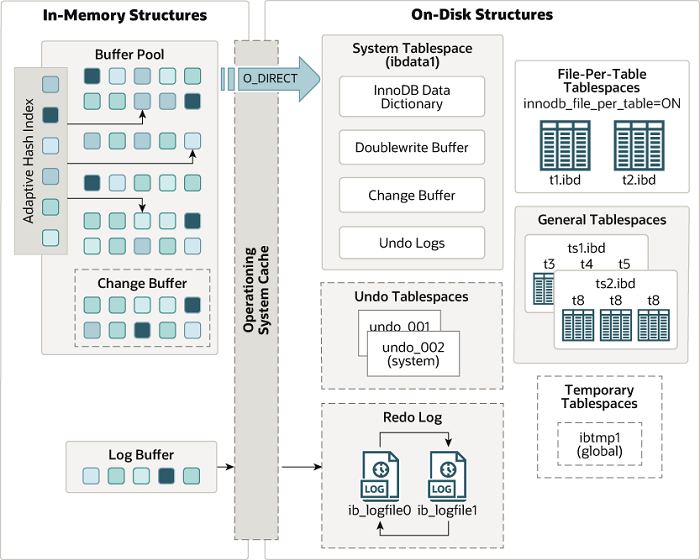
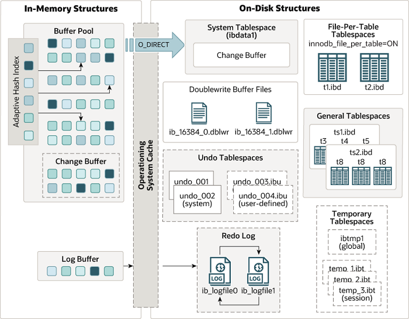

# Arquitetura do InnoDB
**InnoDB 5.7**

**InnoDB 8.0**

## Estruturas de memória
Nessa seção serão abordados todos os tópicos relacionados a memória.

### Buffer Pool
O buffer pool é uma área na memória onde o InnoDB armazena dados de tabelas e índices acessados com frequência, acelerando o processamento ao evitar leituras em disco. Em servidores dedicados, costuma-se configurar até 80% da memória física. Ele é dividido em páginas e gerenciado como uma lista encadeada, usando uma variação do algoritmo LRU para descartar dados menos usados.

### Change Buffer
O change buffer é uma estrutura usada pelo InnoDB para armazenar alterações em índices secundários (Resultantes de comandos DML) quando as páginas afetadas não estão no buffer pool. Essas mudanças são mescladas posteriormente, quando as páginas são carregadas por outras operações de leitura, reduzindo o I/O aleatório em disco.

Esse processo melhora o desempenho, mas pode gerar lentidão em consultas quando há muitos dados a mesclar. A mesclagem pode continuar mesmo após a confirmação da transação ou após reinicializações. O change buffer reside parcialmente no buffer pool (Memória) e no system tablespace (Disco), sendo controlado pela variável `innodb_change_buffering`.

### Adaptive Hash Index
O adaptive hash index permite ao InnoDB acelerar buscas em memória ao criar automaticamente índices hash com base nos acessos mais frequentes ao b-tree. Isso torna as consultas mais rápidas, pois permite buscas diretas (Como um ponteiro), sem comprometer a confiabilidade transacional.

O adaptive hash index é útil quando a tabela cabe quase toda na memória e o padrão de consultas é repetitivo. Porém, pode causar contenção sob carga alta ou com consultas `LIKE` com curingas (`%`). Pode ser ativado ou desativado pela variável `innodb_adaptive_hash_index`.

### Log Buffer
O log buffer é uma área na memória que armazena dados, sendo estes gravados posteriormente nos arquivos de log em disco. O tamanho do log buffer é definido pela variável `innodb_log_buffer_size`. O conteúdo do log buffer é periodicamente gravado no disco. Um log buffer grande permite que transações extensas sejam executadas sem a necessidade de gravar os dados de redo log em disco antes do `COMMIT`. Assim, se você tiver transações que atualizam, inserem ou deletam muitas linhas, aumentar o tamanho do log buffer reduzirá o número de operações de I/O em disco.

## Estruturas de disco
Nessa seção serão abordados os principais tópicos relacionados a disco.

### Tablespaces

#### System Tablespace
O system tablespace é a área de armazenamento do change buffer. Ele também pode conter dados de tabelas e índices, caso as tabelas sejam criadas no próprio system tablespace em vez de utilizarem a opção file-per-table ou general tablespaces.

O system tablespace pode ter um ou mais datafiles. Por padrão, é criado um único datafile chamado `ibdata1` no diretório de dados. O tamanho e a quantidade desses arquivos são definidos pela variável `innodb_data_file_path`.

#### General Tablespaces
O general tablespace é uma área de armazenamento compartilhada do InnoDB, que permite armazenar várias tabelas em um único tablespace.

Principais vantagens:

- Compartilha dados entre várias tabelas.
- Consome menos memória com metadados do que múltiplos file-per-table.
- Permite armazenar arquivos fora do diretório padrão do MySQL, facilitando o gerenciamento de desempenho e armazenamento.
- Entre outras.

> Esse [link](https://dev.mysql.com/doc/refman/8.0/en/innodb-file-per-table-tablespaces.html) pode ser útil, pois podemos avaliar os prós e contras ao comparar com um tablespace do tipo file-per-table.

#### Undo Tablespaces
Os undo tablespaces armazenam undo logs, que são conjuntos de registros usados para desfazer alterações feitas por transações que precisam ser revertidas. Eles também são fundamentais para garantir o isolamento das transações, especialmente durante leituras consistentes.

Em versões anteriores do MySQL, esses undo logs eram mantidos no system tablespace por padrão. A partir do MySQL 8.0 essa abordagem foi modificada: Dois undo tablespaces são criados automaticamente durante a inicialização do servidor. Esses tablespaces fornecem o espaço necessário para os segmentos de rollback, que precisam estar disponíveis antes que qualquer instrução SQL possa ser processada.

O MySQL exige no mínimo dois undo tablespaces para possibilitar o truncamento automático, uma funcionalidade que permite o reaproveitamento de espaço em disco de forma mais eficiente. Os datafiles dos undo tablespaces são criados no diretório especificado pela variável `innodb_undo_directory`. Caso essa variável não esteja configurada, os arquivos serão criados no diretório de dados padrão. Por padrão, os datafiles são nomeados como `undo_001` e `undo_002`, enquanto os nomes dos tablespaces correspondentes são `innodb_undo_001` e `innodb_undo_002`.

#### Temporary Tablespaces
O temporary tablespace é uma área de armazenamento utilizada para dados temporários gerados durante operações SQL, como ordenações, junções, agrupamentos e tabelas temporárias criadas explicitamente pela aplicação e/ou usuário.

Anteriormente o InnoDB utilizava um global temporary tablespace, `ibtmp1`, sendo este compartilhado entre todas as sessões do banco de dados. Em versões mais recentes foi introduzido os session temporary tablespaces, proporcionando maior isolamento e melhor gerenciamento de recursos. Os arquivos para estes tablespaces de sessão são nomeados de forma distinta do global, como por exemplo `temp_*.ibt`.

Esses tablespaces são automaticamente descartados ao final da sessão ou reinicialização do servidor, pois seu conteúdo não é persistente.

### Doublewrite Buffer
O doublewrite buffer é uma área de armazenamento onde o InnoDB grava páginas liberadas do buffer pool antes de gravá-las em suas posições corretas nos datafiles. Se houver uma saída inesperada do sistema operacional, subsistema de armazenamento ou processo `mysqld` no meio da gravação de uma página, o InnoDB pode encontrar uma cópia válida da página nessa área durante o processo de recuperação.

Os arquivos costumam seguir o seguinte formato: `#ib_<pagase_size>_<file_number>.dblwr`.

### Redo
Os redo logs são fundamentais para garantir a durabilidade das transações e possibilitar a recuperação da instância após falhas. Eles seguem o princípio do Write-Ahead Logging (WAL), no qual toda modificação nos dados é registrada sequencialmente nos logs antes de ser gravada nos datafiles - escritas sequenciais em log são mais rápidas que escritas aleatórias nos datafiles.

Durante a execução da instância, as alterações são primeiramente acumuladas em um log buffer na memória e depois escritas nos arquivos de log físicos. Cada entrada é identificada por um Log Sequence Number (LSN), que garante a ordenação e consistência das operações. Se houver uma interrupção inesperada, o InnoDB utiliza os redo logs para reaplicar as transações confirmadas que ainda não haviam sido persistidas nos datafiles, mantendo a integridade da instância. O mecanismo de checkpointing atua periodicamente para gravar em disco as páginas de dados modificadas na memória, liberando espaço nos redo logs para reutilização.

No MySQL 5.7, os redo logs eram configurados pelas variáveis `innodb_log_file_size` (Tamanho de cada arquivo) e `innodb_log_files_in_group` (Quantidade de arquivos). Os arquivos, como `ib_logfile0` e `ib_logfile1`, eram criados no diretório de dados e o espaço total disponível para os redo logs era o resultado da multiplicação dessas duas variáveis. No MySQL 8.0, a configuração foi simplificada com a introdução da variável `innodb_redo_log_capacity`, que define diretamente a capacidade total de redo logs. Essa capacidade pode ser ajustada dinamicamente, sem reiniciar o servidor. Além disso, os redo logs passaram a ser armazenados no subdiretório `#innodb_redo`, proporcionando melhor organização e gerenciamento automático pelo InnoDB.

# Referências
- https://dev.mysql.com/doc/refman/5.7/en/innodb-architecture.html
- https://dev.mysql.com/doc/refman/8.0/en/innodb-architecture.html