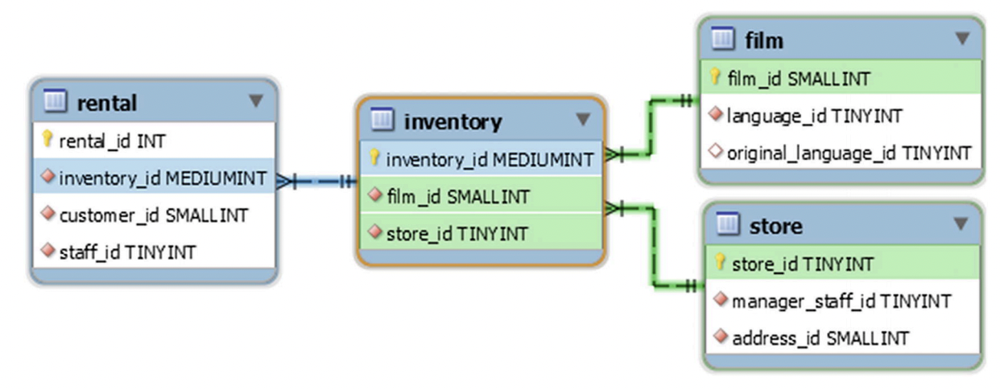

# Introdução

## Por que os bloqueios são necessários?
Quando você tem várias conexões executando consultas simultaneamente, é preciso garantir que elas não interfiram umas nas outras. É aí que os bloqueios entram em cena. Você pode pensar nos bloqueios como semáforos em uma estrada, que regulam o acesso aos recursos para evitar acidentes. Em um cruzamento é necessário garantir que dois carros não cruzem o caminho um do outro e colidam.

Em um banco de dados é necessário garantir que o acesso de duas consultas aos dados não entre em conflito. Assim como existem diferentes níveis de controle de acesso a um cruzamento - como dar a preferência, placas de pare e semáforos - existem diferentes tipos de bloqueio em um banco de dados.

## Níveis de bloqueio
Os bloqueios no MySQL vêm em vários formatos, atuando em diferentes níveis, desde bloqueios de usuário até bloqueios de linha.

No nível mais alto estão os bloqueios de usuário, que podem proteger todo o aplicativo e qualquer objeto dentro do banco de dados. Na camada intermediária existem bloqueios que operam sobre os objetos do banco de dados. Isso inclui bloqueios de metadados, que protegem os metadados das tabelas, bem como bloqueios de tabela que protegem todos os dados da tabela. O que os bloqueios de nível de usuário e de nível de tabela têm em comum é que são implementados na camada SQL do banco de dados. E no nível mais baixo estão os bloqueios implementados pelos mecanismos de armazenamento - InnoDB sendo o mecanismo de armazenamento mais utilizado no MySQL.

## Pré-requisito para os exercícios práticos
Baixe os bancos de dados de exemplo `world` e `sakila` hospedados no [site](https://dev.mysql.com/doc/index-other.html) e restaure-os localmente.

# Monitorando bloqueios
O monitoramento é essencial para entender onde ocorrem os gargalos no sistema. Você precisa usar o monitoramento para determinar as fontes de contenção e para verificar se as alterações feitas reduzem a contenção.

## Performance schema
O Performance Schema contém a fonte da maioria das informações de bloqueio disponíveis.

### Metadata e table locks
Os bloqueios de metadados são monitorados através da tabela [performance_schema.metadata_locks](https://dev.mysql.com/doc/refman/8.0/en/performance-schema-metadata-locks-table.html) - o instrumento `wait/lock/metadata/sql/mdl` no Performance Schema deve estar habilitado.

Exemplo:

```sql
START TRANSACTION;

SELECT *
  FROM world.city
 WHERE ID = 130;

SELECT *
  FROM performance_schema.metadata_locks
 WHERE OBJECT_TYPE = 'TABLE'
   AND OBJECT_SCHEMA = 'world'
   AND OBJECT_NAME = 'city'
   AND OWNER_THREAD_ID = PS_CURRENT_THREAD_ID()\G
```

```bash
*************************** 1. row ***************************
          OBJECT_TYPE: TABLE
        OBJECT_SCHEMA: world
          OBJECT_NAME: city
          COLUMN_NAME: NULL
OBJECT_INSTANCE_BEGIN: 139998758843456
            LOCK_TYPE: SHARED_READ
        LOCK_DURATION: TRANSACTION
          LOCK_STATUS: GRANTED
               SOURCE: sql_parse.cc:5981
      OWNER_THREAD_ID: 267
       OWNER_EVENT_ID: 5
```

> Podemos observar que o exemplo acima retrata um bloqueio de leitura compartilhada, portanto outras conexões podem obter o mesmo bloqueio simultaneamente.

```sql
ROLLBACK;
```

Para encontrar todos os casos de bloqueios pendentes e o que os está bloqueando, execute a consulta abaixo:

```sql
SELECT OBJECT_TYPE,
       OBJECT_SCHEMA,
       OBJECT_NAME,
       w.OWNER_THREAD_ID AS WAITING_THREAD_ID,
       b.OWNER_THREAD_ID AS BLOCKING_THREAD_ID
  FROM performance_schema.metadata_locks w
 INNER
  JOIN performance_schema.metadata_locks b
 USING (OBJECT_TYPE, OBJECT_SCHEMA, OBJECT_NAME)
 WHERE w.LOCK_STATUS = 'PENDING'
   AND b.LOCK_STATUS = 'GRANTED';
```

> Você pode opcionalmente fazer junções em outras tabelas do Performance Schema, como [performance_schema.events_statements_current](https://dev.mysql.com/doc/refman/8.0/en/performance-schema-events-statements-current-table.html), para obter mais detalhes sobre as conexões envolvidas na espera de bloqueio.

Consulte [essa]() seção complementar.

### Data locks
Os bloqueios de dados estão em um nível intermediário entre os bloqueios de metadados e os objetos de sincronização. As informações sobre bloqueios de dados são divididas em duas tabelas:

- [performance_schema.data_locks](https://dev.mysql.com/doc/refman/8.0/en/performance-schema-data-locks-table.html): Essa tabela contém detalhes dos bloqueios de tabelas e linhas no nível do InnoDB. Ela mostra todos os bloqueios atualmente mantidos ou pendentes.
- [performance_schema.data_locks_waits](https://dev.mysql.com/doc/refman/8.0/en/performance-schema-data-lock-waits-table.html): Assim como a tabela [performance_schema.data_locks](https://dev.mysql.com/doc/refman/8.0/en/performance-schema-data-locks-table.html), ela mostra os bloqueios relacionados ao InnoDB, mas apenas aqueles que aguardam concessão, com informações sobre qual thread está bloqueando a solicitação.

Exemplo (Aquisição de dois bloqueios e consulta da tabela [performance_schema.data_locks](https://dev.mysql.com/doc/refman/8.0/en/performance-schema-data-locks-table.html)):

```sql
START TRANSACTION;

SELECT *
  FROM world.city
 WHERE ID = 130 FOR SHARE;

SELECT *
  FROM performance_schema.data_locks
 WHERE THREAD_ID = PS_CURRENT_THREAD_ID()\G
```

```bash
*************************** 1. row ***************************
               ENGINE: INNODB
       ENGINE_LOCK_ID: 140000881578424:1088:140000767332784
ENGINE_TRANSACTION_ID: 421475858289080
            THREAD_ID: 267
             EVENT_ID: 11
        OBJECT_SCHEMA: world
          OBJECT_NAME: city
       PARTITION_NAME: NULL
    SUBPARTITION_NAME: NULL
           INDEX_NAME: NULL
OBJECT_INSTANCE_BEGIN: 140000767332784
            LOCK_TYPE: TABLE
            LOCK_MODE: IS
          LOCK_STATUS: GRANTED
            LOCK_DATA: NULL
*************************** 2. row ***************************
               ENGINE: INNODB
       ENGINE_LOCK_ID: 140000881578424:30:7:44:140000767329680
ENGINE_TRANSACTION_ID: 421475858289080
            THREAD_ID: 267
             EVENT_ID: 11
        OBJECT_SCHEMA: world
          OBJECT_NAME: city
       PARTITION_NAME: NULL
    SUBPARTITION_NAME: NULL
           INDEX_NAME: PRIMARY
OBJECT_INSTANCE_BEGIN: 140000767329680
            LOCK_TYPE: RECORD
            LOCK_MODE: S,REC_NOT_GAP
          LOCK_STATUS: GRANTED
            LOCK_DATA: 130
```

> Nesse exemplo a consulta obtém um bloqueio intencional compartilhado (IS) na tabela `world.city` e um bloqueio de linha compartilhado (S), mas não um bloqueio de intervalo (`REC NOT_GAP`), na chave primária com o valor 130.

```sql
ROLLBACK;
```

### Sync waits
> O InnoDB usa objetos de exclusão mútua, mais conhecidos como mutexes, e semáforos para proteger o código. Exemplo: evitam condições de disputa ao atualizar o buffer pool.

As esperas de sincronização são as mais difíceis de monitorar por diversos motivos. Elas ocorrem com muita frequência, geralmente em intervalos muito curtos, e o monitoramento delas tem uma sobrecarga alta. Inclusive, essa instrumentação não está habilitada por padrão.

Para maiores informações sobre esse tipo de espera, consulte a seção de semáforos através do comando `SHOW ENGINE INNODB STATUS` ou a saída do comando `SHOW ENGINE INNODB MUTEX` - a exceção ocorre quando se deseja investigar um problema específico de contenção.

### Statement e error tables
O Performance Schema disponibiliza diversas tabelas que podem ser utilizadas na investigação de erros. Considere os seguintes cenários: 

- Falhas na obtenção de bloqueios, seja por timeout ou deadlock.
- Problemas relacionados a bloqueios, permitindo identificar quais instruções, contas e outros elementos são mais afetados por disputas de bloqueio.
- Entre outros.

Podemos usar as tabelas [performance_schema.events_statements_current](https://dev.mysql.com/doc/refman/8.0/en/performance-schema-events-statements-current-table.html), [performance_schema.events_statements_history](https://dev.mysql.com/doc/refman/8.0/en/performance-schema-events-statements-history-table.html) e [performance_schema.events_statements_history_long](https://dev.mysql.com/doc/refman/8.0/en/performance-schema-events-statements-history-long-table.html) para verificar se ocorreu algum erro ou um erro específico. As duas primeiras tabelas estão habilitadas por padrão, enquanto a tabela [performance_schema.events_statements_history_long](https://dev.mysql.com/doc/refman/8.0/en/performance-schema-events-statements-history-long-table.html) requer que seja habilitado o consumidor `events_statements_history_long`.

Abaixo, é apresentado um exemplo de lock wait timeout e como esse evento é registrado na tabela [performance_schema.events_statements_history](https://dev.mysql.com/doc/refman/8.0/en/performance-schema-events-statements-history-table.html):

```sql
-- Conexão 1
START TRANSACTION;

UPDATE world.city
   SET Population = Population + 1
 WHERE ID = 130;

-- Conexão 2
SET SESSION innodb_lock_wait_timeout = 1;

START TRANSACTION;

UPDATE world.city
   SET Population = Population + 1
 WHERE ID = 130;
```

```bash
ERROR 1205 (HY000): Lock wait timeout exceeded; try restarting transaction
```

```sql
-- Conexão 2
SELECT thread_id,
       event_id,
       FORMAT_PICO_TIME(lock_time) AS lock_time,
       sys.format_statement(SQL_TEXT) AS statement,
       digest,
       mysql_errno,
       returned_sqlstate,
       message_text,
       errors
  FROM performance_schema.events_statements_history
 WHERE thread_id = PS_CURRENT_THREAD_ID()
   AND mysql_errno > 0\G
```

```bash
*************************** 1. row ***************************
        thread_id: 268
         event_id: 5
        lock_time: 417.00 us
        statement: UPDATE world.city    SET Popul ... Population + 1  WHERE ID = 130
           digest: 3e9795ad6fc0f4e3a4b4e99f33fbab2dc7b40d0761a8adbc60abfab02326108d
      mysql_errno: 1205
returned_sqlstate: HY000
     message_text: Lock wait timeout exceeded; try restarting transaction
           errors: 1
```

O tempo de bloqueio é de apenas 417 microssegundos, apesar de ter levado 1 segundo inteiro para que o lock wait timeout fosse atingido. Ou seja, a espera por um bloqueio de linha dentro do InnoDB não é adicionada ao tempo de bloqueio relatado pelo Performance Schema, portanto não podemos usá-lo para investigar a contenção de bloqueio a nível de linha.

```sql
-- Conexão 1
ROLLBACK;

-- Conexão 2
ROLLBACK;
```

O conjunto de tabelas que consolidam informações sobre erros também pode ser obtido através do seguinte comando:

```sql
SHOW TABLES FROM performance_schema LIKE '%error%';
```

| Tables_in_performance_schema (%error%)    |
|-------------------------------------------|
| events_errors_summary_by_account_by_error |
| events_errors_summary_by_host_by_error    |
| events_errors_summary_by_thread_by_error  |
| events_errors_summary_by_user_by_error    |
| events_errors_summary_global_by_error     |

Podemos, por exemplo, recuperar as estátisticas sobre lock wait timeouts e deadlocks da seguinte forma:

```sql
SELECT *
  FROM performance_schema.events_errors_summary_global_by_error
 WHERE error_name IN ('ER_LOCK_WAIT_TIMEOUT', 'ER_LOCK_DEADLOCK')\G
```

Embora isso não ajude a identificar as instruções com erros, pode ajudar a monitorar a frequência com que os erros ocorrem e, dessa forma, determinar se os erros de bloqueio estão se tornando mais frequentes ou não.

## Sys schema
O esquema sys pode ser entendido como um conjunto de views que atuam como relatórios sobre o Performance Schema e o Information Schema, além de disponibilizar functions e procedures úteis. Vamos focar aqui em duas views, que consolidam informações do Performance Schema, para identificar situações de espera por bloqueios, ou seja, casos em que um bloqueio não pode ser concedido devido a outro. Essas views são [sys.innodb_lock_waits e sys.schema_table_lock_waits](https://dev.mysql.com/doc/refman/8.0/en/sys-innodb-lock-waits.html).

A view `sys.innodb_lock_waits` utiliza as tabelas [performance_schema.data_locks](https://dev.mysql.com/doc/refman/8.0/en/performance-schema-data-locks-table.html) e [performance_schema.data_lock_waits](https://dev.mysql.com/doc/refman/8.0/en/performance-schema-data-lock-waits-table.html) do Performance Schema para exibir esperas de bloqueio relacionadas a registros InnoDB, indicando qual bloqueio está sendo solicitado e quais conexões e consultas estão envolvidas. Para acesso aos dados sem formatação, há a view `sys.x$innodb_lock_waits`.

> - As tabelas [performance_schema.data_locks](https://dev.mysql.com/doc/refman/8.0/en/performance-schema-data-locks-table.html) e [performance_schema.data_lock_waits](https://dev.mysql.com/doc/refman/8.0/en/performance-schema-data-lock-waits-table.html) são novas no MySQL 8.0. No MySQL 5.7 e versões anteriores existiam duas tabelas semelhantes no Information Schema, chamadas `INNODB_LOCKS` e `INNODB_LOCK_WAITS`. Uma vantagem de usar a view `sys.innodb_lock_waits` é que ela funciona da mesma forma (mas com algumas informações adicionais no MySQL 8.0) em todas as versões do MySQL.
> - Sobre a view `sys.innodb_lock_waits`, as colunas de saída podem ser divididas em cinco grupos com base no prefixo do nome da coluna. Os grupos são:
>   - `wait_`: Essas colunas mostram informações gerais sobre o tempo de espera do bloqueio.
>   - `locked_`: Essas colunas mostram o que está bloqueado, desde o esquema até o índice, bem como o tipo de bloqueio.
>   - `waiting_`: Essas colunas mostram detalhes da transação que está aguardando a concessão do bloqueio, incluindo a operação e o modo de bloqueio solicitado.
>   - `blocking_`: Essas colunas mostram detalhes da transação que está bloqueando a solicitação de bloqueio.
>     - A coluna `blocking_query` indica a operação atualmente em execução (se houver) para a transação bloqueadora. Isso não significa necessariamente que a própria operação esteja causando o bloqueio da solicitação.
>     - Ainda sobre a coluna `blocking_query`, não é incomum retornar `NULL`. Significa que a transação bloqueadora não está executando nenhuma consulta no momento. Isso pode ocorrer porque ela está entre duas consultas. Se esse período for longo, sugere que o aplicativo está executando tarefas que, idealmente, deveriam ser realizadas fora da transação. Mais comumente, a transação não está executando uma consulta porque foi esquecida, seja em uma sessão interativa onde o usuário esqueceu de finalizar a transação, seja em um fluxo de aplicativo que não garante que as transações sejam confirmadas ou revertidas.
>   - `sql_kill_`: Fornece as instruções `KILL` que podem ser usadas para encerrar a operação ou conexão que está bloqueando.

De forma semelhante, a view `sys.schema_table_lock_waits` baseia-se na tabela [performance_schema.metadata_locks](https://dev.mysql.com/doc/refman/8.0/en/performance-schema-metadata-locks-table.html) para apresentar esperas de bloqueio associadas a objetos de esquema. As mesmas informações também podem ser obtidas sem formatação por meio da view `x$schema_table_lock_waits`.

## Contadores de status e métricas do InnoDB
Existem vários contadores de status e métricas do InnoDB que fornecem informações sobre bloqueios e podem ser úteis para detectar um aumento geral nos problemas de bloqueio.

### Consultando os dados
Exemplo:

```sql
SELECT Variable_name,
       Variable_value AS Value,
       Enabled
  FROM sys.metrics
 WHERE Variable_name LIKE 'innodb_row_lock%'
    OR Variable_name LIKE 'Table_locks%'
    OR Variable_name LIKE 'innodb_rwlock_%'
    OR Type = 'InnoDB Metrics - lock';
```

| Variable_name                     | Value | Enabled |
|-----------------------------------|-------|---------|
| **innodb_row_lock_current_waits** | 0     | YES     |
| **innodb_row_lock_time**          | 2000  | YES     |
| **innodb_row_lock_time_avg**      | 2000  | YES     |
| **innodb_row_lock_time_max**      | 2000  | YES     |
| **innodb_row_lock_waits**         | 1     | YES     |
| table_locks_immediate             | 822   | YES     |
| table_locks_waited                | 0     | YES     |
| lock_deadlock_false_positives     | 0     | YES     |
| lock_deadlock_rounds              | 2552  | YES     |
| **lock_deadlocks**                | 0     | YES     |
| lock_rec_grant_attempts           | 0     | YES     |
| lock_rec_lock_created             | 0     | NO      |
| lock_rec_lock_removed             | 0     | NO      |
| lock_rec_lock_requests            | 0     | NO      |
| lock_rec_lock_waits               | 0     | NO      |
| lock_rec_locks                    | 0     | NO      |
| lock_rec_release_attempts         | 2851  | YES     |
| lock_row_lock_current_waits       | 0     | YES     |
| lock_schedule_refreshes           | 2552  | YES     |
| lock_table_lock_created           | 0     | NO      |
| lock_table_lock_removed           | 0     | NO      |
| lock_table_lock_waits             | 0     | NO      |
| lock_table_locks                  | 0     | NO      |
| lock_threads_waiting              | 0     | YES     |
| **lock_timeouts**                 | 1     | YES     |
| innodb_rwlock_s_os_waits          | 0     | YES     |
| innodb_rwlock_s_spin_rounds       | 3     | YES     |
| innodb_rwlock_s_spin_waits        | 3     | YES     |
| innodb_rwlock_sx_os_waits         | 0     | YES     |
| innodb_rwlock_sx_spin_rounds      | 1     | YES     |
| innodb_rwlock_sx_spin_waits       | 1     | YES     |
| innodb_rwlock_x_os_waits          | 0     | YES     |
| innodb_rwlock_x_spin_rounds       | 2     | YES     |
| innodb_rwlock_x_spin_waits        | 2     | YES     |

As métricas `innodb_row_lock_%`, `lock_deadlocks` e `lock_timeouts` são as mais interessantes. A métrica de bloqueio de linha mostra quantos bloqueios estão atualmente em espera e estatísticas sobre o tempo, em milissegundos, gasto na espera para adquirir bloqueios de linha do InnoDB. As métricas `lock_deadlocks` e `lock_timeouts` mostram o número de deadlocks e lock wait timeout que foram encontrados, respectivamente.

Se você encontrar contenção de mutex ou semáforo do InnoDB, a métrica `innodb_rwlock_%` é útil para monitorar a taxa de ocorrência das esperas e quantas rodadas são gastas em espera.

> Podemos observar que nem todas as métricas estão habilitadas por padrão. Na [próxima seção]() vamos investigar como é possível habilitar, desabilitar e redefinir as métricas provenientes da tabela [information_schema.INNODB_METRICS](https://dev.mysql.com/doc/refman/8.0/en/information-schema-innodb-metrics-table.html).

Veja também:

- https://dev.mysql.com/doc/refman/8.0/en/show-status.html / https://dev.mysql.com/doc/refman/8.0/en/performance-schema-status-variable-tables.html
- https://dev.mysql.com/doc/refman/8.0/en/innodb-information-schema-metrics-table.html

### Configurando as métricas do InnoDB
As métricas do InnoDB podem ser configuradas - permitindo a ativação, desativação e redefinição das métricas - usando variáveis ​​globais do sistema:

- `innodb_monitor_disable`: Desativa uma ou mais métricas.
- `innodb_monitor_enable`: Ativa uma ou mais métricas.
- `innodb_monitor_reset`: Redefine o contador de uma ou mais métricas.
- `innodb_monitor_reset_all`: Redefine todas as estatísticas, incluindo o contador, os valores mínimo e máximo de uma ou mais métricas.

As métricas podem ser ativadas e desativadas conforme necessário, com o status atual encontrado na coluna `STATUS` da tabela [information_schema.INNODB_METRICS](https://dev.mysql.com/doc/refman/8.0/en/information-schema-innodb-metrics-table.html). Você especifica o nome da métrica ou o nome do subsistema precedido por *module_* como valor da variável `innodb_monitor_enable` ou `innodb_monitor_disable`, e pode usar `%` como um caractere curinga. O valor `all` funciona como um valor especial para afetar todas as métricas.

Exemplo:

```sql
SET GLOBAL innodb_monitor_enable = 'icp%';

SELECT NAME,
       SUBSYSTEM,
       COUNT,
       MIN_COUNT,
       MAX_COUNT,
       AVG_COUNT,
       STATUS,
       COMMENT
  FROM information_schema.INNODB_METRICS
 WHERE SUBSYSTEM = 'icp'\G
```

```bash
*************************** 1. row ***************************
     NAME: icp_attempts
SUBSYSTEM: icp
    COUNT: 0
MIN_COUNT: NULL
MAX_COUNT: NULL
AVG_COUNT: 0
   STATUS: enabled
  COMMENT: Number of attempts for index push-down condition checks
*************************** 2. row ***************************
     NAME: icp_no_match
SUBSYSTEM: icp
    COUNT: 0
MIN_COUNT: NULL
MAX_COUNT: NULL
AVG_COUNT: 0
   STATUS: enabled
  COMMENT: Index push-down condition does not match
*************************** 3. row ***************************
     NAME: icp_out_of_range
SUBSYSTEM: icp
    COUNT: 0
MIN_COUNT: NULL
MAX_COUNT: NULL
AVG_COUNT: 0
   STATUS: enabled
  COMMENT: Index push-down condition out of range
*************************** 4. row ***************************
     NAME: icp_match
SUBSYSTEM: icp
    COUNT: 0
MIN_COUNT: NULL
MAX_COUNT: NULL
AVG_COUNT: 0
   STATUS: enabled
  COMMENT: Index push-down condition matches
```

```sql
SET GLOBAL innodb_monitor_disable = 'module_icp';
```

> As métricas têm custos adicionais variáveis, por isso recomenda-se fazer testes com uma carga de trabalho real antes de habilitá-las em produção.

## Análise de deadlocks no InnoDB
Exemplo:

```sql
-- Conexão 1
START TRANSACTION;

UPDATE world.city
   SET Population = Population + 1
 WHERE ID = 130;

-- Conexão 2
START TRANSACTION;

UPDATE world.city
   SET Population = Population + 1
 WHERE ID = 3805;

UPDATE world.city
   SET Population = Population + 1
 WHERE ID = 130;

-- Conexão 1
UPDATE world.city
   SET Population = Population + 1
 WHERE ID = 3805;
```

```bash
ERROR 1213 (40001): Deadlock found when trying to get lock; try restarting transaction
```

> Caso queira garantir o registro de todos os deadlocks, habilite a variável `innodb_print_all_deadlocks`. Isso fará com que informações sobre deadlocks, como as exibidas na saída do `SHOW ENGINE INNODB STATUS`, sejam impressas no log de erros sempre que um deadlock ocorrer. Isso pode ser útil se você precisar investigar deadlocks, mas é recomendável habilitá-lo apenas sob demanda para evitar que o log de erros fique muito grande e possa ocultar outros problemas.

# Monitorando transações
No MySQL, transações estão diretamente relacionadas ao mecanismo de armazenamento InnoDB, e nessa seção nos concentraremos no monitoramento de transações via:

- Tabela [information_schema.INNODB_TRX](https://dev.mysql.com/doc/refman/8.0/en/information-schema-innodb-trx-table.html), sendo o objeto mais importante quando se trata de investigar transações em andamento.
- Tabela [information_schema.INNODB_METRICS](https://dev.mysql.com/doc/refman/8.0/en/information-schema-innodb-metrics-table.html) e view [sys.metrics](https://dev.mysql.com/doc/refman/8.0/en/sys-metrics.html).
-  Tabelas [performance_schema.events_transactions_current](https://dev.mysql.com/doc/refman/8.0/en/performance-schema-events-transactions-current-table.html), [performance_schema.events_transactions_history](https://dev.mysql.com/doc/refman/8.0/en/performance-schema-events-transactions-history-table.html) e [performance_schema.events_transactions_history_long](https://dev.mysql.com/doc/refman/8.0/en/performance-schema-events-transactions-history-long-table.html) - não há muitos detalhes de transação disponíveis no Performance Schema que não possam ser obtidos da tabela [information_schema.INNODB_TRX](https://dev.mysql.com/doc/refman/8.0/en/information-schema-innodb-trx-table.html), no entanto os eventos de transação do Performance Schema têm a vantagem de poderem ser combinados com outros tipos de eventos, como instruções, para obter informações sobre o trabalho realizado por uma transação.

> Outra possibilidade seria a recuperação da seção de transações, via `SHOW ENGINE INNODB STATUS`, entretanto não entrarei em detalhes aqui.

Exemplo:

```sql
-- Conexão 1
START TRANSACTION;

UPDATE world.city
   SET Population = Population + MOD(ID, 2) + SLEEP(0.01);

-- Conexão 2
SET SESSION autocommit = ON;

SELECT COUNT(*) FROM world.city WHERE ID > SLEEP(0.01);

-- Conexão 3 (As transações acima serão executadas por alguns segundos - enquanto elas estiverem em execução, podemos consultar a tabela INNODB_TRX)
SELECT *
  FROM information_schema.INNODB_TRX
 WHERE trx_started < NOW() - INTERVAL 1 SECOND\G
```

```bash
*************************** 1. row ***************************
                    trx_id: 10340
                 trx_state: RUNNING
               trx_started: 2026-03-31 12:42:28
     trx_requested_lock_id: NULL
          trx_wait_started: NULL
                trx_weight: 1284
       trx_mysql_thread_id: 217
                 trx_query: UPDATE world.city
   SET Population = Population + MOD(ID, 2) + SLEEP(0.01)
       trx_operation_state: fetching rows
         trx_tables_in_use: 1
         trx_tables_locked: 1
          trx_lock_structs: 17
     trx_lock_memory_bytes: 1136
           trx_rows_locked: 2533
         trx_rows_modified: 1267
   trx_concurrency_tickets: 1200
       trx_isolation_level: READ COMMITTED
         trx_unique_checks: 1
    trx_foreign_key_checks: 1
trx_last_foreign_key_error: NULL
 trx_adaptive_hash_latched: 0
 trx_adaptive_hash_timeout: 0
          trx_is_read_only: 0
trx_autocommit_non_locking: 0
       trx_schedule_weight: NULL
*************************** 2. row ***************************
                    trx_id: 421475858289976
                 trx_state: RUNNING
               trx_started: 2026-03-31 12:42:52
     trx_requested_lock_id: NULL
          trx_wait_started: NULL
                trx_weight: 0
       trx_mysql_thread_id: 414
                 trx_query: SELECT COUNT(*) FROM world.city WHERE ID > SLEEP(0.01)
       trx_operation_state: NULL
         trx_tables_in_use: 1
         trx_tables_locked: 0
          trx_lock_structs: 0
     trx_lock_memory_bytes: 1136
           trx_rows_locked: 0
         trx_rows_modified: 0
   trx_concurrency_tickets: 4814
       trx_isolation_level: READ COMMITTED
         trx_unique_checks: 1
    trx_foreign_key_checks: 1
trx_last_foreign_key_error: NULL
 trx_adaptive_hash_latched: 0
 trx_adaptive_hash_timeout: 0
          trx_is_read_only: 1
trx_autocommit_non_locking: 1
       trx_schedule_weight: NULL
```

A primeira linha mostra um exemplo de uma transação que modifica dados. Também podemos ver que a transação ainda está ativa e em execução. A segunda linha mostra um exemplo de uma consulta executada com o `autocommit` ativado (vale lembrar que um `START TRANSACTION` explícito desativa o `autocommit`). Ainda sobre essa linha, podemos ver que é uma consulta `SELECT COUNT(*)` sem nenhuma cláusula de bloqueio, portanto é uma instrução somente leitura. Isso significa que o InnoDB pode ignorar algumas coisas, o que reduz a sobrecarga da transação. A coluna `trx_autocommit_non_locking` está definida como 1 para refletir isso.

Opcionalmente, podemos fazer junções com outras tabelas para obter mais detalhes. Por exemplo:

```sql
-- Conexão 3
SELECT thd.thread_id,
       thd.processlist_id,
       trx.trx_id,
       stmt.event_id,
       trx.trx_started,
       TO_SECONDS(NOW()) - TO_SECONDS(trx.trx_started) AS age_seconds,
       trx.trx_rows_locked,
       trx.trx_rows_modified,
       FORMAT_PICO_TIME(stmt.timer_wait) AS latency,
       stmt.rows_examined,
       stmt.rows_affected,
       sys.format_statement(SQL_TEXT) AS statement
  FROM information_schema.INNODB_TRX trx
 INNER
  JOIN performance_schema.threads thd
    ON thd.processlist_id = trx.trx_mysql_thread_id
 INNER
  JOIN performance_schema.events_statements_current stmt
 USING (thread_id)
 WHERE trx_started < NOW() - INTERVAL 1 SECOND\G
```

```bash
*************************** 1. row ***************************
        thread_id: 267
   processlist_id: 217
           trx_id: 10896
         event_id: 46
      trx_started: 2026-03-31 12:47:05
      age_seconds: 5
  trx_rows_locked: 521
trx_rows_modified: 260
          latency: 5.34 s
    rows_examined: 521
    rows_affected: 0
        statement: UPDATE world.city    SET Popul ... ion + MOD(ID, 2) + SLEEP(0.01)
*************************** 2. row ***************************
        thread_id: 464
   processlist_id: 414
           trx_id: 421475858289976
         event_id: 12
      trx_started: 2026-03-31 12:47:08
      age_seconds: 2
  trx_rows_locked: 0
trx_rows_modified: 0
          latency: 2.06 s
    rows_examined: 0
    rows_affected: 0
        statement: SELECT COUNT(*) FROM world.city WHERE ID > SLEEP(0.01)
```

Outro item que requer monitoramento é o History List Length (HLL) - esse conceito será detalhado melhor [aqui](). Mais detalhes, abaixo:

```sql
-- Conexão 3
SELECT NAME,
       COUNT,
       STATUS,
       COMMENT
  FROM information_schema.INNODB_METRICS
 WHERE SUBSYSTEM = 'transaction'\G
```

```bash
*************************** 1. row ***************************
   NAME: trx_rw_commits
  COUNT: 0
 STATUS: disabled
COMMENT: Number of read-write transactions  committed
*************************** 2. row ***************************
   NAME: trx_ro_commits
  COUNT: 0
 STATUS: disabled
COMMENT: Number of read-only transactions committed
*************************** 3. row ***************************
   NAME: trx_nl_ro_commits
  COUNT: 0
 STATUS: disabled
COMMENT: Number of non-locking auto-commit read-only transactions committed
*************************** 4. row ***************************
   NAME: trx_commits_insert_update
  COUNT: 0
 STATUS: disabled
COMMENT: Number of transactions committed with inserts and updates
*************************** 5. row ***************************
   NAME: trx_rollbacks
  COUNT: 0
 STATUS: disabled
COMMENT: Number of transactions rolled back
*************************** 6. row ***************************
   NAME: trx_rollbacks_savepoint
  COUNT: 0
 STATUS: disabled
COMMENT: Number of transactions rolled back to savepoint
*************************** 7. row ***************************
   NAME: trx_rollback_active
  COUNT: 0
 STATUS: disabled
COMMENT: Number of resurrected active transactions rolled back
*************************** 8. row ***************************
   NAME: trx_active_transactions
  COUNT: 0
 STATUS: disabled
COMMENT: Number of active transactions
*************************** 9. row ***************************
   NAME: trx_allocations
  COUNT: 0
 STATUS: disabled
COMMENT: Number of trx_t allocations
*************************** 10. row ***************************
   NAME: trx_on_log_no_waits
  COUNT: 0
 STATUS: disabled
COMMENT: Waits for redo during transaction commits
*************************** 11. row ***************************
   NAME: trx_on_log_waits
  COUNT: 0
 STATUS: disabled
COMMENT: Waits for redo during transaction commits
*************************** 12. row ***************************
   NAME: trx_on_log_wait_loops
  COUNT: 0
 STATUS: disabled
COMMENT: Waits for redo during transaction commits
*************************** 13. row ***************************
   NAME: trx_rseg_history_len
  COUNT: 2
 STATUS: enabled
COMMENT: Length of the TRX_RSEG_HISTORY list
*************************** 14. row ***************************
   NAME: trx_undo_slots_used
  COUNT: 0
 STATUS: disabled
COMMENT: Number of undo slots used
*************************** 15. row ***************************
   NAME: trx_undo_slots_cached
  COUNT: 0
 STATUS: disabled
COMMENT: Number of undo slots cached
*************************** 16. row ***************************
   NAME: trx_rseg_current_size
  COUNT: 0
 STATUS: disabled
COMMENT: Current rollback segment size in pages
```

```sql
-- Conexão 3
SELECT Variable_name AS Name,
       Variable_value AS Value,
       Enabled
  FROM sys.metrics
 WHERE Type = 'InnoDB Metrics - transaction';
```

| Name                      | Value | Enabled |
|---------------------------|-------|---------|
| trx_active_transactions   | 0     | NO      |
| trx_allocations           | 0     | NO      |
| trx_commits_insert_update | 0     | NO      |
| trx_nl_ro_commits         | 0     | NO      |
| **trx_on_log_no_waits**   | 0     | NO      |
| **trx_on_log_wait_loops** | 0     | NO      |
| **trx_on_log_waits**      | 0     | NO      |
| trx_ro_commits            | 0     | NO      |
| trx_rollback_active       | 0     | NO      |
| trx_rollbacks             | 0     | NO      |
| trx_rollbacks_savepoint   | 0     | NO      |
| trx_rseg_current_size     | 0     | NO      |
| **trx_rseg_history_len**  | 25    | YES     |
| trx_rw_commits            | 0     | NO      |
| trx_undo_slots_cached     | 0     | NO      |
| trx_undo_slots_used       | 0     | NO      |

> A métrica mais importante é a `trx_rseg_history_len`, que é o HLL. Essa é também a única métrica habilitada por padrão. As métricas relacionadas a commits e rollbacks podem ser usadas para determinar quantas transações você tem e com que frequência elas são confirmadas e revertidas. Muitos rollbacks sugerem que há um problema.
> 
> Se você suspeitar que o redo log é um gargalo, a métrica `trx_on_log_%` pode ser usada para medir quantas transações estão aguardando o redo log durante os commits de transação. Tais métricas podem ser habilitadas com a opção `innodb_monitor_enable` e desabilitas com a opção `innodb_monitor_disable` - isso pode ser feito dinamicamente.

Por fim, vamos conferir alguns exemplos com o Performance Schema e Sys Schema:

```sql
-- Conexão 1
START TRANSACTION;

UPDATE world.city SET Population = 5200000 WHERE ID = 130;

UPDATE world.city SET Population = 4900000 WHERE ID = 131;

UPDATE world.city SET Population = 2400000 WHERE ID = 132;

UPDATE world.city SET Population = 2000000 WHERE ID = 133;

-- Conexão 2 (Para maiores informações sobre XA Transactions, consulte https://dev.mysql.com/doc/refman/8.0/en/xa.html)
XA START 'abc', 'def', 1;

UPDATE world.city SET Population = 900000 WHERE ID = 3805;

-- Conexão 3, investigação 1 (Rastreamento de transações ativas)
SELECT *
  FROM performance_schema.events_transactions_current
 WHERE state = 'ACTIVE'\G

-- Conexão 3, investigação 2 (Rastreamento das instruções de uma transação, pt I)
SELECT *
  FROM performance_schema.events_statements_history
 WHERE thread_id = 613
   AND event_id = 9\G

-- Conexão 3, investigação 3 (Rastreamento das instruções de uma transação, pt II - além desse tipo de consulta ser útil na investigação de transações que ainda executam operações, também pode ser muito útil quando encontrarmos uma transação ociosa e desejamos saber o que a transação fez antes de ser abandonada)
SET @thread_id = 613,
    @event_id = 10,
    @nesting_event_id = 9;

SELECT event_id,
       sql_text,
       FORMAT_PICO_TIME(timer_wait) AS latency,
       IF(end_event_id IS NULL, 'YES', 'NO') AS current
  FROM ((SELECT event_id,
                end_event_id,
                timer_wait,
                sql_text,
                nesting_event_id,
                nesting_event_type
           FROM performance_schema.events_statements_current
          WHERE thread_id = @thread_id
        ) UNION
        (SELECT event_id,
                end_event_id,
                timer_wait,
                sql_text,
                nesting_event_id,
                nesting_event_type
           FROM performance_schema.events_statements_history
          WHERE thread_id = @thread_id
        )
       ) events
 WHERE (nesting_event_type = 'TRANSACTION' AND nesting_event_id = @event_id)
    OR event_id = @nesting_event_id
 ORDER
    BY event_id DESC\G

-- Conexão 3, investigação 4 (Rastreamento de transações ativas)
SELECT *
  FROM sys.session
 WHERE trx_state = 'ACTIVE'
   AND conn_id <> CONNECTION_ID()\G
```

> Sobre a tabela [performance_schema.events_statements_history](https://dev.mysql.com/doc/refman/8.0/en/performance-schema-events-statements-history-table.html), vale lembrar que apenas as dez últimas instruções da conexão são mantidas, não havendo garantia de que a instrução que iniciou a transação ainda esteja presente no histórico (tamanho esse definido pela variável [performance_schema_events_statements_history_size](https://dev.mysql.com/doc/refman/8.0/en/performance-schema-system-variables.html#sysvar_performance_schema_events_statements_history_size)). Nesses casos, pode ser útil analisar a tabela [performance_schema.events_statements_current](https://dev.mysql.com/doc/refman/8.0/en/performance-schema-events-statements-current-table.html), especialmente ao investigar uma transação composta por uma única instrução (ou a primeira instrução de um bloco com o `autocommit` desativado) enquanto ela ainda estiver em execução.

```bash
# Resultado da investigação 1
*************************** 1. row ***************************
                      THREAD_ID: 612
                       EVENT_ID: 8
                   END_EVENT_ID: NULL
                     EVENT_NAME: transaction
                          STATE: ACTIVE
                         TRX_ID: NULL
                           GTID: AUTOMATIC
                  XID_FORMAT_ID: 1
                      XID_GTRID: abc
                      XID_BQUAL: def
                       XA_STATE: ACTIVE
                         SOURCE: transaction.cc:209
                    TIMER_START: 5291766030733000
                      TIMER_END: 5306276489666000
                     TIMER_WAIT: 14510458933000
                    ACCESS_MODE: READ WRITE
                ISOLATION_LEVEL: READ COMMITTED
                     AUTOCOMMIT: NO
           NUMBER_OF_SAVEPOINTS: 0
NUMBER_OF_ROLLBACK_TO_SAVEPOINT: 0
    NUMBER_OF_RELEASE_SAVEPOINT: 0
          OBJECT_INSTANCE_BEGIN: NULL
               NESTING_EVENT_ID: 7
             NESTING_EVENT_TYPE: STATEMENT
*************************** 2. row ***************************
                      THREAD_ID: 613
                       EVENT_ID: 10
                   END_EVENT_ID: NULL
                     EVENT_NAME: transaction
                          STATE: ACTIVE
                         TRX_ID: NULL
                           GTID: AUTOMATIC
                  XID_FORMAT_ID: NULL
                      XID_GTRID: NULL
                      XID_BQUAL: NULL
                       XA_STATE: NULL
                         SOURCE: transaction.cc:209
                    TIMER_START: 5259029967688000
                      TIMER_END: 5306276501144000
                     TIMER_WAIT: 47246533456000
                    ACCESS_MODE: READ WRITE
                ISOLATION_LEVEL: READ COMMITTED
                     AUTOCOMMIT: NO
           NUMBER_OF_SAVEPOINTS: 0
NUMBER_OF_ROLLBACK_TO_SAVEPOINT: 0
    NUMBER_OF_RELEASE_SAVEPOINT: 0
          OBJECT_INSTANCE_BEGIN: NULL
               NESTING_EVENT_ID: 9
             NESTING_EVENT_TYPE: STATEMENT

# Resultado da investigação 2
*************************** 1. row ***************************
              THREAD_ID: 613
               EVENT_ID: 9
           END_EVENT_ID: 10
             EVENT_NAME: statement/sql/begin
                 SOURCE: init_net_server_extension.cc:95
            TIMER_START: 5259029862662000
              TIMER_END: 5259030007390000
             TIMER_WAIT: 144728000
              LOCK_TIME: 0
               SQL_TEXT: START TRANSACTION
                 DIGEST: b57cf422fbfb5629759554d7a60a31947a2333a6e1b55d7dce60a94aa1eed044
            DIGEST_TEXT: START TRANSACTION
         CURRENT_SCHEMA: NULL
            OBJECT_TYPE: NULL
          OBJECT_SCHEMA: NULL
            OBJECT_NAME: NULL
  OBJECT_INSTANCE_BEGIN: NULL
            MYSQL_ERRNO: 0
      RETURNED_SQLSTATE: 00000
           MESSAGE_TEXT: NULL
                 ERRORS: 0
               WARNINGS: 0
          ROWS_AFFECTED: 0
              ROWS_SENT: 0
          ROWS_EXAMINED: 0
CREATED_TMP_DISK_TABLES: 0
     CREATED_TMP_TABLES: 0
       SELECT_FULL_JOIN: 0
 SELECT_FULL_RANGE_JOIN: 0
           SELECT_RANGE: 0
     SELECT_RANGE_CHECK: 0
            SELECT_SCAN: 0
      SORT_MERGE_PASSES: 0
             SORT_RANGE: 0
              SORT_ROWS: 0
              SORT_SCAN: 0
          NO_INDEX_USED: 0
     NO_GOOD_INDEX_USED: 0
       NESTING_EVENT_ID: NULL
     NESTING_EVENT_TYPE: NULL
    NESTING_EVENT_LEVEL: 0
           STATEMENT_ID: 25844

# Resultado da investigação 3
*************************** 1. row ***************************
event_id: 14
sql_text: UPDATE world.city SET Population = 2000000 WHERE ID = 133
 latency: 502.93 us
 current: NO
*************************** 2. row ***************************
event_id: 13
sql_text: UPDATE world.city SET Population = 2400000 WHERE ID = 132
 latency: 767.52 us
 current: NO
*************************** 3. row ***************************
event_id: 12
sql_text: UPDATE world.city SET Population = 4900000 WHERE ID = 131
 latency: 717.52 us
 current: NO
*************************** 4. row ***************************
event_id: 11
sql_text: UPDATE world.city SET Population = 5200000 WHERE ID = 130
 latency: 775.62 us
 current: NO
*************************** 5. row ***************************
event_id: 9
sql_text: START TRANSACTION
 latency: 144.73 us
 current: NO

# Resultado da investigação 4
*************************** 1. row ***************************
                thd_id: 613
               conn_id: 563
                  user: root@localhost
                    db: NULL
               command: Sleep
                 state: NULL
                  time: 201
     current_statement: NULL
     statement_latency: NULL
              progress: NULL
          lock_latency: 197.00 us
         rows_examined: 1
             rows_sent: 0
         rows_affected: 1
            tmp_tables: 0
       tmp_disk_tables: 0
             full_scan: NO
        last_statement: UPDATE world.city SET Population = 2000000 WHERE ID = 133
last_statement_latency: 502.93 us
        current_memory: 43.42 KiB
             last_wait: NULL
     last_wait_latency: NULL
                source: NULL
           trx_latency: 3.70 min
             trx_state: ACTIVE
        trx_autocommit: NO
                   pid: 6484
          program_name: mysql
*************************** 2. row ***************************
                thd_id: 612
               conn_id: 562
                  user: root@localhost
                    db: NULL
               command: Sleep
                 state: NULL
                  time: 184
     current_statement: NULL
     statement_latency: NULL
              progress: NULL
          lock_latency: 221.00 us
         rows_examined: 1
             rows_sent: 0
         rows_affected: 1
            tmp_tables: 0
       tmp_disk_tables: 0
             full_scan: NO
        last_statement: UPDATE world.city SET Population = 900000 WHERE ID = 3805
last_statement_latency: 514.52 us
        current_memory: 43.42 KiB
             last_wait: NULL
     last_wait_latency: NULL
                source: NULL
           trx_latency: 3.16 min
             trx_state: ACTIVE
        trx_autocommit: NO
                   pid: 6487
          program_name: mysql
```

```sql
-- Conexão 1
ROLLBACK;

-- Conexão 2
XA END 'abc', 'def', 1;

XA ROLLBACK 'abc', 'def', 1;
```

# Lock access levels
Um semáforo concede acesso ao cruzamento não apenas a um carro por vez, mas a todos que dirigem na mesma direção. Da mesma forma, em um banco de dados, você distingue entre acesso compartilhado (leitura) e acesso exclusivo (escrita). Os níveis de acesso fazem o que seus nomes sugerem. Um bloqueio compartilhado permite que outras conexões também obtenham um bloqueio compartilhado. Este é o nível de acesso de bloqueio mais permissivo. Um bloqueio exclusivo permite que apenas aquela conexão obtenha o bloqueio.

O MySQL também possui um conceito chamado bloqueios intencionais, que especificam a intenção de uma transação. Um bloqueio intencional pode ser compartilhado ou exclusivo.

## Shared locks
Quando uma thread precisa proteger um recurso, mas não vai alterá-lo, ela pode usar um bloqueio compartilhado para impedir que outras threads alterem o recurso, permitindo que elas ainda acessem o mesmo recurso.

Sempre que uma instrução seleciona dados de uma tabela, o MySQL adquire um bloqueio de metadados sobre as tabelas envolvidas na operação. Em relação aos bloqueios de dados, o comportamento é diferente, pois o InnoDB geralmente não adquire um bloqueio compartilhado ao ler uma linha, exceto se um bloqueio compartilhado for explicitamente solicitado - como no nível de isolamento `SERIALIZABLE` - ou quando o próprio fluxo da operação exigir - como em verificações envolvendo chaves estrangeiras.

> Você pode solicitar explicitamente um bloqueio compartilhado nas linhas acessadas por uma consulta adicionando o `FOR SHARE` ou seu sinônimo `LOCK IN SHARE MODE`.

Exemplo:

```sql
START TRANSACTION;

SELECT *
  FROM world.city
 WHERE ID = 130 FOR SHARE;

SELECT object_type,
       object_schema,
       object_name,
       lock_type,
       lock_duration,
       lock_status
  FROM performance_schema.metadata_locks
 WHERE OWNER_THREAD_ID = PS_CURRENT_THREAD_ID()
   AND OBJECT_SCHEMA <> 'performance_schema'\G
```

```bash
*************************** 1. row ***************************
  object_type: TABLE
object_schema: world
  object_name: city
    lock_type: SHARED_READ
lock_duration: TRANSACTION
  lock_status: GRANTED
```

```sql
ROLLBACK;
```

## Exclusive locks
Os bloqueios exclusivos são o oposto dos bloqueios compartilhados. Eles garantem que apenas a thread que recebeu o bloqueio exclusivo possa acessar o recurso durante a duração do bloqueio.

Exemplo:

```sql
START TRANSACTION;

UPDATE world.city
   SET Population = Population + 1
 WHERE ID = 130;

SELECT object_type,
       object_schema,
       object_name,
       lock_type,
       lock_duration,
       lock_status
  FROM performance_schema.metadata_locks
 WHERE OWNER_THREAD_ID = PS_CURRENT_THREAD_ID()
   AND OBJECT_SCHEMA <> 'performance_schema'\G
```

```bash
*************************** 1. row ***************************
  object_type: TABLE
object_schema: world
  object_name: city
    lock_type: SHARED_WRITE
lock_duration: TRANSACTION
  lock_status: GRANTED
*************************** 2. row ***************************
  object_type: TABLE
object_schema: world
  object_name: country
    lock_type: SHARED_READ
lock_duration: TRANSACTION
  lock_status: GRANTED
```

```sql
SELECT engine,
       object_schema,
       object_name,
       lock_type,
       lock_mode,
       lock_status
  FROM performance_schema.data_locks
 WHERE THREAD_ID = PS_CURRENT_THREAD_ID()\G
```

```bash
*************************** 1. row ***************************
       engine: INNODB
object_schema: world
  object_name: city
    lock_type: TABLE
    lock_mode: IX
  lock_status: GRANTED
*************************** 2. row ***************************
       engine: INNODB
object_schema: world
  object_name: city
    lock_type: RECORD
    lock_mode: X,REC_NOT_GAP
  lock_status: GRANTED
```

```sql
ROLLBACK;
```

Boa parte do exemplo reflete a obtenção de bloqueios compartilhados, mas também há algumas surpresas. Começando pela tabela [performance_schema.data_locks](https://dev.mysql.com/doc/refman/8.0/en/performance-schema-data-locks-table.html), ela mostra um bloqueio intencional exclusivo (IX) na tabela e um bloqueio exclusivo de linha (X). Isso é o esperado.

A situação se complica com a tabela [performance_schema.metadata_locks](https://dev.mysql.com/doc/refman/8.0/en/performance-schema-metadata-locks-table.html), onde agora existem dois bloqueios de tabela: um bloqueio `SHARED_WRITE` na tabela `city` e um bloqueio `SHARED_READ` na tabela `country`. Como um bloqueio pode ser de leitura e de escrita ao mesmo tempo? Por que o bloqueio na tabela `city` é compartilhado se a linha foi modificada? E por que existe um bloqueio na tabela `country`?

Um bloqueio `SHARED_WRITE` indica que os dados estão bloqueados para atualizações, mas que o próprio bloqueio de metadados é um bloqueio compartilhado. Isso ocorre porque os metadados da tabela não são modificados, portanto é seguro permitir outros acessos compartilhados simultâneos aos metadados da tabela. Lembre-se de que a tabela [performance_schema.metadata_locks](https://dev.mysql.com/doc/refman/8.0/en/performance-schema-metadata-locks-table.html) não leva em consideração os bloqueios mantidos em registros individuais; portanto, da perspectiva dos metadados, o acesso à tabela `city` é compartilhado.

Já o bloqueio de metadados na tabela `country` provém da relação entre as tabelas `city` e `country` - chave estrangeira. O bloqueio compartilhado impede modificações nos metadados da tabela `country`, como a remoção da coluna envolvida na chave estrangeira, enquanto a transação ainda estiver em andamento.

## Intention locks
Trata-se de um bloqueio que sinaliza a intenção de uma transação InnoDB e pode ser compartilhado ou exclusivo. Inicialmente pode parecer uma complicação desnecessária, mas os bloqueios intencionais permitem que o InnoDB resolva as solicitações de bloqueio em ordem, sem bloquear operações compatíveis.

## Lock compatibility
A matriz de compatibilidade de bloqueios determina se duas solicitações de bloqueio entram ou não em conflito. Com a introdução dos bloqueios intencionais, essa análise deixa de ser tão simples quanto afirmar que bloqueios compartilhados são sempre compatíveis entre si e que bloqueios exclusivos não são compatíveis com nenhum outro.

|                       |Exclusive (X)|Intention Exclusive (IX)|Shared (S)|Intention Shared (IS)|
|-----------------------|-------------|------------------------|----------|---------------------|
|Exclusive (X)          |      ✘      |           ✘            |    ✘     |         ✘           |
|Intetion Exclusive (IX)|      ✘      |           ✔            |    ✘     |         ✔           |
|Shared (S)             |      ✘      |           ✘            |    ✔     |         ✔           | 
|Intetion Shared (IS)   |      ✘      |           ✔            |    ✔     |         ✔           |

Bloqueios intencionais são sempre compatíveis entre si. Assim, mesmo que uma transação possua um bloqueio intencional exclusivo, ela não impede que outra transação obtenha também um bloqueio intencional, no entanto esse bloqueio impedirá que a outra transação promova seu bloqueio intencional para um bloqueio completo (compartilhado ou exclusivo).

Os conflitos envolvendo bloqueios intencionais ocorrem apenas com bloqueios compartilhados e exclusivos. Um bloqueio exclusivo entra em conflito com qualquer outro tipo de bloqueio, incluindo ambos os tipos de bloqueio intencionais. Já um bloqueio compartilhado entra em conflito apenas com bloqueios exclusivos e com bloqueios intencionais exclusivos.

Essas regras são válidas ao analisar dois bloqueios isoladamente. Quando consideramos diferentes níveis de bloqueio no mecanismo InnoDB, a análise pode se tornar mais complexa, especialmente em cenários de contenção.

Embora o MySQL e o próprio InnoDB gerenciem automaticamente essas situações, é fundamental compreender essas regras ao investigar problemas de bloqueio.

> No MySQL (InnoDB) os **Intention Locks (IS/IX)** existem para sinalizar que uma transação pretende bloquear linhas dentro de uma tabela, permitindo que o mecanismo coordene corretamente bloqueios de linha com bloqueios de tabela sem precisar inspecionar todas as linhas para detectar conflitos — ou seja, eles viabilizam o bloqueio hierárquico eficiente entre níveis diferentes. Já no PostgreSQL a coordenação é feita por meio dos próprios modos de bloqueio de tabela combinados com o sistema de MVCC e sua matriz de compatibilidade, que já incorporam essa lógica de conflito entre bloqueios de linha e tabela. Caso queira saber mais detalhes sobre o PostgreSQL, acesse a [documentação oficial](https://www.postgresql.org/docs/current/explicit-locking.html).

# Tipos de bloqueio de alto nível

## Bloqueios de nível de usuário
Os bloqueios de nível de usuário são um tipo de bloqueio explícito que o aplicativo pode usar para proteger, por exemplo, um fluxo de trabalho. Eles não são usados ​​com frequência, mas podem ser úteis para algumas tarefas complexas em que você deseja serializar o acesso. Todos os bloqueios de usuário são bloqueios exclusivos e são obtidos usando um nome que pode ter até 64 caracteres. Para maiores informações, consulte a [documentação oficial](https://dev.mysql.com/doc/refman/8.0/en/locking-functions.html).

## Flush locks
Esse bloqueio está associado a execução da instrução `FLUSH TABLES`. Por padrão ele é mantido somente durante o processamento da instrução, sendo liberado automaticamente ao seu término. Quando a cláusula `WITH READ LOCK` é utilizada, o comportamento é diferente, pois além do flush, o servidor mantém um bloqueio global de leitura que impede operações de escrita nas tabelas até que o bloqueio seja explicitamente liberado - com `UNLOCK TABLES`.

> O flush também ocorre de forma implícita - por exemplo, ele é acionado ao final da instrução `ANALYZE TABLE`.

Uma causa comum de problemas relacionados a esse bloqueio são operações de longa duração. A instrução `FLUSH TABLES` não conseguirá limpar uma tabela enquanto houver sessões que a mantenham aberta. Assim, se o comando for executado enquanto uma operação longa estiver utilizando uma ou mais das tabelas envolvidas, ele permanecerá aguardando. Durante esse período outras instruções que precisarem dessas mesmas tabelas também poderão ficar bloqueadas, até que a situação seja resolvida.

Os bloqueios de flush estão sujeitos indiretamente a variável `lock_wait_timeout`. Se o tempo para obtenção do bloqueio exceder o valor definido, o MySQL abandonará a tentativa e retornará um erro. O mesmo ocorre caso o comando seja interrompido.

> - Vale lembrar que devido ao funcionamento interno do MySQL é possível que a atividade não seja interrompida até que a operação de longa duração seja concluída - isso acontece quando o low-level table definition cache (TDC) version lock não é liberado. Portanto, em alguns casos, a única forma de resolver definitivamente o problema é interrompendo a operação.
>   - É importante considerar que, se a operação tiver modificado muitas linhas, o processo de reversão poderá levar um tempo significativo - para `SELECT` simples (sem envolver stored routines), a quantidade de dados alterados é sempre nula e, considerando o trabalho realizado, é seguro interrompê-lo. Ao decidir se deve esperar ou não, é importante tentar estimar quanto tempo a consulta levará. Uma boa opção é usar o comando `EXPLAIN FOR CONNECTION <processlist id>` para examinar o plano de execução da consulta de longa duração e/ou usar a tabela [information_schema.INNODB_TRX](https://dev.mysql.com/doc/refman/8.0/en/information-schema-innodb-trx-table.html) para estimar a quantidade de trabalho realizado, observando a coluna `trx_rows_modified` - se houver muito trabalho a ser revertido, pode ser melhor aguardar a operação ser concluída.

Quando há contenção de bloqueio em torno do bloqueio de flush, tanto a instrução `FLUSH TABLES` quanto as consultas iniciadas posteriormente terão o estado definido como "Waiting for table flush".

Exemplo:

```sql
-- Conexão 1
SELECT city.*,
       SLEEP(20)
  FROM world.city
 WHERE ID = 130;

-- Conexão 2
FLUSH TABLES world.city;

-- Conexão 3
SELECT *
  FROM world.city
 WHERE ID = 201;

-- Conexão 4
SELECT thd_id,
       conn_id,
       state,
       current_statement
  FROM sys.session
 WHERE current_statement IS NOT NULL
   AND thd_id IN (1625, 1629, 1630)
 ORDER
    BY thd_id\G
```

> O exemplo usa a view `sys.session`, entretanto resultados semelhantes podem ser obtidos usando a tabela `performance_schema.threads` e/ou `SHOW PROCESSLIST`.

```bash
*************************** 1. row ***************************
           thd_id: 1625
          conn_id: 1575
            state: User sleep
current_statement: SELECT city.*,        SLEEP(20 ... ROM world.city  WHERE ID = 130
*************************** 2. row ***************************
           thd_id: 1629
          conn_id: 1579
            state: Waiting for table flush
current_statement: FLUSH TABLES world.city
*************************** 3. row ***************************
           thd_id: 1630
          conn_id: 1580
            state: Waiting for table flush
current_statement: SELECT *   FROM world.city  WHERE ID = 201
```

## Metadata locks
Esse tipo de bloqueio já foi discutido inicialmente [aqui](). Agora, iremos explorar os seguintes itens:

### Sintomas
Os sintomas a serem observados são os seguintes:

- Uma instrução DDL e possivelmente outras instruções subsequentes bloqueadas com o estado "Waiting for table metadata lock".
- Pode haver um acúmulo de consultas caso as consultas em espera usem a mesma tabela.
- Quando a instrução DDL atinge o lock wait timeout, definido pela variável `lock_wait_timeout`, ocorre um erro ER_LOCK_WAIT_TIMEOUT - `ERROR: 1205: Lock wait timeout exceeded; try restarting transaction`.
- Há uma consulta ou transação de longa duração. Neste último caso, a transação pode estar ociosa ou executando uma consulta que não utiliza a tabela sobre a qual a instrução DDL atua.

### Causa
Lembre-se de que os bloqueios de metadados existem para proteger a definição do esquema, além de serem usados com bloqueios explícitos. A proteção do esquema existirá enquanto uma transação estiver ativa, portanto quando uma transação lidar com uma tabela, o bloqueio de metadados durará até o final da transação. Consequentemente, você pode não ver nenhuma consulta de longa duração - na verdade, a transação que detém o bloqueio de metadados pode não estar fazendo absolutamente nada. Em resumo, o bloqueio de metadados existe porque uma ou mais conexões podem depender da estabilidade do esquema de uma determinada tabela ou podem ter bloqueado explicitamente a tabela usando as instruções `LOCK TABLES` ou `FLUSH TABLES WITH READ LOCK`.

### Cenário
```sql
-- Conexão 1
START TRANSACTION;

SELECT * FROM world.city WHERE ID = 3805\G

SELECT Code, Name FROM world.country WHERE Code = 'USA'\G

-- Conexão 2
ALTER TABLE world.city ADD INDEX (Name);

-- Conexão 3
SELECT * FROM world.city WHERE ID = 130\G
```

### Investigação
Investigar problemas de bloqueio de metadados se torna mais fácil quando o instrumento `wait/lock/metadata/sql/mdl` do Performance Schema está habilitado - o padrão no MySQL 8.0. Caso precise habilitar, siga o procedimento abaixo:

```sql
UPDATE performance_schema.setup_instruments
   SET ENABLED = 'YES',
       TIMED = 'YES'
 WHERE NAME = 'wait/lock/metadata/sql/mdl';
```

Podemos usar a tabela [performance_schema.metadata_locks](https://dev.mysql.com/doc/refman/8.0/en/performance-schema-metadata-locks-table.html) para listar os bloqueios concedidos e pendentes, no entanto uma maneira mais simples de obter um resumo da situação dos bloqueios é usar a view `sys.schema_table_lock_waits`.

Inicialmente, avaliamos se há um problema de bloqueio de metadados:

```sql
-- Conexão 4, investigação 1
SELECT thd_id,
       conn_id,
       state,
       current_statement, -- NULL pode indicar ociosidade
       statement_latency -- NULL pode indicar ociosidade
  FROM sys.session
 WHERE command = 'Query' -- Filtro aplicado para facilitar essa análise, mas pode ser necessário não aplicá-lo em outros cenários
    OR trx_state = 'ACTIVE'\G -- Filtro aplicado para facilitar essa análise, mas pode ser necessário não aplicá-lo em outros cenários
```

```bash
*************************** 1. row ***************************
           thd_id: 1625
          conn_id: 1575
            state: NULL
current_statement: NULL
statement_latency: NULL
*************************** 2. row ***************************
           thd_id: 1629
          conn_id: 1579
            state: Waiting for table metadata lock
current_statement: ALTER TABLE world.city ADD INDEX (Name)
statement_latency: 7.04 s
*************************** 3. row ***************************
           thd_id: 1630
          conn_id: 1580
            state: Waiting for table metadata lock
current_statement: SELECT * FROM world.city WHERE ID = 130
statement_latency: 2.72 s
*************************** 4. row ***************************
           thd_id: 1631
          conn_id: 1581
            state: NULL
current_statement: SELECT thd_id,        conn_id, ... '      OR trx_state = 'ACTIVE'
statement_latency: 60.17 ms
```

Existindo o problema, podemos usar a view `sys.schema_table_lock_waits` para obter informações sobre a disputa de bloqueio:

```sql
-- Conexão 4, investigação 2
SELECT *
  FROM sys.schema_table_lock_waits\G
```

```bash
*************************** 1. row ***************************
               object_schema: world
                 object_name: city
           waiting_thread_id: 1629
                 waiting_pid: 1579
             waiting_account: root@localhost
           waiting_lock_type: EXCLUSIVE
       waiting_lock_duration: TRANSACTION
               waiting_query: ALTER TABLE world.city ADD INDEX (Name)
          waiting_query_secs: 28
 waiting_query_rows_affected: 0
 waiting_query_rows_examined: 0
          blocking_thread_id: 1629
                blocking_pid: 1579
            blocking_account: root@localhost
          blocking_lock_type: SHARED_UPGRADABLE
      blocking_lock_duration: TRANSACTION
     sql_kill_blocking_query: KILL QUERY 1579
sql_kill_blocking_connection: KILL 1579
*************************** 2. row ***************************
               object_schema: world
                 object_name: city
           waiting_thread_id: 1630
                 waiting_pid: 1580
             waiting_account: root@localhost
           waiting_lock_type: SHARED_READ
       waiting_lock_duration: TRANSACTION
               waiting_query: SELECT * FROM world.city WHERE ID = 130
          waiting_query_secs: 23
 waiting_query_rows_affected: 0
 waiting_query_rows_examined: 0
          blocking_thread_id: 1629
                blocking_pid: 1579
            blocking_account: root@localhost
          blocking_lock_type: SHARED_UPGRADABLE
      blocking_lock_duration: TRANSACTION
     sql_kill_blocking_query: KILL QUERY 1579
sql_kill_blocking_connection: KILL 1579
*************************** 3. row ***************************
               object_schema: world
                 object_name: city
           waiting_thread_id: 1629
                 waiting_pid: 1579
             waiting_account: root@localhost
           waiting_lock_type: EXCLUSIVE
       waiting_lock_duration: TRANSACTION
               waiting_query: ALTER TABLE world.city ADD INDEX (Name)
          waiting_query_secs: 28
 waiting_query_rows_affected: 0
 waiting_query_rows_examined: 0
          blocking_thread_id: 1625
                blocking_pid: 1575
            blocking_account: root@localhost
          blocking_lock_type: SHARED_READ
      blocking_lock_duration: TRANSACTION
     sql_kill_blocking_query: KILL QUERY 1575
sql_kill_blocking_connection: KILL 1575
*************************** 4. row ***************************
               object_schema: world
                 object_name: city
           waiting_thread_id: 1630
                 waiting_pid: 1580
             waiting_account: root@localhost
           waiting_lock_type: SHARED_READ
       waiting_lock_duration: TRANSACTION
               waiting_query: SELECT * FROM world.city WHERE ID = 130
          waiting_query_secs: 23
 waiting_query_rows_affected: 0
 waiting_query_rows_examined: 0
          blocking_thread_id: 1625
                blocking_pid: 1575
            blocking_account: root@localhost
          blocking_lock_type: SHARED_READ
      blocking_lock_duration: TRANSACTION
     sql_kill_blocking_query: KILL QUERY 1575
sql_kill_blocking_connection: KILL 1575
```

A saída mostra que existem quatro operações em espera e bloqueadas. As informações incluem qual bloqueio foi imposto, detalhes sobre a conexão em espera, detalhes sobre a conexão responsável pelo bloqueio e duas instruções que podem ser usadas para encerrar a operação ou conexão responsável pelo bloqueio.

A primeira linha mostra o ID 1579 aguardando à si mesmo. Isso pode parecer um deadlock, mas não é. O motivo é que o comando `ALTER TABLE` primeiro obteve um bloqueio compartilhado que pode ser atualizado e, em seguida, tentou obter o bloqueio exclusivo que está em espera. Como não há informações explícitas sobre qual bloqueio existente está realmente bloqueando o novo bloqueio, essa informação acaba sendo incluída.

A segunda linha mostra que a instrução `SELECT` está aguardando o ID 1579, que é o próprio comando `ALTER TABLE`. É por isso que as conexões podem começar a se acumular, já que a instrução DDL requer um bloqueio exclusivo, bloqueando, portanto, as solicitações de bloqueios compartilhados.

A terceira e a quarta linhas revelam o problema subjacente à disputa de bloqueio. O ID 1575 está bloqueando ambas as outras conexões, o que demonstra que ele é o principal culpado pelo bloqueio da instrução DDL. Portanto, ao investigar um problema como esse, procure por uma conexão aguardando um bloqueio exclusivo de metadados que esteja sendo bloqueada por outra conexão. Se houver um grande número de linhas na saída, você também pode procurar a conexão que está causando o maior número de bloqueios e usá-la como ponto de partida. Veja os exemplos abaixo:

```sql
-- Conexão 4, investigação 3
SELECT *
  FROM sys.schema_table_lock_waits
 WHERE waiting_lock_type = 'EXCLUSIVE'
   AND waiting_pid <> blocking_pid\G
```

```bash
*************************** 1. row ***************************
               object_schema: world
                 object_name: city
           waiting_thread_id: 1629
                 waiting_pid: 1579
             waiting_account: root@localhost
           waiting_lock_type: EXCLUSIVE
       waiting_lock_duration: TRANSACTION
               waiting_query: ALTER TABLE world.city ADD INDEX (Name)
          waiting_query_secs: 52
 waiting_query_rows_affected: 0
 waiting_query_rows_examined: 0
          blocking_thread_id: 1625
                blocking_pid: 1575
            blocking_account: root@localhost
          blocking_lock_type: SHARED_READ
      blocking_lock_duration: TRANSACTION
     sql_kill_blocking_query: KILL QUERY 1575
sql_kill_blocking_connection: KILL 1575
```

```sql
-- Conexão 4, investigação 4
SELECT blocking_pid, COUNT(*)
  FROM sys.schema_table_lock_waits
 WHERE waiting_pid <> blocking_pid
 GROUP
    BY blocking_pid
 ORDER
    BY COUNT(*) DESC;
```

| blocking_pid | COUNT(*) |
|--------------|----------|
|         1575 |        2 |
|         1579 |        1 |

> Usar consultas como as apresentadas aqui ajudará a restringir onde está a contenção de bloqueios.

Depois de determinar onde a contenção de bloqueios se origina, você precisa identificar o que a transação está fazendo. Nesse caso a origem da contenção de bloqueios é a conexão com o ID 1575. Voltando a saída da lista de processos, podemos ver que, neste caso, ela não está fazendo nada.

O que essa conexão fez para obter o bloqueio de metadados? O fato de não haver nenhuma instrução atual envolvendo a tabela `world.city` sugere que a conexão possui uma transação ativa em aberto. Nesse caso, a transação está ociosa, como indicado por `statement_latency = NULL`, mas também pode ser que houvesse uma consulta em execução não relacionada ao bloqueio de metadados na tabela `world.city`. Em ambos os casos, precisamos determinar o que a transação estava fazendo antes do estado atual. Podemos usar o Performance Schema e o Information Schema para isso. O exemplo abaixo mostra como investigar o status e o histórico recente de uma transação:

```sql
-- Conexão 4, investigação 5
SELECT *
  FROM information_schema.INNODB_TRX
 WHERE trx_mysql_thread_id = 1575\G

-- Conexão 4, investigação 6
SELECT *
  FROM performance_schema.events_transactions_current
 WHERE thread_id = 1625\G

-- Conexão 4, investigação 7
SELECT event_id,
       current_schema,
       sql_text
  FROM performance_schema.events_statements_history
 WHERE thread_id = 1625
   AND nesting_event_id = 9
   AND nesting_event_type = 'TRANSACTION'\G

-- Conexão 4, investigação 8
SELECT attr_name,
       attr_value
  FROM performance_schema.session_connect_attrs
 WHERE processlist_id = 1575
 ORDER
    BY attr_name;
```

```bash
# Resultado da investigação 5
*************************** 1. row ***************************
                    trx_id: 421475858289080
                 trx_state: RUNNING
               trx_started: 2026-03-31 15:26:54
     trx_requested_lock_id: NULL
          trx_wait_started: NULL
                trx_weight: 0
       trx_mysql_thread_id: 1575
                 trx_query: NULL
       trx_operation_state: NULL
         trx_tables_in_use: 0
         trx_tables_locked: 0
          trx_lock_structs: 0
     trx_lock_memory_bytes: 1136
           trx_rows_locked: 0
         trx_rows_modified: 0
   trx_concurrency_tickets: 0
       trx_isolation_level: READ COMMITTED
         trx_unique_checks: 1
    trx_foreign_key_checks: 1
trx_last_foreign_key_error: NULL
 trx_adaptive_hash_latched: 0
 trx_adaptive_hash_timeout: 0
          trx_is_read_only: 0
trx_autocommit_non_locking: 0
       trx_schedule_weight: NULL

# Resultado da investigação 6
*************************** 1. row ***************************
                      THREAD_ID: 1625
                       EVENT_ID: 9
                   END_EVENT_ID: NULL
                     EVENT_NAME: transaction
                          STATE: ACTIVE
                         TRX_ID: NULL
                           GTID: AUTOMATIC
                  XID_FORMAT_ID: NULL
                      XID_GTRID: NULL
                      XID_BQUAL: NULL
                       XA_STATE: NULL
                         SOURCE: transaction.cc:209
                    TIMER_START: 13370708659810000
                      TIMER_END: 15783189792551000
                     TIMER_WAIT: 2412481132741000
                    ACCESS_MODE: READ WRITE
                ISOLATION_LEVEL: READ COMMITTED
                     AUTOCOMMIT: NO
           NUMBER_OF_SAVEPOINTS: 0
NUMBER_OF_ROLLBACK_TO_SAVEPOINT: 0
    NUMBER_OF_RELEASE_SAVEPOINT: 0
          OBJECT_INSTANCE_BEGIN: NULL
               NESTING_EVENT_ID: 8
             NESTING_EVENT_TYPE: STATEMENT

# Resultado da investigação 7
*************************** 1. row ***************************
      event_id: 10
current_schema: NULL
      sql_text: SELECT * FROM world.city WHERE ID = 3805
*************************** 2. row ***************************
      event_id: 11
current_schema: NULL
      sql_text: SELECT Code, Name FROM world.country WHERE Code = 'USA'

# Resultado da investigação 8
+-----------------+----------------------+
| attr_name       | attr_value           |
+-----------------+----------------------+
| _client_name    | libmysql             |
| _client_version | 8.0.22-13            |
| _os             | Linux                |
| _pid            | 9218                 |
| _platform       | x86_64               |
| os_sudouser     | joao_tavares         |
| os_user         | root                 |
| program_name    | mysql                |
+-----------------+----------------------+
```

A consulta da **investigação 5** utiliza a tabela [information_schema.INNODB_TRX](https://dev.mysql.com/doc/refman/8.0/en/information-schema-innodb-trx-table.html). Ela mostra, por exemplo, quando a transação foi iniciada, permitindo determinar há quanto tempo está ativa. A coluna `trx_rows_modified` também é útil para saber a quantidade de dados que foram alterados pela transação, caso seja necessário revertê-la. Observe que o que o InnoDB chama de ID da thread (a coluna `trx_mysql_thread_id`) é, na verdade, o ID da conexão.

A consulta da **investigação 6** utiliza a tabela [performance_schema.events_transactions_current](https://dev.mysql.com/doc/refman/8.0/en/performance-schema-events-transactions-current-table.html) para obter mais informações sobre a transação. Podemos usar a coluna `timer_wait` para determinar a idade da transação. O valor é em picossegundos, portanto, pode ser mais fácil interpretá-lo usando a função FORMAT_PICO_TIME() - `SELECT FORMAT_PICO_TIME(1054807373800000) AS Age;` - ou a função [sys.format_time()](https://dev.mysql.com/doc/refman/8.0/en/sys-format-time.html) para versões mais antigas do MySQL.

A consulta da **investigação 7** utiliza a tabela [performance_schema.events_statements_history](https://dev.mysql.com/doc/refman/8.0/en/performance-schema-events-statements-history-table.html) para encontrar as consultas anteriores executadas na transação. A coluna `nesting_event_id` é definida com o valor do `event_id` da saída da tabela `events_transactions_current` e a coluna `nesting_event_type` é definida para corresponder a uma transação. Isso garante que apenas os eventos filhos da transação em andamento sejam retornados. O resultado é ordenado pelo `event_id` para obter as instruções na ordem em que foram executadas. Por padrão, a tabela `events_statements_history` incluirá, no máximo, as dez consultas mais recentes da conexão. Nesse exemplo, a investigação mostra que a transação executou duas consultas: uma selecionando dados da tabela `world.city` e outra da tabela `world.country`. Podemos concluir que a primeira consulta é que está causando a contenção do bloqueio de metadados.

A consulta da **investigação 8** usa a tabela [performance_schema.session_connect_attrs](https://dev.mysql.com/doc/refman/8.0/en/performance-schema-session-connect-attrs-table.html) para encontrar os atributos enviados pela conexão. Nem todos os clientes / conectores enviam atributos ou eles podem estar desativados, portanto essa informação nem sempre estará disponível. Quando os atributos estão disponíveis, eles podem ser úteis para descobrir de onde a transação problemática foi executada.

Concluída a investigação do problema, podemos reverter a transação relacionada ao ID 1575 da lista de processos. Isso fará com que o comando `ALTER TABLE` seja executado.

```sql
-- Conexão 1
ROLLBACK;
```

### Solução
Para uma disputa de bloqueio de metadados, podemos resolver o problema concluindo a transação responsável pelo bloqueio ou encerrando a instrução DDL.

Para concluir a transação bloqueadora é necessário confirmá-la ou revertê-la. Se a conexão for encerrada, o `ROLLBACK` da transação será acionado, portanto considere o custo desse processo. Para confirmar a transação, devemos encontrar onde a conexão está sendo executada e confirmá-la.

Encerrar a instrução DDL permitirá que as outras consultas prossigam, mas não resolve o problema a longo prazo se o bloqueio for mantido por uma transação abandonada, mas ainda ativa. Para casos em que há uma transação abandonada mantendo o bloqueio de metadados, pode ser uma opção encerrar tanto a instrução DDL quanto a conexão com a transação abandonada. Dessa forma você evita que a instrução DDL continue bloqueando as consultas subsequentes enquanto a transação é revertida. Então, quando o `ROLLBACK` for concluído, você poderá tentar novamente a instrução DDL.

## Bloqueios de tabela explícitos
Bloqueios de tabela explícitos podem ser obtidos com as instruções `LOCK TABLES` e `FLUSH TABLES WITH READ LOCK`.

Com `LOCK TABLES` é possível obter bloqueios de leitura (READ) ou de escrita (WRITE) sobre tabelas especificadas. Esses bloqueios permanecem ativos até que sejam explicitamente liberados com `UNLOCK TABLES`.

Já `FLUSH TABLES WITH READ LOCK` estabelece um bloqueio global de leitura - quando executado sem listar tabelas específicas - impedindo operações de escrita em todas as tabelas da instância. Esses bloqueios permanecem ativos até que sejam explicitamente liberados com `UNLOCK TABLES`.

Embora esses bloqueios também protejam os dados, eles são considerados bloqueios de metadados no MySQL (Ou seja, podemos obter mais detalhes na tabela [performance_schema.metadata_locks](https://dev.mysql.com/doc/refman/8.0/en/performance-schema-metadata-locks-table.html)).

Bloqueios de tabela explícitos não são frequentemente usados no InnoDB, exceto em cenários como backups consistentes, nos quais `FLUSH TABLES WITH READ LOCK` pode ser empregado. Na maioria dos casos, o controle de concorrência do próprio InnoDB é mais eficiente e flexível do que o gerenciamento manual de bloqueios de tabela.

Ainda assim, quando há necessidade de impedir completamente o acesso concorrente a tabelas específicas, os bloqueios explícitos podem ser úteis, pois sua verificação pelo servidor é simples e de baixo custo.

Abaixo, um exemplo de uma conexão que obtém um bloqueio de leitura explícito nas tabelas `world.country` e `world.countrylanguage` e um bloqueio de escrita na tabela `world.city`:

```sql
LOCK TABLES world.country READ, world.countrylanguage READ, world.city WRITE;

UPDATE world.country
   SET Population = Population + 1
 WHERE Code = 'AUS';
```

```bash
ERROR 1099 (HY000): Table 'country' was locked with a READ lock and can't be updated
```

```sql
SELECT *
  FROM sakila.film
 WHERE film_id = 1;
```

```bash
ERROR 1100 (HY000): Table 'film' was not locked with LOCK TABLES
```

Ao obter bloqueios explícitos, você só tem permissão para usar as tabelas que você bloqueou e de acordo com os bloqueios solicitados. Isso significa que você receberá um erro se obtiver um bloqueio de leitura e tentar gravar na tabela (ER_TABLE_NOT_LOCKED_FOR_WRITE) ou se tentar usar uma tabela para a qual você não obteve um bloqueio (ER_TABLE_NOT_LOCKED).

```sql
UNLOCK TABLES;
```

## Bloqueios de tabela implícitos
O MySQL utiliza bloqueios implícitos em tabelas quando estas são manipuladas. Os bloqueios de tabela não desempenham um papel significativo em tabelas InnoDB, exceto para flush, metadados e bloqueios explícitos, visto que o InnoDB utiliza bloqueios de linha para permitir o acesso simultâneo a uma tabela - desde que as transações não modifiquem as mesmas linhas.

O InnoDB, no entanto, trabalha com o conceito de bloqueios intencionais no nível da tabela. Como é provável que você encontre esses bloqueios ao investigar problemas de bloqueio, vale a pena familiarizar-se com eles. Conforme mencionado na discussão sobre [lock access levels](), os bloqueios intencionais marcam a intenção da transação.

Para bloqueios obtidos por transações, primeiro é obtido um bloqueio intencional, que pode então ser atualizado, se necessário. Isso difere de um bloqueio explícito `LOCK TABLES`, que não se altera. Para obter um bloqueio compartilhado, a transação primeiro obtém um bloqueio intencional compartilhado e, em seguida, o bloqueio compartilhado. Da mesma forma para um bloqueio exclusivo, onde primeiro é obtido um bloqueio intencional exclusivo. Alguns exemplos de bloqueios intencionais são os seguintes:

- Uma instrução `SELECT ... FOR SHARE` adquire um bloqueio intencional compartilhado nas tabelas consultadas. A sintaxe `SELECT ... LOCK IN SHARE MODE` é um sinônimo.

- Uma instrução `SELECT ... FOR UPDATE` adquire um bloqueio intencional exclusivo nas tabelas consultadas.

- Uma instrução DML, exceto `SELECT`, adquire um bloqueio intencional exclusivo nas tabelas modificadas. Se uma coluna de chave estrangeira for modificada, um bloqueio intencional compartilhado será adquirido na tabela pai.

## Backup locks
O bloqueio de backup é um bloqueio em nível de instância - introduzido no MySQL 8.0 - que impede operações que poderiam resultar em um backup inconsistente, entretanto ao mesmo tempo são permitidas a execução de operações DML durante um backup online. Quanto as operações bloqueadas, alguns exemplos:

- Instruções que criam, renomeiam ou removem arquivos.
- As instruções `REPAIR TABLE`, `TRUNCATE TABLE`, `OPTIMIZE TABLE` e instruções de gerenciamento de contas.
- Instruções que modificam arquivos do InnoDB que não são registradas no redo log.

Atualmente o principal beneficiário desse recurso é o MySQL Enterprise Backup, que o utiliza e evita a execução do comando `FLUSH TABLES WITH READ LOCK` em tabelas InnoDB.

Um exemplo de como obter o bloqueio de backup e liberá-lo novamente:

```sql
LOCK INSTANCE FOR BACKUP;

UNLOCK INSTANCE;
```

> - É necessário o privilégio `BACKUP_ADMIN` para executar as instruções acima.
> - Os bloqueios de backup podem ser monitorados através da tabela [performance_schema.metadata_locks](https://dev.mysql.com/doc/refman/8.0/en/performance-schema-metadata-locks-table.html) com a coluna `OBJECT_TYPE` definida como **BACKUP LOCK**.

# O custo das chaves estrangeiras no desempenho do banco de dados
As chaves estrangeiras são um recurso essencial para garantir a consistência dos dados entre tabelas em um banco de dados relacional, assegurando a integridade referencial e evitando registros órfãos ou inconsistentes. Essa segurança, contudo, tem um custo: para manter a integridade entre as tabelas, o banco de dados precisa aplicar bloqueios adicionais tanto na tabela pai quanto na tabela filha.

Os bloqueios necessários variam conforme a operação realizada, especialmente dependendo de qual tabela está sendo modificada e de quais colunas são alteradas. No nível de metadados, em regra, é aplicado um bloqueio compartilhado nas tabelas envolvidas no relacionamento de chave estrangeira. Existe, porém, uma exceção relevante: ao inserir dados na tabela pai, não é necessário obter um bloqueio compartilhado de metadados na tabela filha.

No InnoDB, o comportamento é mais específico. Quando uma coluna que faz parte de uma chave estrangeira é modificada, o InnoDB estabelece um bloqueio compartilhado em nível de linha na tabela localizada na outra extremidade do relacionamento, correspondente a linha que contém o novo valor da chave estrangeira. Além disso, estabelece um bloqueio intencional compartilhado na tabela. Esse procedimento ocorre independentemente de a restrição de chave estrangeira ser efetivamente violada.

Por outro lado, se nenhuma coluna que compõe a chave estrangeira for alterada, o InnoDB não aplica bloqueios adicionais, mesmo que a coluna seja utilizada como critério de filtragem na consulta.

Para entender como isso afeta você, considere o modelo abaixo e as seções a seguir.



## Operações DML
Exemplo:

```sql
-- Conexão 1
START TRANSACTION;

UPDATE sakila.inventory
   SET store_id = 1
 WHERE inventory_id = 4090;

-- Conexão 2, investigação 1
SELECT object_schema,
       object_name,
       lock_type,
       index_name,
       lock_mode,
       lock_data
  FROM performance_schema.data_locks
 WHERE thread_id = 2265\G

-- Conexão 2, investigação 2
SELECT object_type,
       object_schema,
       object_name,
       column_name,
       lock_type,
       lock_duration
  FROM performance_schema.metadata_locks
 WHERE owner_thread_id = 2265
 ORDER
    BY object_type,
       object_schema,
       object_name,
       column_name,
       lock_type\G
```

```bash
# Resultado da investigação 1
*************************** 1. row ***************************
object_schema: sakila
  object_name: inventory
    lock_type: TABLE
   index_name: NULL
    lock_mode: IX
    lock_data: NULL
*************************** 2. row ***************************
object_schema: sakila
  object_name: inventory
    lock_type: RECORD
   index_name: PRIMARY
    lock_mode: X,REC_NOT_GAP
    lock_data: 4090
*************************** 3. row ***************************
object_schema: sakila
  object_name: store
    lock_type: TABLE
   index_name: NULL
    lock_mode: IS
    lock_data: NULL
*************************** 4. row ***************************
object_schema: sakila
  object_name: store
    lock_type: RECORD
   index_name: PRIMARY
    lock_mode: S,REC_NOT_GAP
    lock_data: 1

# Resultado da investigação 2
*************************** 1. row ***************************
  object_type: TABLE
object_schema: sakila
  object_name: customer
  column_name: NULL
    lock_type: SHARED_READ
lock_duration: TRANSACTION
*************************** 2. row ***************************
  object_type: TABLE
object_schema: sakila
  object_name: film
  column_name: NULL
    lock_type: SHARED_READ
lock_duration: TRANSACTION
*************************** 3. row ***************************
  object_type: TABLE
object_schema: sakila
  object_name: inventory
  column_name: NULL
    lock_type: SHARED_WRITE
lock_duration: TRANSACTION
*************************** 4. row ***************************
  object_type: TABLE
object_schema: sakila
  object_name: payment
  column_name: NULL
    lock_type: SHARED_WRITE
lock_duration: TRANSACTION
*************************** 5. row ***************************
  object_type: TABLE
object_schema: sakila
  object_name: rental
  column_name: NULL
    lock_type: SHARED_WRITE
lock_duration: TRANSACTION
*************************** 6. row ***************************
  object_type: TABLE
object_schema: sakila
  object_name: staff
  column_name: NULL
    lock_type: SHARED_READ
lock_duration: TRANSACTION
*************************** 7. row ***************************
  object_type: TABLE
object_schema: sakila
  object_name: store
  column_name: NULL
    lock_type: SHARED_READ
lock_duration: TRANSACTION
```

Nesse caso o InnoDB adquire um bloqueio intencional compartilhado nas tabelas, bem como um bloqueio compartilhado na linha com as chaves primárias definidas como 1. Não há bloqueios na tabela `film`, pois a instrução `UPDATE` não altera o valor da coluna `film_id`.

Para os bloqueios de metadados a situação é mais complexa. Nem sempre você verá o bloqueio `INTENTION_EXCLUSIVE` no banco de dados `sakila`, portanto seu resultado pode incluir apenas os sete bloqueios de metadados em nível de tabela. Isso mostra que há um bloqueio `SHARED_READ` nas tabelas `film` e `store` e um bloqueio `SHARED_WRITE` na tabela `rental`, o que é esperado. No entanto existem vários outros bloqueios de metadados. Os bloqueios extras ocorrem porque a chave estrangeira da tabela `rental` para `inventory` é `ON UPDATE CASCADE`. Isso faz com que os bloqueios de metadados se propaguem também para as relações de chave estrangeira da tabela `rental`.

A lição que fica aqui é que com chaves estrangeiras, principalmente relações em cascata, é preciso estar ciente de que o número de bloqueios de metadados pode aumentar rapidamente.

```sql
-- Conexão 1
ROLLBACK;
```

## Operações DDL
Ao executar instruções DDL em uma tabela com uma chave estrangeira, um bloqueio de metadados `SHARED_UPGRADABLE` é obtido para cada uma das tabelas pai e filha da tabela modificada. Exemplo:

```sql
-- Conexão 1
OPTIMIZE TABLE sakila.inventory;

-- Conexão 2
SELECT object_name,
       lock_type,
       lock_duration
  FROM performance_schema.metadata_locks
 WHERE owner_thread_id = 2265
   AND object_type = 'TABLE';
```

| object_name   | lock_type         | lock_duration |
|---------------|-------------------|---------------|
| inventory     | SHARED_NO_WRITE   | TRANSACTION   |
| film          | SHARED_UPGRADABLE | STATEMENT     |
| rental        | SHARED_UPGRADABLE | STATEMENT     |
| store         | SHARED_UPGRADABLE | STATEMENT     |
| #sql-8490_334 | EXCLUSIVE         | STATEMENT     |


A chave estrangeira em cascata na tabela `rental` não causa mais bloqueios de metadados, pois não há atualização para cascatear. A tabela `#sql-8490_334` é a tabela sendo reconstruída à partir da instrução `OPTIMIZE TABLE` e o nome depende do ID do processo `mysqld` e do ID da thread que executa a instrução. A conclusão é que embora as chaves estrangeiras sejam muito importantes para garantir a consistência dos dados, em cargas de trabalho de alta concorrência elas podem se tornar um gargalo devido ao bloqueio adicional (e ao tempo gasto na validação de restrições). No entanto não descarte as chaves estrangeiras por padrão, pois você estará arriscando a integridade de seus dados - elas também são úteis para documentar o relacionamento entre as tabelas.

# Transações

## Transações e ACID
De forma simplista, uma transação é um bloco com uma ou mais instruções. Ela também possui propriedades próprias, sendo a principal ferramenta para alcançar atomicidade, consistência, isolamento e durabilidade (ACID).

### Atomicidade
Todas as alterações em uma transação são confirmadas ou revertidas. É aqui que entra o conceito de bloco, de modo que todas as instruções sejam tratadas como uma unidade de trabalho.

O exemplo clássico de por que a atomicidade é importante em uma transação financeira envolvendo duas contas bancárias: um valor é retirado da conta do pagador e inserido na conta do beneficiário. Sem atomicidade o dinheiro pode ser retirado, mas nunca inserido, deixando uma das duas partes no prejuízo. O fato de uma transação ser atômica garante que, se o dinheiro for retirado, o beneficiário também receberá o dinheiro em sua conta.

### Consistência
A consistência é garantida por meio de verificações que asseguram que após a confirmação de uma transação os dados permaneçam válidos. O que define essa consistência depende, em grande parte, da lógica de negócios. Um exemplo simples é a impossibilidade de criar uma conta bancária para uma entidade inexistente. No banco de dados essa integridade é garantida por constraints, como chaves estrangeiras. Ao utilizar transações, seu comportamento atômico garante que, caso uma constraint falhe em qualquer etapa, toda a transação seja revertida. Assim, o banco de dados retorna ao seu estado original e consistente.

Em alguns bancos de dados as verificações de constraints podem ser adiadas até o momento da confirmação da transação (deferred constraints). Nesse caso, seria possível primeiro criar a conta bancária e depois — ainda dentro da mesma transação — registrar a entidade proprietária. Esse recurso é especialmente útil em relações circulares. Por exemplo, ao criar um grupo que precisa ter um membro padrão: como o membro deve pertencer a um grupo, pode ser necessário adiar temporariamente a verificação das constraints para permitir a criação do grupo e de seus membros iniciais dentro da mesma transação.

O InnoDB não suporta deferred constraints, mas suporta a desativação de verificações de chave estrangeira, onde é possível desabilitar explicitamente a variável `foreign_key_checks`, que pode ser alterada tanto no escopo global quanto no escopo da sessão.

> Desativar essa variável pode ser útil em cargas expressivas, onde a consistência dos dados já foi garantida.

Ainda sobre o InnoDB, vale lembrar que as constraints de unicidade (unique keys) não podem ser realmente desabilitadas. Mesmo quando a variável `unique_checks` indicar que a verificação pode ser ignorada, o mecanismo de armazenamento ainda pode realizar checagens de unicidade para garantir a integridade dos dados. Em outras palavras, essas configurações apenas permitem otimizações em determinados cenários, mas não eliminam completamente a possibilidade de verificação, nem impedem que erros de chave duplicada sejam detectados.

### Isolamento
É o que conecta transações e bloqueios. O fato de duas transações estarem isoladas significa que elas não interferem na visão que uma da outra tem dos dados. O isolamento ocorre no nível do conteúdo dos dados - duas transações simultâneas ainda podem interferir uma na outra em termos de desempenho e bloqueios. O MySQL, como a maioria dos sistemas de banco de dados, implementa o isolamento usando bloqueios e o InnoDB possui o conceito de níveis de isolamento de transação para definir o que significa isolamento. Os níveis de isolamento serão discutidos em detalhes logo mais.

### Durabilidade
O fato de os dados serem duráveis ​​significa que as alterações nos dados não são perdidas. No MySQL, isso se aplica apenas a dados confirmados ou a transações XA para transações na fase de preparação. O InnoDB implementa a durabilidade em nível local por meio do redo log e do binary log, com uma transação XA interna sendo usada para garantir a consistência entre os dois logs.

A durabilidade dos commits só é garantida se tanto `innodb_flush_log_at_trx_commit` quanto `sync_binlog` estiverem habilitados - que é o padrão, inclusive. Para garantir a durabilidade em caso de falha do sistema local, você também deve garantir que os eventos do binary log tenham sido replicados para no mínimo uma réplica. O MySQL Group Replication ou o MySQL InnoDB Cluster são as melhores maneiras de fazer isso.

## Undo logs
As alterações realizadas durante uma transação precisam ser registradas para que possam ser desfeitas em eventual necessidade de reversão da transação. Esse comportamento é relativamente intuitivo. O que pode ser menos intuitivo é que até mesmo uma transação que não realizou alterações pode impedir que informações de undo geradas por outras transações sejam descartadas. Isso ocorre quando a transação utiliza um snapshot consistente, como acontece ao usar o nível de isolamento `REPEATABLE READ`. Nesse caso, todas as leituras da transação devem refletir o estado dos dados no momento em que ela começou, independentemente de modificações feitas por outras transações posteriormente. Para garantir esse comportamento, o banco precisa manter versões antigas das linhas que foram modificadas enquanto a transação ainda está ativa. Essas versões são armazenadas nos undo logs, permitindo reconstruir o estado anterior dos dados quando necessário. Por esse motivo transações de longa duração que mantêm um snapshot consistente são uma das causas mais comuns de crescimento excessivo dos undo logs. No MySQL 5.7 e versões anteriores, isso podia levar ao aumento significativo do arquivo `ibdata1`. A partir do MySQL 8.0, os undo logs passaram a ser armazenados em undo tablespaces, que podem ser truncados quando não são mais necessários.

> O nível de isolamento `READ COMMITTED` é menos propenso a gerar undo logs excessivos, pois os snapshots consistentes são mantidos apenas durante a execução de uma instrução, e não durante toda a transação.

O tamanho da parte ativa do undo log pode ser observado pelo History List Length (HLL). Esse indicador representa a quantidade de registros de undo gerados por transações já confirmadas que ainda não foram removidos pelo processo de purge. Vale destacar que o HLL não mede diretamente o número total de alterações de linhas. Em vez disso, ele indica quantas versões antigas de linhas ainda precisam ser consideradas ao reconstruir o estado correto dos dados durante uma operação. Quanto maior for essa cadeia de versões, mais trabalho o banco de dados precisa realizar para encontrar a versão visível de cada linha. Em casos extremos, um HLL elevado pode impactar significativamente o desempenho das operações.

O que determina um HLL grande? Não existem regras rígidas sobre isso – apenas que quanto menor, melhor. Normalmente problemas de desempenho começam a aparecer quando a lista ultrapassa o valor de 1 mil, mas o ponto em que ela se torna um gargalo costuma variar.

> Caso tenha curiosidade sobre como monitorar o HLL, retorne nessa [seção](). Aproveite e leia também:
>
> - [What is InnoDB History List Length?](https://www.youtube.com/watch?v=_LMsG4RWfMk&list=PLWx5a9Tn2EvG4C90YFJ9eU61IpALeE0SN&index=98)
> - [How to monitor InnoDB History List Length?](https://www.youtube.com/watch?v=Omp-RUWw9Iw&list=PLWx5a9Tn2EvG4C90YFJ9eU61IpALeE0SN&index=99)
> - [Is having a large InnoDB History List Length a performance issue?](https://www.youtube.com/watch?v=PBvGicWAkKI&list=PLWx5a9Tn2EvG4C90YFJ9eU61IpALeE0SN&index=100)

O InnoDB purga automaticamente a lista em segundo plano quando os itens mais antigos não são mais necessários. Existem duas variáveis para controlar a purga, bem como duas para influenciar o que acontece quando a purga não pode ser feita. As variáveis são:

- `innodb_purge_batch_size`: O número de páginas do undo log que são purgadas por lote. O lote é dividido entre os threads de purga. A alteração dessa variável não é indicada em sistemas de produção. O padrão é 300, com valores válidos entre 1 e 5000.
- `innodb_purge_threads`: O número de threads de purga a serem usados ​​em paralelo. Um paralelismo maior pode ser útil se as alterações de dados abrangerem muitas tabelas. Por outro lado, se todas as alterações estiverem concentradas em poucas tabelas, um valor baixo é preferível. Alterar o número de threads de purga requer a reinicialização do MySQL. O padrão é 4, com valores válidos entre 1 e 32.
- `innodb_max_purge_lag`: Quando o HLL é maior que o valor de `innodb_max_purge_lag`, um atraso é adicionado às operações que alteram dados para reduzir a taxa de crescimento da lista, à custa de maior latência nas instruções. O valor padrão é 0, o que significa que nenhum atraso será adicionado. Os valores válidos são de 0 a 4294967295.
- `innodb_max_purge_lag_delay`: O atraso máximo que pode ser adicionado às consultas DML quando o HLL for maior que `innodb_max_purge_lag`.

Geralmente não é necessário alterar nenhuma dessas variáveis, no entanto isso pode ser útil em circunstâncias especiais. Se os threads de purga não conseguirem acompanhar o ritmo, você pode tentar alterar o número de threads de purga com base no número de tabelas modificadas - considerando, claro, os recursos computacionais para isso; quanto mais tabelas forem modificadas, mais threads de purga serão úteis. Ao alterar o número de threads de purga, é importante monitorar o efeito, para que você possa verificar se a mudança resulta em melhoria. As variáveis de lag máximo da purga podem ser usadas para diminuir a velocidade de instruções DML que modificam dados. Isso é especialmente útil quando as gravações são limitadas a conexões específicas e os atrasos não causam a criação de threads de gravação adicionais para manter a mesma taxa de transferência.

## Group commit
Para que a durabilidade seja garantida com o InnoDB, é necessário manter as variáveis `innodb_flush_log_at_trx_commit` e `sync_binlog` com o valor padrão (1), garantindo que as alterações feitas por uma transação sejam sincronizadas com o disco como parte do `COMMIT`. Embora esse comportamento seja desejável para evitar a perda de alterações confirmadas em uma eventual falha, ele tem um custo de desempenho. Para reduzir esse impacto, o **group commit** permite que múltiplas transações que chegam ao `COMMIT` aproximadamente ao mesmo tempo compartilhem a mesma operação de sincronização com o disco. Assim, em vez de executar uma chamada de `fsync()` para cada transação, o servidor pode sincronizar várias delas de uma só vez. Essencialmente, o **group commit** sacrifica um pouco de latência em troca de maior throughput.

> O **group commit** pode melhorar significativamente o desempenho ao reduzir o número de operações de sincronização necessárias, especialmente quando `sync_binlog = 1` é utilizado.

O group commit é controlado por duas variáveis, [binlog_group_commit_sync_delay](https://dev.mysql.com/doc/refman/8.0/en/replication-options-binary-log.html#sysvar_binlog_group_commit_sync_delay) e [binlog_group_commit_sync_no_delay_count](https://dev.mysql.com/doc/refman/8.0/en/replication-options-binary-log.html#sysvar_binlog_group_commit_sync_no_delay_count) - avalie a documentação oficial para maiores detalhes.

# Níveis de isolamento
O nível de isolamento é a configuração que equilibra desempenho, confiabilidade, consistência e reprodutibilidade dos resultados quando várias transações estão fazendo alterações e realizando consultas simultaneamente. O padrão SQL:1992 define quatro níveis de isolamento clássicos e o MySQL suporta todos eles. O InnoDB suporta cada um dos níveis de isolamento de transação descritos aqui usando diferentes estratégias de bloqueio. Um usuário também pode alterar o nível de isolamento para uma única sessão ou todas as conexões subsequentes com a instrução `SET [GLOBAL/SESSION] TRANSACTION`. Podemos impor um alto grau de consistência com o nível de isolamento padrão `REPEATABLE READ` para operações que exigem a conformidade ACID ou podemos flexibilizar as regras de consistência com o nível de isolamento `READ COMMITTED` ou `READ UNCOMMITTED` para geração de relatórios, por exemplo, onde a consistência precisa e a repetibilidade dos resultados são menos importantes do que uma possível sobrecarga imposta por um bloqueio. O isolamento `SERIALIZABLE` impõe regras ainda mais rígidas do que o `REPEATABLE READ` e é usado em situações especiais. Antes de nos aprofundarmos nos detalhes, vamos rever as seguintes terminologias:

## Dirty reads
Ocorre quando uma transação lê dados de uma linha modificada por outra transação ainda não confirmada. Caso a transação que realizou as alterações seja revertida, a primeira terá acessado valores incorretos, que não refletem o estado real do banco de dados, comprometendo sua integridade.

## Non-repeatable reads
Ocorre quando duas consultas dentro da mesma transação executam um `SELECT` e retornam valores diferentes devido a alterações feitas por outra transação nesse intervalo. Por exemplo, ao ler uma linha no momento T1 e novamente em T2, ela pode ter sido atualizada. Diferentemente da leitura suja, aqui há um `COMMIT`, tornando a leitura inicial não repetível.

## Phantom reads
Ocorre quando, durante a execução de uma transação, outra transação insere ou remove linhas que fazem parte do conjunto de dados consultado (também com `COMMIT`). Assim, ao repetir a mesma consulta dentro da transação original, o número de linhas retornadas pode ser diferente. Isso acontece na ausência de bloqueios de alcance que garantam a consistência dos dados.

---

Com esses conceitos em mente, vamos analisar agora os diferentes níveis de isolamento no MySQL:

## REPEATABLE READ
É o nível de isolamento padrão do InnoDB, garantindo leituras consistentes dentro da mesma transação - ou seja, todas as consultas dentro da transação verão o mesmo snapshot dos dados, estabelecido pela primeira leitura. Para maiores detalhes, consulte a [documentação oficial](https://dev.mysql.com/doc/refman/8.0/en/innodb-transaction-isolation-levels.html#isolevel_repeatable-read)

Exemplo:

```sql
-- Conexão 1
SET SESSION TRANSACTION ISOLATION LEVEL REPEATABLE READ;

CREATE TABLE person (
    i INT PRIMARY KEY,
    name VARCHAR(255)
);

INSERT INTO person (i, name) VALUE (1, 'João');
INSERT INTO person (i, name) VALUE (2, 'Paulo');
INSERT INTO person (i, name) VALUE (3, 'Deborah');
INSERT INTO person (i, name) VALUE (4, 'Solange');

START TRANSACTION;

SELECT *
  FROM person
 WHERE i BETWEEN 1 AND 4;
```

| i | name    |
|---|---------|
| 1 | João    |
| 2 | Paulo   |
| 3 | Deborah |
| 4 | Solange |

```sql
-- Conexão 2
SET SESSION TRANSACTION ISOLATION LEVEL REPEATABLE READ;

START TRANSACTION;

UPDATE person
   SET name = 'Tavares'
 WHERE i = 2;

COMMIT;

SELECT *
  FROM person
 WHERE i BETWEEN 1 AND 4;
```

| i | name    |
|---|---------|
| 1 | João    |
| 2 | Tavares |
| 3 | Deborah |
| 4 | Solange |

```sql
-- Conexão 1
SELECT *
  FROM person
 WHERE i BETWEEN 1 AND 4;
```

| i | name    |
|---|---------|
| 1 | João    |
| 2 | Paulo   |
| 3 | Deborah |
| 4 | Solange |

```sql
-- Conexão 1
ROLLBACK;
```

## READ COMMITED
> Curiosidade: o nível de isolamento `READ COMMITED` é o padrão para muitos bancos de dados, como PostgreSQL, Oracle e SQL Server, mas não o MySQL.

Cada leitura consistente, mesmo dentro da mesma transação, define e lê seu próprio snapshot atualizado. Para maiores detalhes, consulte a [documentação oficial](https://dev.mysql.com/doc/refman/8.0/en/innodb-transaction-isolation-levels.html#isolevel_read-committed).

Exemplo:

```sql
-- Conexão 1
SET SESSION TRANSACTION ISOLATION LEVEL READ COMMITTED;

START TRANSACTION;

SELECT *
  FROM person
 WHERE i = 1;
```

| i | name   |
|---|--------|
| 1 | João   |

```sql
-- Conexão 2
START TRANSACTION;

UPDATE person
   SET name = 'Filho'
 WHERE i = 1;

COMMIT;
```

```sql
-- Conexão 1
SELECT *
  FROM person
 WHERE i = 1;
```

| i | name   |
|---|--------|
| 1 | Filho  |

```sql
-- Conexão 1
ROLLBACK;
```

## READ UNCOMMITED
Com o nível de isolamento `READ UNCOMMITED`, o MySQL executa instruções `SELECT` sem bloqueio, podendo retornar versões não consistentes das linhas. Este fenômeno é chamado de leitura suja.

Exemplo:

```sql
-- Conexão 1
SET SESSION TRANSACTION ISOLATION LEVEL READ UNCOMMITTED;

START TRANSACTION;

SELECT *
  FROM person
 WHERE i = 4;
```

| i | name    |
|---|---------|
| 4 | Solange |

```sql
-- Conexão 2
START TRANSACTION;

UPDATE person
   SET name = 'Silva'
 WHERE i = 4;
```

```sql
-- Conexão 1
SELECT *
  FROM person
 WHERE i = 4;
```

| i | name  |
|---|-------|
| 4 | Silva |

```sql
-- Conexão 1
ROLLBACK;

-- Conexão 2
ROLLBACK;
```

## SERIALIZABLE
Esse é o nível de isolamento mais restrito disponível no MySQL. É semelhante ao `REPEATABLE READ`, mas tem uma restrição adicional de não permitir que uma transação interfira na outra. Assim, com esse mecanismo de bloqueio, o cenário de dados inconsistente não é mais possível.

Para tornar isso mais claro, imagine um banco de dados onde registramos os saldos das contas dos clientes em uma tabela chamada `accounts`. O que acontecerá se duas transações tentarem atualizar o saldo da conta de um cliente ao mesmo tempo? O exemplo a seguir ilustra esse cenário. Suponha que iniciamos duas sessões usando o nível de isolamento padrão, `REPEATABLE READ`, e abrimos explicitamente uma transação em cada uma delas com `START TRANSACTION`. Na **conexão 1** selecionamos todas as contas da tabela:

```sql
-- Conexão 1
SET SESSION TRANSACTION ISOLATION LEVEL REPEATABLE READ;

CREATE TABLE accounts (
    i INT PRIMARY KEY,
    owner VARCHAR(255),
    balance DECIMAL(10, 2),
    currency VARCHAR(10),
    created_at DATETIME
);

INSERT INTO accounts (i, owner, balance, currency, created_at) VALUES
(1, 'João', 80.00, 'R$', '2025-07-01 00:00:00'),
(2, 'Paulo', 100.00, 'R$', '2025-07-01 01:00:00'),
(3, 'Deborah', 100.00, 'R$', '2025-07-01 02:00:00');

START TRANSACTION;

SELECT *
  FROM accounts;
```

| i | owner   | balance | currency | created_at          |
|---|---------|---------|----------|---------------------|
| 1 | João    | 80.00   | R$       | 2025-07-01 00:00:00 |
| 2 | Paulo   | 100.00  | R$       | 2025-07-01 01:00:00 |
| 3 | Deborah | 100.00  | R$       | 2025-07-01 02:00:00 |

Na **conexão 2** selecionamos todas as contas com saldo de pelo menos R$ 80:

```sql
-- Conexão 2
SET SESSION TRANSACTION ISOLATION LEVEL REPEATABLE READ;

START TRANSACTION;

SELECT *
  FROM accounts
 WHERE balance >= 80;
```

| i | owner   | balance | currency | created_at          |
|---|---------|---------|----------|---------------------|
| 1 | João    | 80.00   | R$       | 2025-07-01 00:00:00 |
| 2 | Paulo   | 100.00  | R$       | 2025-07-01 01:00:00 |
| 3 | Deborah | 100.00  | R$       | 2025-07-01 02:00:00 |

Agora, na **conexão 1**, subtraímos R$ 10 da conta 1 e verificamos o resultado:

```sql
-- Conexão 1
UPDATE accounts
   SET balance = balance - 10
 WHERE i = 1;

SELECT *
  FROM accounts;
```

| i | owner   | balance | currency | created_at          |
|---|---------|---------|----------|---------------------|
| 1 | João    | 70.00   | R$       | 2025-07-01 00:00:00 |
| 2 | Paulo   | 100.00  | R$       | 2025-07-01 01:00:00 |
| 3 | Deborah | 100.00  | R$       | 2025-07-01 02:00:00 |

Podemos ver que o saldo da conta 1 caiu para R$ 70. Agora, vamos confirmar a transação na **conexão 1**...

```sql
-- Conexão 1
COMMIT;
```

... e agora, na **conexão 2**, vamos ver se é possível ler as novas alterações feitas pela **conexão 1**:

```sql
-- Conexão 2
SELECT *
  FROM accounts
 WHERE i = 1;
```

| i | owner   | balance | currency | created_at          |
|---|---------|---------|----------|---------------------|
| 1 | João    | 80.00   | R$       | 2025-07-01 00:00:00 |

A consulta retornou os dados antigos da conta 1, com um saldo de R$ 80, por mais que a transação da **conexão 1** tenha alterado o saldo para R$ 70 e tenha sido confirmada com sucesso. Isso ocorre porque o nível de isolamento `REPEATABLE READ` garante que todas as leituras em uma transação sejam repetíveis, o que significa que sempre retornam o mesmo resultado, mesmo que alterações tenham sido feitas por outras transações confirmadas. Agora, o que acontecerá se executarmos a operação `UPDATE` para subtrair R$ 10 do saldo da conta 1 na **conexão 2**? Ela alterará o saldo para R$ 70 ou R$ 60 ou gerará um erro? Vejamos:

```sql
-- Conexão 2
UPDATE accounts
   SET balance = balance - 10
 WHERE i = 1;

SELECT *
  FROM accounts
 WHERE i = 1;

COMMIT;
```

| i | owner   | balance | currency | created_at          |
|---|---------|---------|----------|---------------------|
| 1 | João    | 60.00   | R$       | 2025-07-01 00:00:00 |

Não há erro e o saldo da conta agora é de R$ 60, visto que a transação da **conexão 1** já havia sido confirmada e modificou o saldo para R$ 70. No entanto, do ponto de vista da transação da **conexão 2**, isso não faz sentido: na última consulta ela viu um saldo de R$ 80, mas depois de subtrair R$ 10 da conta viu um saldo de R$ 60. A matemática não funciona aqui porque essa transação ainda está sendo afetada por atualizações simultâneas de outras transações. Esse é o cenário em que usar `SERIALIZABLE` pode ajudar. Vamos voltar ao ponto de partida antes de fazermos novas alterações. Desta vez, definiremos explicitamente o nível de isolamento de ambas as conexões como `SERIALIZABLE`.

Novamente, na **conexão 1**, selecionamos todas as contas:

```sql
-- Conexão 1
SET SESSION TRANSACTION ISOLATION LEVEL SERIALIZABLE;

START TRANSACTION;

SELECT *
  FROM accounts;
```

| i | owner   | balance | currency | created_at          |
|---|---------|---------|----------|---------------------|
| 1 | João    | 60.00   | R$       | 2025-07-01 00:00:00 |
| 2 | Paulo   | 100.00  | R$       | 2025-07-01 01:00:00 |
| 3 | Deborah | 100.00  | R$       | 2025-07-01 02:00:00 |

E na **conexão 2** selecionamos todas as contas com saldo de pelo menos R$ 60:

```sql
-- Conexão 2
SET SESSION TRANSACTION ISOLATION LEVEL SERIALIZABLE;

START TRANSACTION;

SELECT *
  FROM accounts
 WHERE balance >= 60;
```

| i | owner   | balance | currency | created_at          |
|---|---------|---------|----------|---------------------|
| 1 | João    | 60.00   | R$       | 2025-07-01 00:00:00 |
| 2 | Paulo   | 100.00  | R$       | 2025-07-01 01:00:00 |
| 3 | Deborah | 100.00  | R$       | 2025-07-01 02:00:00 |

Agora, na **conexão 1**, subtraímos R$ 10 da conta 1 e verificamos o resultado:

```sql
-- Conexão 1
UPDATE accounts
   SET balance = balance - 10
 WHERE i = 1;
```

Perceba que nada acontece, pois a operação `UPDATE` foi bloqueada — a consulta `SELECT` na **conexão 2** bloqueou essas linhas e impediu que a operação `UPDATE` na **conexão 1** fosse bem-sucedida. De todo modo a atualização na **conexão 1**  não ficará bloqueada para sempre. Esse bloqueio tem um tempo limite de duração que é controlado pela variável `innodb_lock_wait_timeout`. Sendo assim, se a **conexão 1** não confirmar ou reverter a transação para liberar o bloqueio, quando o tempo limite da sessão for atingido, o MySQL lançará o seguinte erro: `ERROR 1205 (HY000): Lock wait timeout exceeded; try restarting transaction`.

# Informações adicionais
- Quando uma consulta solicita um bloqueio em nível de linha no InnoDB, ela está sujeita a um timeout semelhante ao timeout para bloqueios de flush, metadados e backup - `lock_wait_timeout`. Como a contenção de bloqueios em nível de linha é mais comum do que a contenção de bloqueios em nível de tabela e os bloqueios em nível de linha aumentam o potencial de deadlocks, o timeout padrão é diferente, sendo controlado através da variável `innodb_lock_wait_timeout`, que pode ser definida tanto para o escopo global quanto para o escopo de sessão. Quando ocorre um timeout, a consulta falha com o erro `ER_LOCK_WAIT_TIMEOUT` (número de erro 1205), assim como ocorre com um timeout de bloqueio em nível de tabela.

- Por padrão, o InnoDB reverte apenas a última instrução em caso de timeout da transação. Se o parâmetro `innodb_rollback_on_timeout` for habilitado, o timeout da transação fará com que o InnoDB aborte e reverta toda a transação.
   - É muito importante que o lock wait timeout seja tratado, pois caso contrário a transação pode ficar com bloqueios que não foram liberados. Se isso acontecer, outras transações podem não conseguir obter os bloqueios necessários.

- O InnoDB sempre anexa a chave primária ao final dos índices secundários não exclusivos, facilitando o acesso a linha à partir do registro do índice. Isso ocorre porque o InnoDB organiza as linhas de acordo com o índice clusterizado e quando há uma chave primária explícita usada para o índice clusterizado.

- Veja também:
  - https://www.percona.com/blog/the-transaction-behavior-impact-of-innodb_rollback_on_timeout-in-mysql/
  - https://www.percona.com/blog/what-is-innodb_autoinc_lock_mode-and-why-should-i-care/

# Referências
- Livro MySQL Concurrency: Locking and Transactions for MySQL Developers and DBAs (1st Edition), por Jesper Wisborg Krogh
- Livro Learning MySQL: Get a Handle on Your Data (2nd Edition), por Vinicius M Grippa e Sergey Kuzmichev