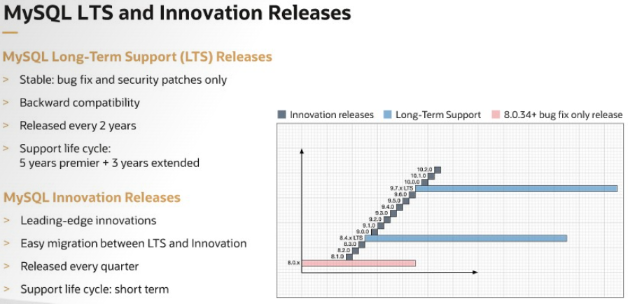

# Modelo de lançamento do MySQL
O modelo de lançamento do MySQL é dividido em versões LTS (Long-Term Support) e Innovation.

As versões LTS são estáveis em recursos e permitem a aplicação de correções de bugs e vulnerabilidades sem mudanças de comportamento, garantindo compatibilidade. São lançadas a cada dois anos e oferecem suporte por até oito anos.

Já as versões Innovation trazem os recursos mais recentes, desenvolvidos durante o ciclo LTS. A atualização entre LTS e Innovation é possível conforme a necessidade do aplicativo. As versões Innovation têm lançamentos trimestrais, com suporte apenas para a versão específica, exigindo atualizações mais frequentes.

# Material complementar
- https://endoflife.date/mysql