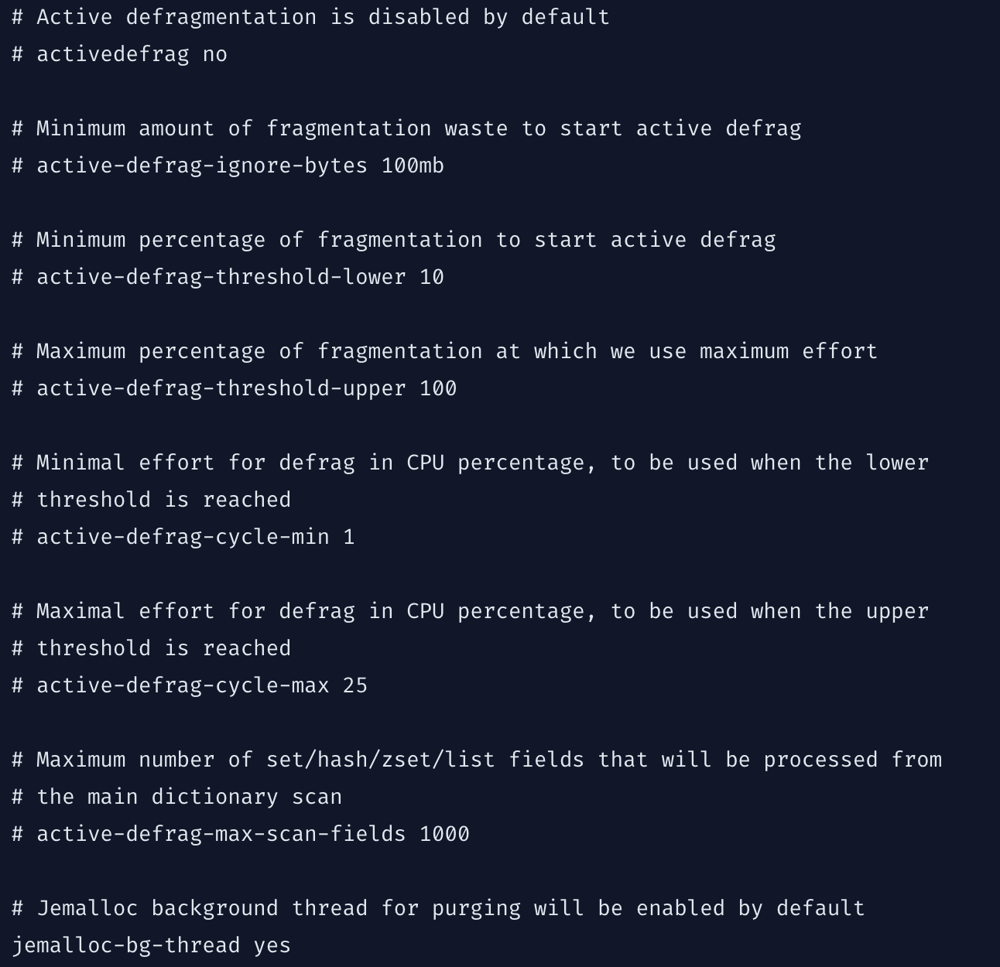

## Como o Redis gerencia a memória?

O Redis nem sempre libera (retorna) memória para o sistema operacional quando as chaves são removidas. Isso não é algo específico no Redis, mas é como a maioria das implementações de malloc() funcionam. Por exemplo, se você preencher uma instância com 5 GB de dados e, em seguida, remover o equivalente a 2 GB de dados, o Resident Set Size (também conhecido como RSS, que é o número de páginas de memória consumidas pelo processo) provavelmente ainda estará em torno de 5 GB, mesmo que o Redis afirme que a memória do usuário está em torno de 3 GB. Isso acontece porque o alocador subjacente não consegue liberar memória facilmente. Por exemplo, muitas vezes a maioria das chaves removidas foram alocadas nas mesmas páginas que as outras chaves que ainda existem.

O ponto anterior significa que você precisa provisionar memória com base no pico de uso de memória. Se sua carga de trabalho exigir 10 GB de vez em quando, mesmo que na maioria das vezes 5 GB possam bastar, você precisará provisionar 10 GB.

No entanto, os alocadores são inteligentes e são capazes de reutilizar pedaços livres de memória; portanto, depois de liberar 2 GB do seu conjunto de dados de 5 GB, quando você começar a adicionar mais chaves novamente, verá o RSS (Resident Set Size) permanecer estável e não crescer mais, à medida que você adiciona até 2 GB de chaves adicionais. O alocador está basicamente tentando reutilizar os 2 GB de memória previamente (logicamente) liberados.

Por tudo isso, a taxa de fragmentação não é confiável quando você tem um uso de memória que no pico é muito maior do que a memória usada atualmente. A fragmentação é calculada como a memória física realmente utilizada (o valor RSS) dividida pela quantidade de memória atualmente em uso (como a soma de todas as alocações realizadas pelo Redis). Como o RSS reflete o pico de memória, quando a memória (virtualmente) usada for baixa, pois muitas chaves/valores foram liberadas, mas o RSS for alto, a proporção RSS/mem_used será muito alta.

## Melhores práticas de gerenciamento de memória

### Configuração do Maxmemory

Dependendo da métrica de proporção de uso de memória do sistema, talvez seja necessário diminuir o limite de maxmemory para fornecer sobrecarga de memória para picos de carga de trabalho.

### Proporção de uso da memória do sistema

A métrica de proporção de uso de memória do sistema permite medir o uso de memória de uma instância em relação à memória do sistema. Se a métrica de proporção de uso de memória do sistema exceder 80%, isso pode indicar que a instância está sob pressão de memória. Se você não fizer nada e o uso da memória continuar a crescer, haverá risco de falha em uma instância devido à memória insuficiente. A métrica de proporção de uso de memória do sistema pode exceder 80% devido à fragmentação da memória. Outra possibilidade é que, se a métrica atingir rapidamente 80% ou mais, isso indicará que talvez você tenha usado operações com uso intenso de memória.

Se a proporção de uso de memória do sistema continuar a crescer drasticamente, ative activedefrag, diminua maxmemory e avalie se escalonará a instância.

### Fragmentação de memória

A fragmentação de memória pode fazer com que a instância do Redis fique sem memória mesmo quando a proporção de memória usada para maxmemory estiver baixa. A fragmentação de memória acontece quando o sistema operacional aloca páginas de memória que o Redis não pode utilizar totalmente após operações repetidas de gravação e exclusão. O acúmulo dessas páginas pode causar falta de memória do sistema e, por fim, falha no servidor Redis. A configuração activedefrag do Redis pode ajudar a reduzir a fragmentação.

### Desfragmentação ativa

As versões 4.0 e posteriores do Redis fornecem a configuração activedefrag. O Redis define activedefrag como "no" por padrão. Definir activedefrag como "yes" vem com uma troca de CPU, mas pode ajudar a atenuar a fragmentação de memória, o que contribui para problemas de falta de memória. Se a métrica de proporção de uso de memória do sistema indica a fragmentação de memória, considere ativar activedefrag.

## O que é desfragmentação ativa?

A desfragmentação ativa permite que um servidor Redis compacte os espaços deixados entre pequenas alocações e desalocações de dados na memória, permitindo assim recuperar a memória.

A fragmentação é um processo natural que acontece com todos os alocadores (mas nem tanto com Jemalloc, felizmente) e certas cargas de trabalho. Normalmente é necessário reiniciar o servidor para diminuir a fragmentação ou, pelo menos, eliminar todos os dados e criá-los novamente. Porém graças a este recurso implementado para Redis 4.0 este processo pode acontecer em tempo de execução de forma "quente", enquanto o servidor está em execução.

Basicamente, quando a fragmentação ultrapassa um determinado nível, o Redis começará a criar novas cópias dos valores em regiões de memória contíguas, explorando certos recursos específicos do Jemalloc (para entender se uma alocação está causando fragmentação e alocá-la em um local melhor) e, ao mesmo tempo, liberará as cópias antigas dos dados. Este processo, repetido de forma incremental para todas as chaves, fará com que a fragmentação volte aos valores normais.

Pontos importantes para considerar:

- Este recurso está desabilitado por padrão e só funciona se você compilou o Redis para usar a cópia do Jemalloc com o código-fonte do Redis.
- Você nunca precisará ativar esse recurso se não tiver problemas de fragmentação.
- Depois de experimentar a fragmentação, você pode ativar esse recurso quando necessário com o comando "CONFIG SET activedefrag yes". Os parâmetros de configuração são capazes de ajustar o comportamento do processo de desfragmentação. Se você não tiver certeza do que eles significam, é uma boa ideia deixar os padrões inalterados. Abaixo, a imagem lista a relação dos parâmetros envolvidos.

Obs.: Vale considerar também o uso do comando [MEMORY PURGE](https://redis.io/commands/memory-purge/), como alternativa.

## Referências:
- https://redis.io/docs/management/optimization/memory-optimization/#memory-allocation
- https://cloud.google.com/memorystore/docs/redis/memory-management-best-practices
- https://redis.io/docs/management/config-file/