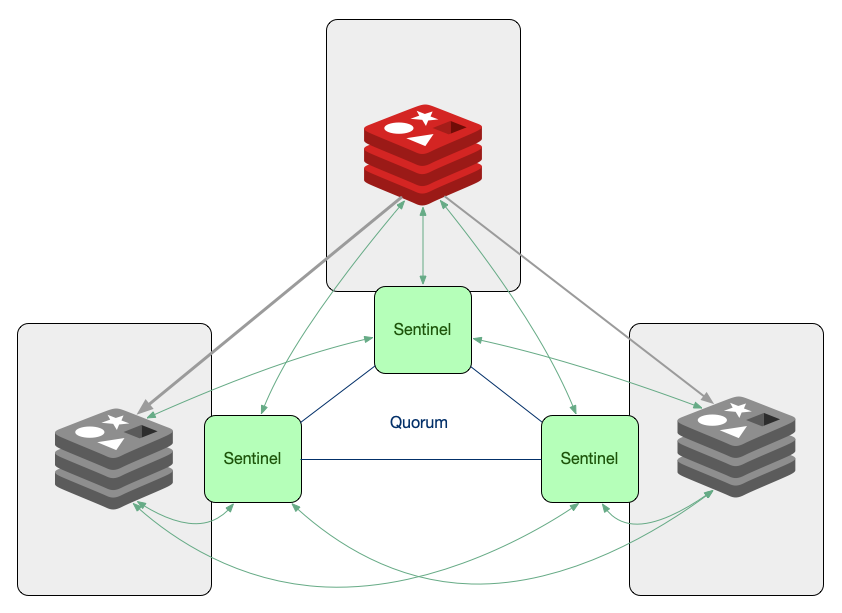

# Sentinel
A adoção do sentinel permitirá contar com alta disponibilidade, já que o failover será automático.

## Arquitetura básica


## Tutorial
Após ter configurado a [replicação](https://github.com/tavaresdb/db/blob/main/redis/alta%20disponibilidade/replication.md), prossiga com os passos abaixo para adoção do sentinel:

> Terminal 1
```bash
# O comando abaixo deverá retornar o caminho ~/replica, supondo que esse foi o último caminho navegável durante a configuração da replicação (https://github.com/tavaresdb/db/blob/main/redis/alta%20disponibilidade/replication.md)
pwd
touch sentinel2.conf
vi sentinel2.conf
..
port 26380
sentinel monitor myprimary 127.0.0.1 6379 2
sentinel down-after-milliseconds myprimary 5000
sentinel failover-timeout myprimary 60000
sentinel auth-pass myprimary a_strong_password
:wq
```

No parâmetro port especificamos a porta na qual o sentinel será executado. No parâmetro sentinel monitor especificamos os dados da instância primária. Definido o endereço e a porta, os sentinels poderão descobrir todas as réplicas por conta própria. O último argumento desse parâmetro equivale ao número de sentinels necessários para o quorum. No cenário acima o número é 2. No parâmetro sentinel down-after-milliseconds especificamos quantos milissegundos uma instância deve ficar inacessível para que seja considerada inativa. No parâmetro sentinel failover-timeout cobriremos o seguinte cenário: Se um sentinel votou em outro sentinel para o failover de um determinado master, ele esperará os ms especificados no parâmetro para tentar fazer o failover do mesmo master novamente. E no parâmetro sentinel auth-pass especificamos a senha para que os sentinels se conectem às instâncias configuradas com requirepass.

```bash
cd ../primary/
touch sentinel1.conf
vi sentinel1.conf
..
port 26379
sentinel monitor myprimary 127.0.0.1 6379 2
sentinel down-after-milliseconds myprimary 5000
sentinel failover-timeout myprimary 60000
sentinel auth-pass myprimary a_strong_password
:wq
cd ..
mkdir sentinel
cd sentinel/
touch sentinel3.conf
vi sentinel3.conf
..
port 26381
sentinel monitor myprimary 127.0.0.1 6379 2
sentinel down-after-milliseconds myprimary 5000
sentinel failover-timeout myprimary 60000
sentinel auth-pass myprimary a_strong_password
:wq
redis-server sentinel3.conf --sentinel --daemonize yes
cd ../replica/
redis-server sentinel2.conf --sentinel --daemonize yes
cd ../primary/
redis-server sentinel1.conf --sentinel --daemonize yes
ps aux | grep redis
root        27  0.4  0.0 133312  6236 ?        Ssl  14:31   0:07 redis-server *:6379
root        40  0.4  0.0 152320  6304 ?        Ssl  14:36   0:07 redis-server *:6380
root        84  0.7  0.0  57472  5916 ?        Ssl  15:00   0:00 redis-server *:26379 [sentinel]
root        92  0.7  0.0  57472  5912 ?        Ssl  15:00   0:00 redis-server *:26380 [sentinel]
root        99  0.7  0.0  57472  5896 ?        Ssl  15:01   0:00 redis-server *:26381 [sentinel]
root       105  0.0  0.0   2884  1292 pts/1    S+   15:01   0:00 grep --color=auto redis
```

Os próximos comandos devem ser executados diretamente no sentinel, caso contrário irão reportar a seguinte mensagem: (error) ERR unknown command 'SENTINEL', with args beginning with: 'XX' 'YY'.

> Terminal 3
```bash
redis-cli -p 26379
127.0.0.1:26379> SENTINEL master myprimary
 1) "name"
 2) "myprimary"
 3) "ip"
 4) "127.0.0.1"
 5) "port"
 6) "6379"
 7) "runid"
 8) "908bea21f2280ed5ccc7277d517bec8248a4222c"
 9) "flags"
10) "master"
11) "link-pending-commands"
12) "0"
13) "link-refcount"
14) "1"
15) "last-ping-sent"
16) "0"
17) "last-ok-ping-reply"
18) "742"
19) "last-ping-reply"
20) "742"
21) "down-after-milliseconds"
22) "5000"
23) "info-refresh"
24) "10022"
25) "role-reported"
26) "master"
27) "role-reported-time"
28) "220797"
29) "config-epoch"
30) "0"
31) "num-slaves"
32) "1"
33) "num-other-sentinels"
34) "2"
35) "quorum"
36) "2"
37) "failover-timeout"
38) "60000"
39) "parallel-syncs"
40) "1"
```

O comando acima fornece informações sobre a primária.

```bash
127.0.0.1:26379> SENTINEL replicas myprimary
1)  1) "name"
    2) "127.0.0.1:6380"
    3) "ip"
    4) "127.0.0.1"
    5) "port"
    6) "6380"
    7) "runid"
    8) "aaf810411c628ad37acbdd295a95a54730d8698e"
    9) "flags"
   10) "slave"
   11) "link-pending-commands"
   12) "0"
   13) "link-refcount"
   14) "1"
   15) "last-ping-sent"
   16) "0"
   17) "last-ok-ping-reply"
   18) "808"
   19) "last-ping-reply"
   20) "808"
   21) "down-after-milliseconds"
   22) "5000"
   23) "info-refresh"
   24) "8871"
   25) "role-reported"
   26) "slave"
   27) "role-reported-time"
   28) "471116"
   29) "master-link-down-time"
   30) "0"
   31) "master-link-status"
   32) "ok"
   33) "master-host"
   34) "127.0.0.1"
   35) "master-port"
   36) "6379"
   37) "slave-priority"
   38) "100"
   39) "slave-repl-offset"
   40) "87438"
   41) "replica-announced"
   42) "1"
```

O comando acima fornece informações sobre as réplicas.

```bash
127.0.0.1:26379> SENTINEL sentinels myprimary
1)  1) "name"
    2) "f1d7abf2cd8e7eec3ae11f7cd6f3b4609623a230"
    3) "ip"
    4) "127.0.0.1"
    5) "port"
    6) "26381"
    7) "runid"
    8) "f1d7abf2cd8e7eec3ae11f7cd6f3b4609623a230"
    9) "flags"
   10) "sentinel"
   11) "link-pending-commands"
   12) "0"
   13) "link-refcount"
   14) "1"
   15) "last-ping-sent"
   16) "0"
   17) "last-ok-ping-reply"
   18) "947"
   19) "last-ping-reply"
   20) "947"
   21) "down-after-milliseconds"
   22) "5000"
   23) "last-hello-message"
   24) "109"
   25) "voted-leader"
   26) "?"
   27) "voted-leader-epoch"
   28) "0"
2)  1) "name"
    2) "4cd203eab91a5202c0526ea1f960d27808f52d54"
    3) "ip"
    4) "127.0.0.1"
    5) "port"
    6) "26380"
    7) "runid"
    8) "4cd203eab91a5202c0526ea1f960d27808f52d54"
    9) "flags"
   10) "sentinel"
   11) "link-pending-commands"
   12) "0"
   13) "link-refcount"
   14) "1"
   15) "last-ping-sent"
   16) "0"
   17) "last-ok-ping-reply"
   18) "947"
   19) "last-ping-reply"
   20) "947"
   21) "down-after-milliseconds"
   22) "5000"
   23) "last-hello-message"
   24) "1526"
   25) "voted-leader"
   26) "?"
   27) "voted-leader-epoch"
   28) "0"
```

O comando acima fornece informações sobre os outros sentinels.

```bash
127.0.0.1:26379> SENTINEL get-master-addr-by-name myprimary
1) "127.0.0.1"
2) "6379"
```

O comando acima fornece o endereço do atual primário.

> Terminal 2 (Simulação de falha)
```bash
127.0.0.1:6379> SHUTDOWN SAVE
(0.66s)
not connected>
```

Obs.: O comando acima simula a falha do atual primário e posteriormente um novo primário será eleito. Uma alternativa seria a emissão do comando SENTINEL FAILOVER <nome do master>, forçando o failover mesmo sem a concordância entre outros sentinels (Uma nova versão da configuração será publicada para que os outros sentinels atualizem suas configurações).

> Terminal 3
```bash
127.0.0.1:26379> SENTINEL get-master-addr-by-name myprimary
1) "127.0.0.1"
2) "6380"
```

## Referências:
- https://developer.redis.com/operate/redis-at-scale/high-availability/understanding-sentinels/
- https://redis.io/docs/management/sentinel/