# Redis Cluster - Instalação, configuração, adição de nós e remoção de nós

### Preparação do ambiente, instalação e configuração do Redis
```bash
apt install ruby-full
gem install redis
# Para instalação do Redis, consulte: https://github.com/tavaresdb/db/blob/main/redis/instala%C3%A7%C3%A3o/install.sh
mkdir cluster-test
cd cluster-test
wget https://github.com/antirez/redis-rb-cluster/archive/refs/heads/master.zip
unzip master.zip
rm -f master.zip
vi redis-rb-cluster-master/cluster.rb
..
require './redis-rb-cluster-master/crc16'
..
:wq
vi redis-rb-cluster-master/consistency-test.rb
..
require './redis-rb-cluster-master/cluster'
..
:wq
vi redis-rb-cluster-master/example.rb
..
require './redis-rb-cluster-master/cluster'

if ARGV.length != 2
    startup_nodes = [
        {:host => "127.0.0.1", :port => 7000},
        {:host => "127.0.0.1", :port => 7001}
    ]
else
    startup_nodes = [
        {:host => ARGV[0], :port => ARGV[1].to_i}
    ]
end
..
:wq
vi redis.conf
..
port 7000
cluster-enabled yes
cluster-config-file nodes.conf
cluster-node-timeout 5000
appendonly yes
:wq
mkdir 7000 7001 7002 7003 7004 7005 7006 7007 7008 7009
cp redis.conf 7000/
cp redis.conf 7001/
vi 7001/redis.conf
..
port 7001
..
:wq
cp redis.conf 7002/
vi 7002/redis.conf
..
port 7002
..
:wq
cp redis.conf 7003/
vi 7003/redis.conf
..
port 7003
..
:wq
cp redis.conf 7004/
vi 7004/redis.conf
..
port 7004
..
:wq
cp redis.conf 7005/
vi 7005/redis.conf
..
port 7005
..
:wq
cp redis.conf 7006/
vi 7006/redis.conf
..
port 7006
..
:wq
cp redis.conf 7007/
vi 7007/redis.conf
..
port 7007
..
:wq
cp redis.conf 7008/
vi 7008/redis.conf
..
port 7008
..
:wq
cp redis.conf 7009/
vi 7009/redis.conf
..
port 7009
..
:wq
rm -f redis.conf
cd 7000
redis-server redis.conf --daemonize yes
cd ../7001
redis-server redis.conf --daemonize yes
cd ../7002
redis-server redis.conf --daemonize yes
cd ../7003
redis-server redis.conf --daemonize yes
cd ../7004
redis-server redis.conf --daemonize yes
cd ../7005
redis-server redis.conf --daemonize yes
cd ../7006
redis-server redis.conf --daemonize yes
cd ../7007
redis-server redis.conf --daemonize yes
cd ../7008
redis-server redis.conf --daemonize yes
cd ../7009
redis-server redis.conf --daemonize yes
cd ..
ps aux | grep redis
```

### Criação do cluster
```bash
redis-cli --cluster create 127.0.0.1:7000 127.0.0.1:7001 127.0.0.1:7002 127.0.0.1:7003 127.0.0.1:7004 127.0.0.1:7005 --cluster-replicas 1
ruby ./redis-rb-cluster-master/example.rb
```

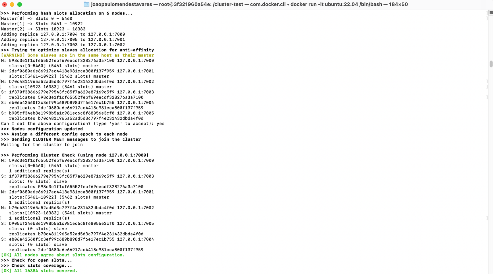
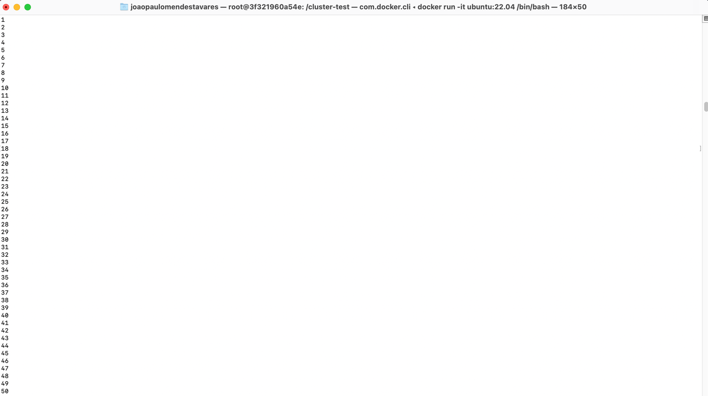

Obs.: Uma vez que iniciou-se a execução do script ruby, aberta nova sessão para interação com o client do Redis.

```bash
redis-cli --cluster check 127.0.0.1:7000
```

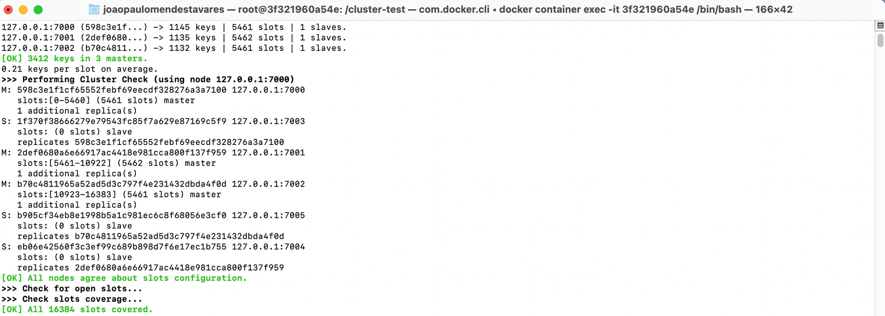

### Adição de shards
```bash
redis-cli --cluster add-node 127.0.0.1:7006 127.0.0.1:7000
redis-cli --cluster add-node 127.0.0.1:7008 127.0.0.1:7000
```


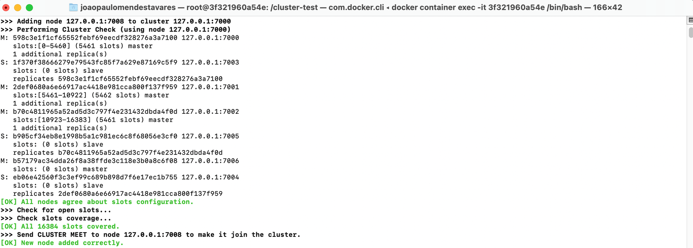

### Adição de réplicas aos shards recém incluídos
```bash
redis-cli -p 7000 cluster nodes
redis-cli --cluster add-node 127.0.0.1:7007 127.0.0.1:7000 --cluster-slave --cluster-master-id UUID_PORT7006
redis-cli --cluster add-node 127.0.0.1:7009 127.0.0.1:7000 --cluster-slave --cluster-master-id UUID_PORT7008
redis-cli --cluster check 127.0.0.1:7000
```

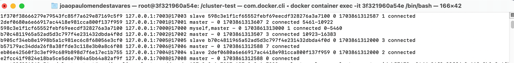
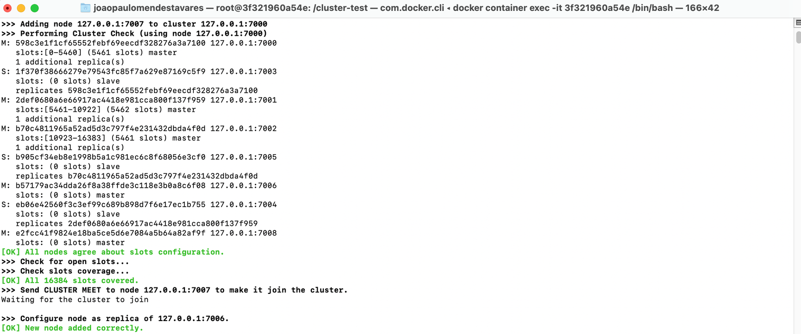
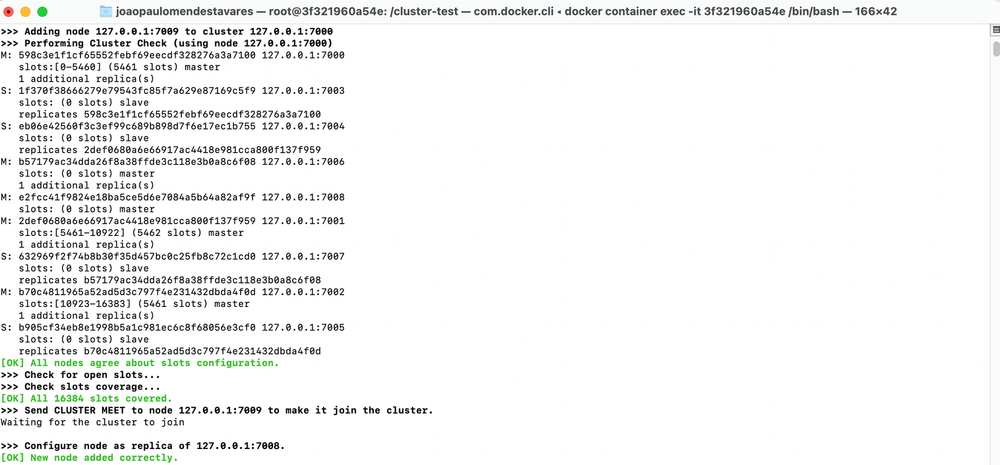
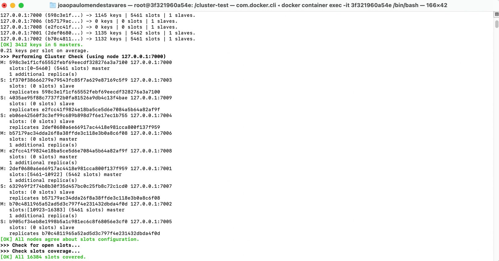

### Rebalanceamento dos slots entre os shards
```bash
redis-cli --cluster rebalance 127.0.0.1:7006 --cluster-use-empty-masters
redis-cli --cluster check 127.0.0.1:7000
```

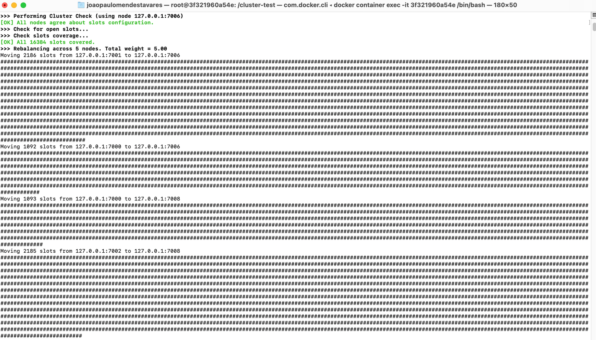
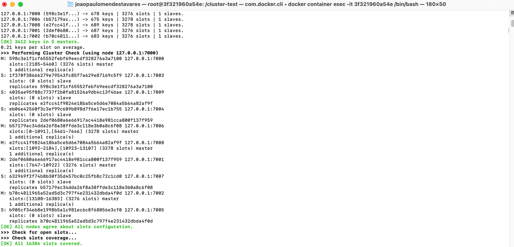

### Remoção de réplicas, para que posteriormente seja possível eliminar alguns shards
```bash
redis-cli --cluster del-node 127.0.0.1:7007 UUID_PORT7007
redis-cli --cluster del-node 127.0.0.1:7009 UUID_PORT7009
redis-cli --cluster check 127.0.0.1:7000
```

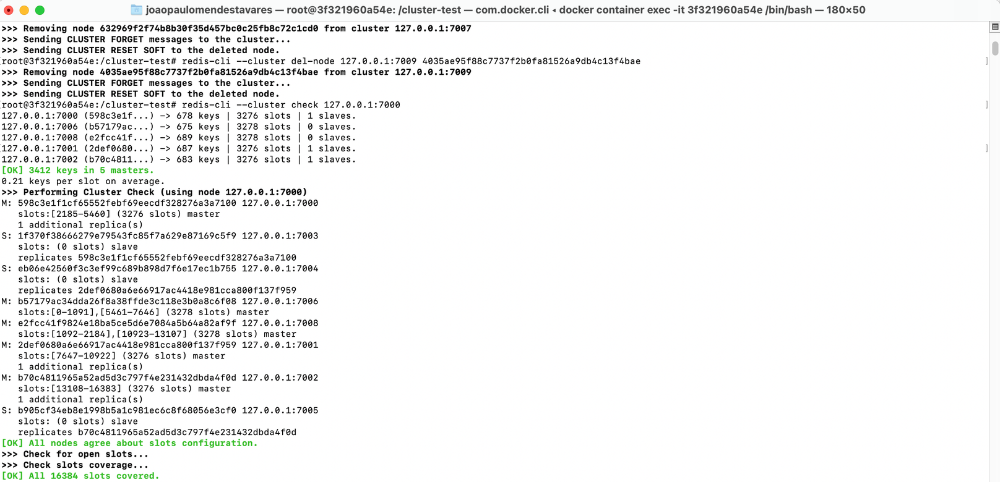

### Migração dos slots, do shard que será removido para um dos shards que permanecerá
```bash
redis-cli --cluster reshard 127.0.0.1:7006 \
--cluster-from UUID_PORT7006 \
--cluster-to UUID_PORT7000 \
--cluster-slots NRO_SLOTS_PORT7006 \
--cluster-yes
redis-cli --cluster reshard 127.0.0.1:7008 \
--cluster-from UUID_PORT7008 \
--cluster-to UUID_PORT7002 \
--cluster-slots NRO_SLOTS_PORT7008 \
--cluster-yes
redis-cli --cluster check 127.0.0.1:7000
```

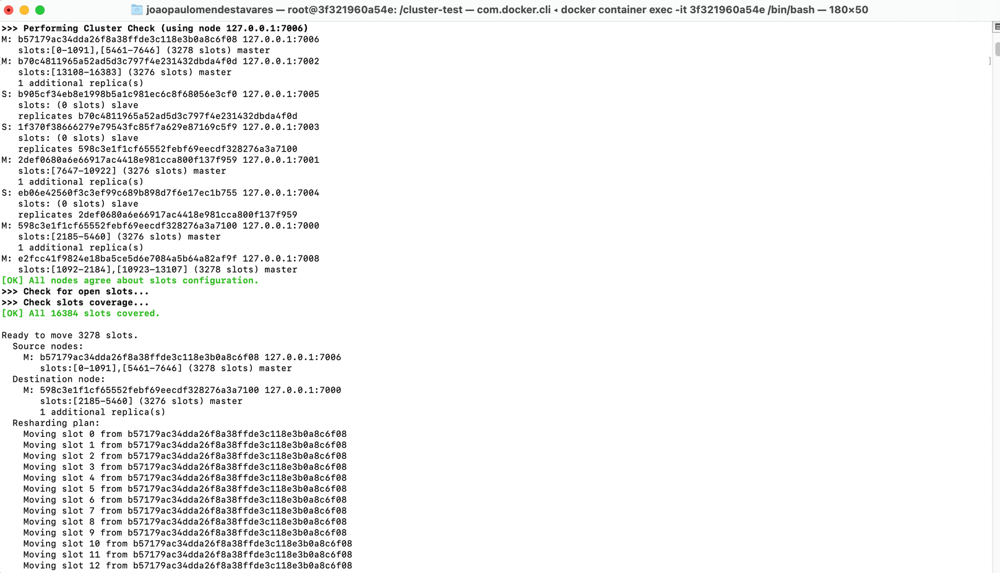
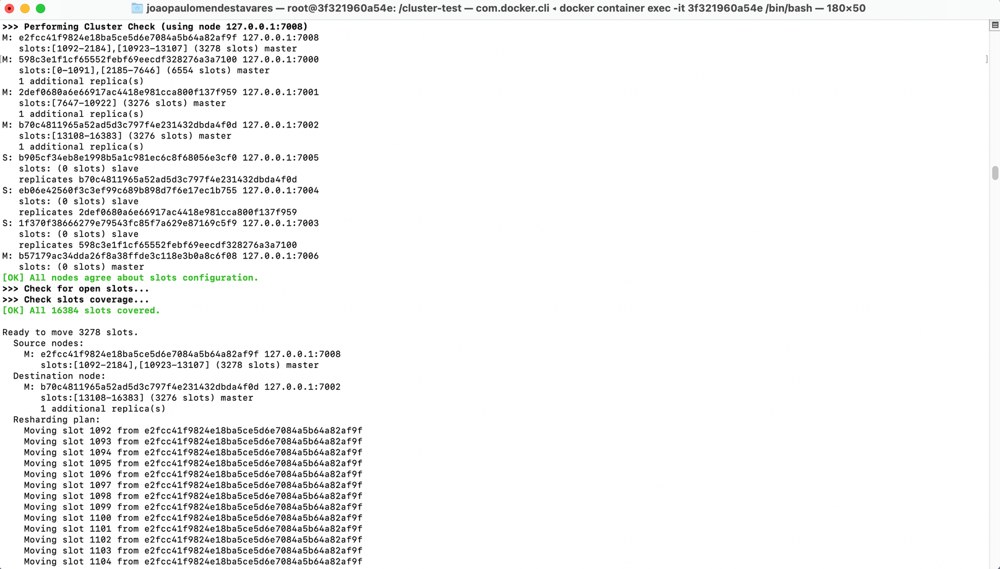
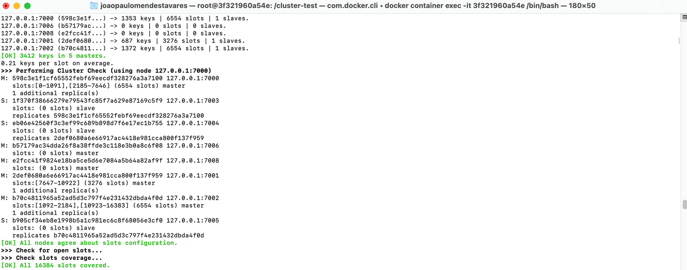

### Rebalanceamento dos slots entre os shards
```bash
redis-cli --cluster rebalance 127.0.0.1:7000
redis-cli --cluster check 127.0.0.1:7000
```

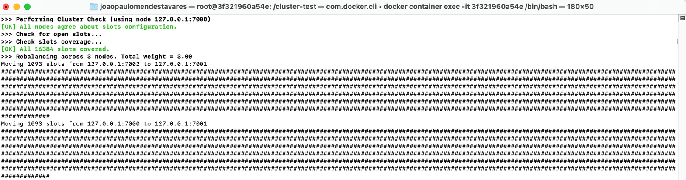
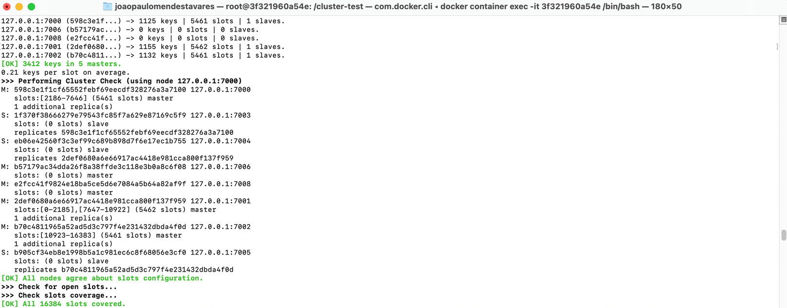

### Remoção de shards
```bash
redis-cli --cluster del-node 127.0.0.1:7006 UUID_PORT7006
redis-cli --cluster del-node 127.0.0.1:7008 UUID_PORT7008
redis-cli --cluster check 127.0.0.1:7000
```

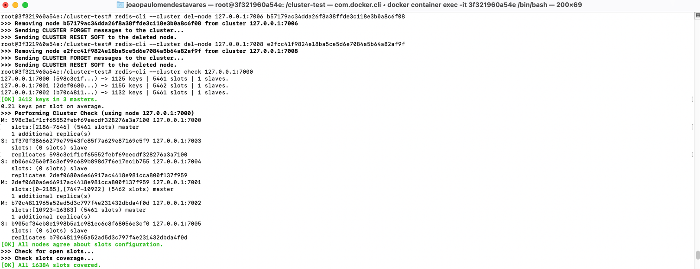

Obs.: Todas as operações acima podem ser realizadas sem interrupção do serviço Redis, no entanto o aplicativo deve usar os clientes/drivers/conectores compatíveis do Redis para que a solicitação possa ser redirecionada para os shards corretos enquanto o rebalanceamento ou o resharding estiver acontecendo.

Durante a POC foi utilizada a app example.rb, entretanto a consistency-test.rb tende a ser mais interessante, pois é um verificador de consistência simples e é capaz de dizer se o cluster perdeu alguma gravação ou se aceitou uma escrita pela qual não temos reconhecimento. Abaixo, uma amostra:

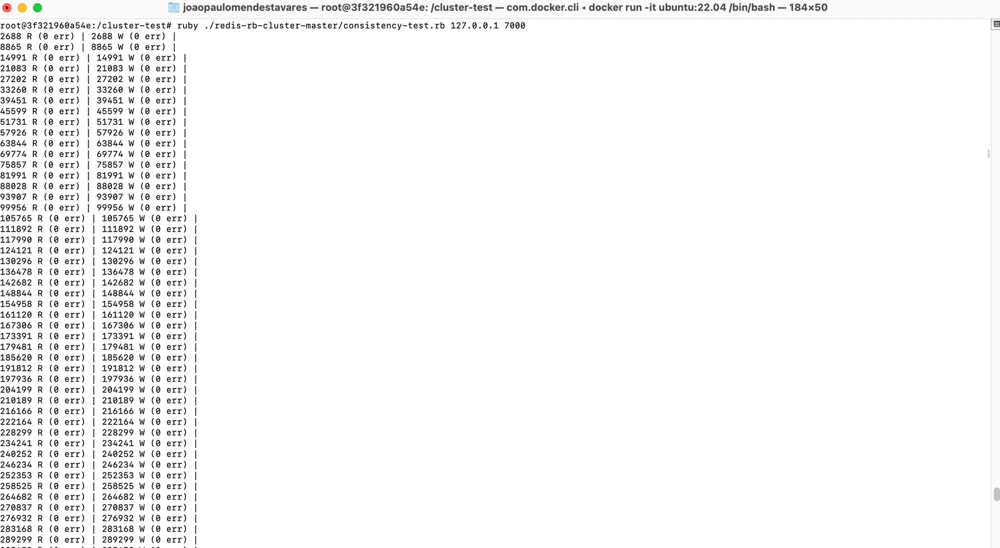

### Referências:

https://redis.io/docs/reference/cluster-spec/
https://redis.io/docs/management/scaling/
https://github.com/antirez/redis-rb-cluster/tree/master/
https://severalnines.com/blog/hash-slot-resharding-and-rebalancing-redis-cluster/