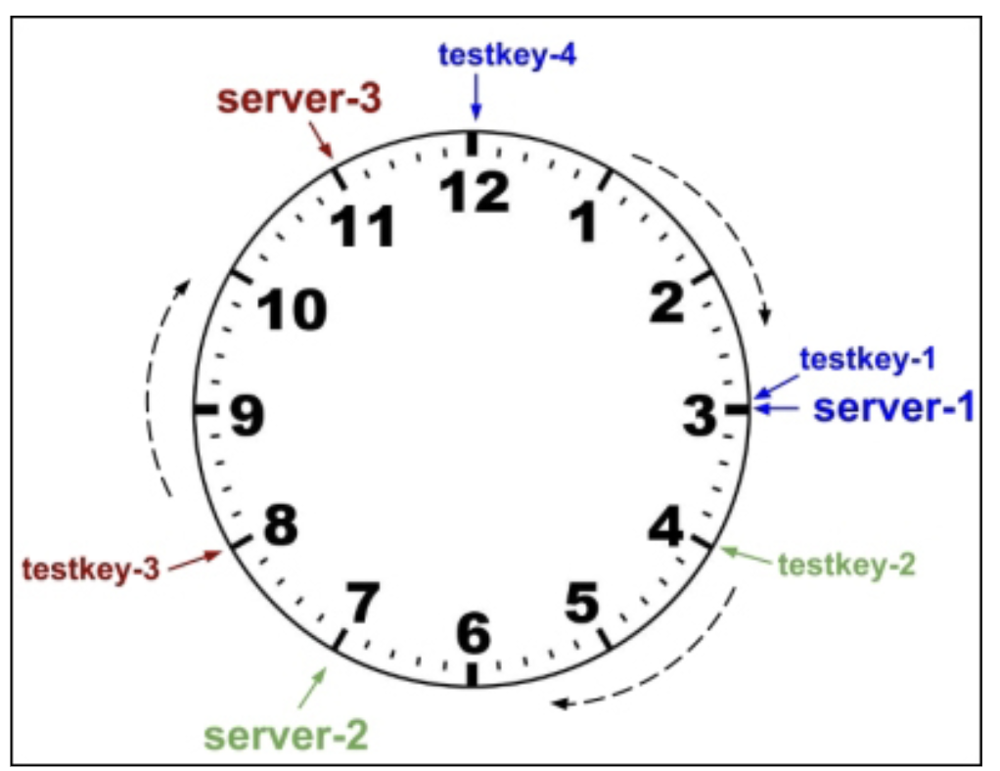
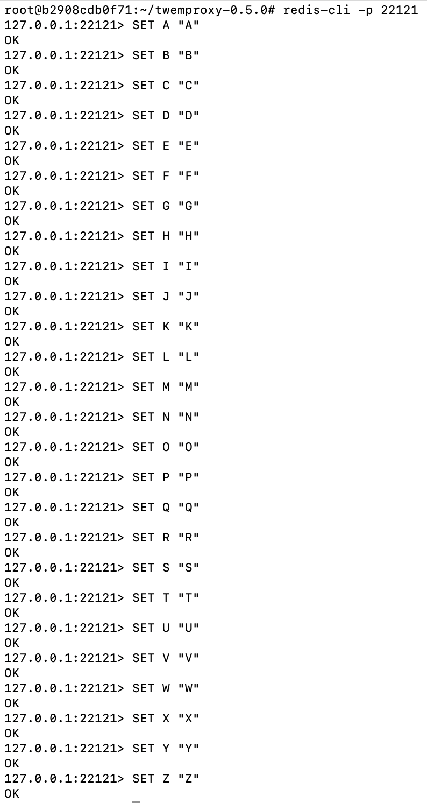
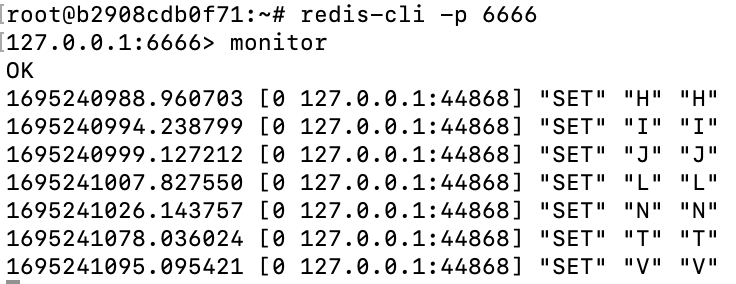
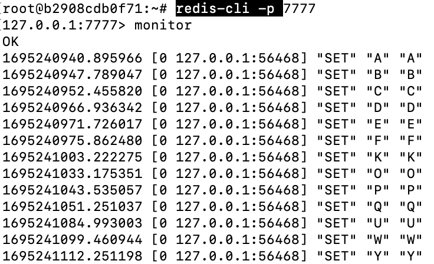
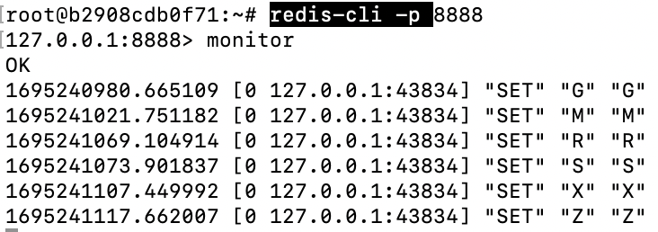
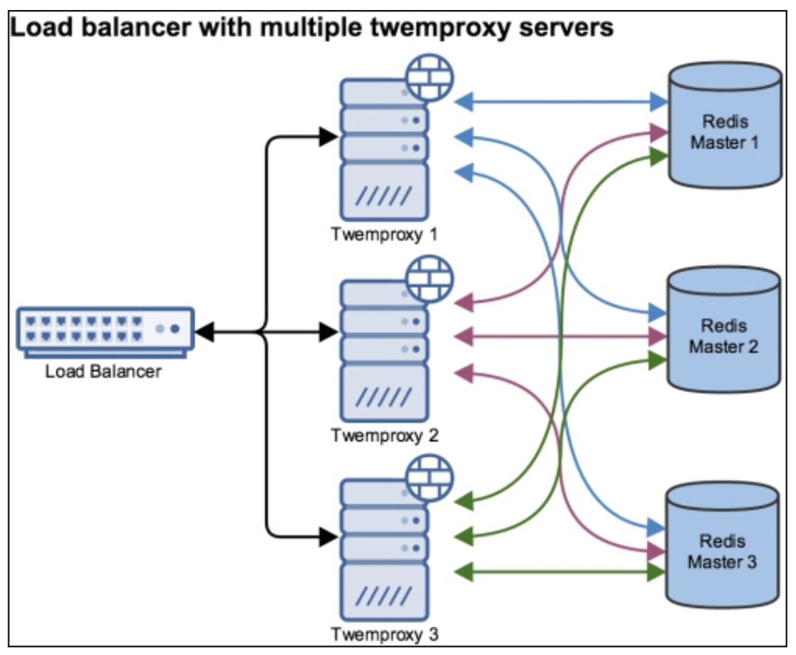

# Redis Ring - O que é?

## Escala horizontal
Podemos usar réplicas para otimizar leituras e remover alguns gargalos na instância master, mas em alguns casos essa abordagem não é suficiente. Considere os cenários abaixo:

• O total de dados à ser armazenado é maior do que o total de memória disponível;

• A largura de banda da rede não é suficiente para lidar com todo o tráfego.

Via escala horizontal podemos resolver os cenários acima. Eis alguns tipos:

• **Range partition:** Distribui os dados baseado em uma faixa(range) de chaves. O lado negativo nessa abordagem é que algumas faixas podem conter mais chaves do que outras, desbalanceando o cluster e impactando o desempenho;

• **Hash partition:** Ao contrário da abordagem anterior, esta distribui de forma equilibrada as chaves entre as instâncias, visto que é aplicado uma função hash à chave e é feita a divisão pelo número de instâncias. O lado negativo nessa abordagem é que o número de instâncias não pode ser alterado, caso contrário resultaria em erros de cache;

• **Consistent hashing:** É um tipo de hashing que remapeia apenas uma pequena parte dos dados para diferentes instâncias quando houver uma alteração no número de instâncias. Por exemplo, em um cluster com 100 chaves e 4 instâncias, adicionar uma nova instância (totalizando 5 instâncias) remapearia apenas 25 chaves em média. Essa técnica é conhecida como hash ring. A técnica consiste em criar vários pontos em um círculo para cada chave e instância Redis. A instância apropriada para uma determinada chave é a instância mais próxima dessa chave no círculo (sentido horário). Este círculo é referenciado como **'Ring'**. Os pontos são criados usando uma função de hash, como MD5. Para ser mais claro, considere o exemplo abaixo:

   - Instâncias disponíveis: server-1, server-2, server-3;
   - Chaves à serem armazenadas: testkey-1, testkey-2, testkey-3, testkey-4;
   - Pontos por instância: 1.

   Assuma que a função hash retornará os seguintes valores por instância:

   - hash("server-1") = 3;
   - hash("server-2") = 7;
   - hash("server-3") = 11.

   E a função hash retornará os seguintes valores por chave:

   - hash("testkey-1") = 3;
   - hash("testkey-2") = 4;
   - hash("testkey-3") = 8;
   - hash("testkey-4") = 12.

   Conforme imagem abaixo, o diagrama demonstra como é feito o direcionamento das chaves para as instâncias. Nesse exemplo foi definido 1 ponto por instância, entretanto em ambiente produtivo é recomendável o uso de N pontos, pois assim facilitará a distribuição das chaves e manterá o ring equilibrado.

   

## Tagging
Tagging é uma técnica para garantir que as chaves sejam armazenadas no mesmo servidor. Escolha uma convenção para seus nomes de chaves e adicione um prefixo ou sufixo, por exemplo key_name:{tag}. Em seguida, decida como rotear essa chave com base no prefixo ou sufixo adicionado. Comandos como SDIFF, SINTER e SUNION exigem que todas as chaves sejam armazenadas na mesma instância.

## Armazenamento de dados x Cache
Quando o Redis é usado para armazenar dados, as chaves devem sempre ser mapeadas para as mesmas instâncias e o uso de tags deve ser adotado. Isso significa que não pode haver alterações no número de instâncias, caso contrário uma chave pode ser mapeada para uma instância incorreta. Uma maneira de resolver isso é criando cópias dos dados em outras instâncias para que cada chave seja replicada para várias instâncias e o sistema saiba como rotear as consultas. Essa abordagem é bem trabalhosa, já que essa lógica seria criada pelos desenvolvedores, e o Redis Cluster é feito para resolver esse tipo de problema. Em resumo, quando o Redis for usado como um cache, use consistent hashing para minimizar erros de cache. Quando for usado para armazenamento de dados, considere o Redis Cluster ou uma solução que garanta que os dados sejam replicados entre os nós e que cada instância saiba como rotear a consulta para instância certa.

## Implementações de escala vertical no Redis
• client: Regra implementada na camada de aplicativo;

• proxy: À seguir será fornecido um exemplo com o programa twemproxy;

• query router: Regra é transparente para o aplicativo, sendo de responsabilidade do server o roteamento das consultas, como por exemplo o Redis Cluster.

Como estudo de caso, abordaremos aqui a implementação via proxy. O [twemproxy](https://github.com/twitter/twemproxy/), também conhecido como nutcracker, é um proxy rápido e leve para protocolo memcached e redis. Ele foi construído principalmente para reduzir o número de conexões com os servidores de cache no back-end. Dessa forma temos condições de dimensionar horizontalmente o cache, tornando-o distribuído.

> Terminal 1
```bash
apt update
apt install linux-libc-dev gcc make net-tools
# Para instalação do Redis, consulte: https://github.com/tavaresdb/db/blob/main/redis/instala%C3%A7%C3%A3o/install.sh
redis-server --port 6666 --daemonize yes
redis-server --port 7777 --daemonize yes
redis-server --port 8888 --daemonize yes
wget https://github.com/twitter/twemproxy/releases/download/0.5.0/twemproxy-0.5.0.tar.gz
tar -zxf twemproxy-0.5.0.tar.gz
cd twemproxy-0.5.0
./configure
make
./src/nutcracker --help
vi config/nutcracker.yaml
..
my_cluster:
  listen: 127.0.0.1:22121
  hash: md5
  distribution: ketama
  auto_eject_hosts: true
  redis: true
  servers:
   - 127.0.0.1:6666:1 server1
   - 127.0.0.1:7777:1 server2
   - 127.0.0.1:8888:1 server3
:wq
```

Obs.: Dentre os parâmetros acima, o que merece destaque é o distribution. Definir o valor ketama é equivalente a optar pelo consistent hashing.

```bash
./src/nutcracker -t
nutcracker: configuration file 'conf/nutcracker.yml' syntax is ok
./src/nutcracker -d
netstat -tulpn | grep LISTEN
tcp        0      0 0.0.0.0:8888            0.0.0.0:*               LISTEN      11929/redis-server  
tcp        0      0 127.0.0.1:22121         0.0.0.0:*               LISTEN      12747/./src/nutcrac 
tcp        0      0 0.0.0.0:22222           0.0.0.0:*               LISTEN      12747/./src/nutcrac 
tcp        0      0 0.0.0.0:6666            0.0.0.0:*               LISTEN      11915/redis-server  
tcp        0      0 0.0.0.0:7777            0.0.0.0:*               LISTEN      11922/redis-server  
tcp6       0      0 :::8888                 :::*                    LISTEN      11929/redis-server  
tcp6       0      0 :::6666                 :::*                    LISTEN      11915/redis-server  
tcp6       0      0 :::7777                 :::*                    LISTEN      11922/redis-server

redis-cli -p 22121
```

A imagem abaixo demonstrará a definição de algumas chaves, entretanto é aconselhável que em paralelo crie outras sessões (Terminal 2, 3 e 4) para que seja possível acompanhar a distribuição dos dados entre os nós.



> Terminal 2
```bash
redis-cli -p 6666
monitor
```



> Terminal 3
```bash
redis-cli -p 7777
monitor
```



> Terminal 4
```bash
redis-cli -p 8888
monitor
```



A implementação acima torna o twemproxy um ponto único de falha. Para mudar tal implementação, considere a arquitetura abaixo:



### Referência:

Livro Redis Essentials: Harness the power of Redis to integrate and manage your projects efficiently, por Maxwell Dayvson Da Silva e Hugo Lopes Tavares. Páginas 148-168.