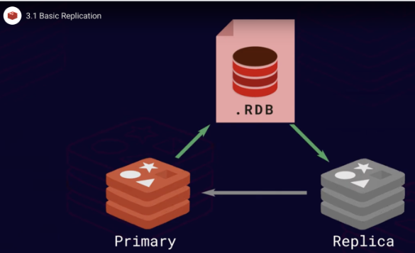

# Replicação
A replicação no Redis segue um modelo simples, primary-replica, onde a replicação ocorre em uma direção - da primária para uma ou várias réplicas. Os dados são gravados apenas na instância primária e as réplicas são mantidas sincronizadas para que sejam cópias exatas das primárias.

## Arquitetura básica


## Tutorial
> Terminal 1
```bash
mkdir primary
mkdir replica
cd primary/
touch primary.conf
vi primary.conf
..
port 6379
requirepass a_strong_password
masterauth a_strong_password
appendonly yes
appendfilename "primary.aof"
:wq
```

No parâmetro port especificamos a porta na qual o servidor será executado. No parâmetro requirepass especificamos uma senha. No parâmetro masterauth especificamos a senha AUTH da instância primária caso esta instância se torne uma réplica. No parâmetro appendonly ativamos a [persistência de dados](https://github.com/tavaresdb/db/blob/main/redis/persistence/persistence.md) e no parâmetro appendfilename definimos o nome do arquivo AOF.

```bash
redis-server primary.conf --daemonize yes
cd ../replica/
vi replica.conf
..
port 6380
replicaof 127.0.0.1 6379
requirepass a_strong_password
masterauth a_strong_password
appendonly yes
appendfilename "replica.aof"
:wq
```

No arquivo de configuração da replica é adicionado um novo parâmetro. No parâmetro replicaof especificamos a instância primária.

```bash
redis-server replica.conf --daemonize yes
ps aux | grep redis
root 27 0.4 0.0 57472  6068 ?     Ssl 14:31 0:01 redis-server *:6379
root 40 0.4 0.0 133312 6072 ?     Ssl 14:36 0:00 redis-server *:6380
root 49 0.0 0.0 2884   1296 pts/1 S+  14:36 0:00 grep --color=auto redis
```

> Terminal 2
```bash
redis-cli
127.0.0.1:6379> AUTH a_strong_password
OK
127.0.0.1:6379> SET foo bar
OK
```

> Terminal 3
```bash
redis-cli -p 6380
127.0.0.1:6380> AUTH a_strong_password
OK
127.0.0.1:6380> MONITOR
OK
1695134878.658155 [0 127.0.0.1:6379] "ping"
1695134886.670815 [0 127.0.0.1:6379] "SELECT" "0"
1695134886.670848 [0 127.0.0.1:6379] "SET" "foo" "bar"
1695134888.950688 [0 127.0.0.1:6379] "ping"
```

## Notas
- Como uma réplica recém-adicionada sincroniza dados da instância primária? Depois que uma instância de réplica estiver funcionando, a réplica tentará sincronizar com a primária. Para transferir todos os seus dados da maneira mais eficiente possível, a instância primária produzirá uma versão compactada dos dados em um arquivo .rdb e a enviará para a réplica. A réplica então lerá o arquivo de instantâneo e carregará todos os seus dados na memória, o que o levará ao mesmo estado que a instância primária tinha no momento da criação do arquivo .rdb. Quando o estágio de carregamento estiver concluído, a instância primária enviará o backlog de todos os comandos de gravação executados desde que o instantâneo foi feito.
- A configuração acima não é suficiente para garantir failover automático. Isso será abordado posteriormente, com a adoção do sentinel.

## Referências:
- https://developer.redis.com/operate/redis-at-scale/high-availability/introduction/
- https://developer.redis.com/operate/redis-at-scale/high-availability/basic-replication/