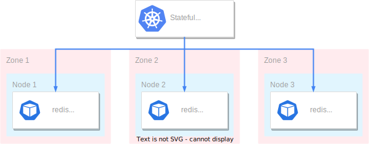
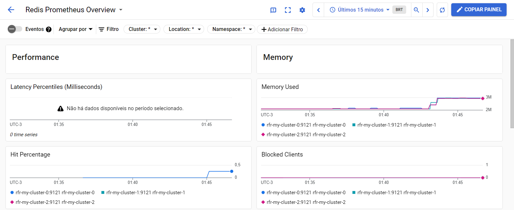
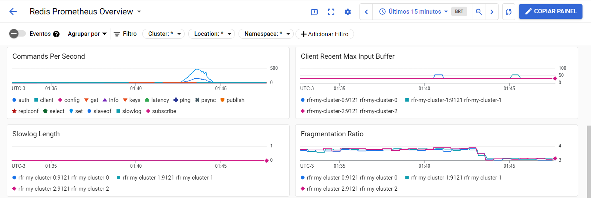
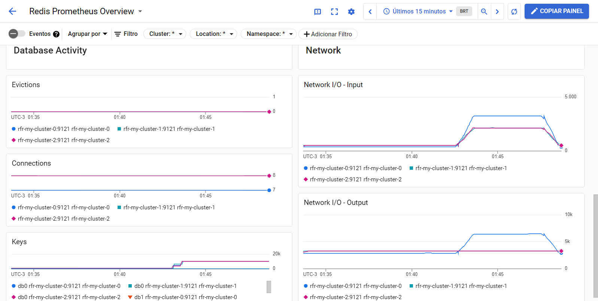

# Arquitetura de implantação
Vamos usar o operator Spotahome para implantar e configurar um Redis altamente disponível no GKE (Google Kubernetes Engine) com um nó líder e duas réplicas de leitura, além do Redis Sentinel.

Também vamos implantar um cluster regional do GKE altamente disponível para o Redis, com vários nós do Kubernetes espalhados por várias zonas de disponibilidade. Essa configuração ajuda a garantir tolerância a falhas, escalabilidade e redundância geográfica.

O diagrama a seguir mostra como o Redis será executado em vários nós e zonas em um cluster do GKE:



Para controlar como o GKE implanta o StatefulSet em nós e zonas, foi definida [topology spread constraints](https://kubernetes.io/docs/concepts/scheduling-eviction/topology-spread-constraints/) na especificação dos pods.

Importante: O tutorial não aborda todas as questões relacionadas a ambiente produtivo. Sendo assim, pense criticamente antes de cogitar a adoção desse procedimento.

# Configuração inicial do ambiente
Execute os seguintes comandos no Cloud Shell:

```bash
gcloud services enable compute.googleapis.com iam.googleapis.com container.googleapis.com gkebackup.googleapis.com cloudresourcemanager.googleapis.com

export PROJECT_ID={Defina seu Project ID}
export KUBERNETES_CLUSTER_PREFIX=redis
export REGION=us-central1

git clone https://github.com/tavaresdb/db
cd db/redis/k8s
```

# Criação da infraestrutura do cluster
O diagrama a seguir mostra um cluster privado regional standard do GKE implantado em três zonas diferentes:


Para implantar essa infraestrutura, execute os seguintes comandos no Cloud Shell:
```bash
export GOOGLE_OAUTH_ACCESS_TOKEN=$(gcloud auth print-access-token)
terraform -chdir=iac/gke-standard init
terraform -chdir=iac/gke-standard apply -var project_id=${PROJECT_ID} \
  -var region=${REGION} \
  -var cluster_prefix=${KUBERNETES_CLUSTER_PREFIX}
```

O Terraform criará os seguintes recursos:

• Uma rede VPC e uma sub-rede privada para os nós do Kubernetes.

• Um roteador para acessar a internet usando NAT.

• Um cluster privado do GKE na região us-central1.

• Node pool com escalonamento automático ativado (de um a dois nós por zona, sendo no mínimo um nó por zona).

• Uma ServiceAccount com permissões de registro e monitoramento.

• Backup do GKE para recuperação de desastres.

• Google Cloud Managed Service para Prometheus para monitoramento de clusters.

Por fim, recupere as credencias do cluster...

```bash
gcloud container clusters get-credentials ${KUBERNETES_CLUSTER_PREFIX}-cluster --region ${REGION}
```

# Implantação do operator Spotahome no cluster

## Criação do namespace
```bash
export NAMESPACE=ns-redis
kubectl create ns ${NAMESPACE}
kubectl config set-context --current --namespace=${NAMESPACE}
```

## Instalação do operator c/ Helm
```bash
helm repo add redis-operator https://spotahome.github.io/redis-operator
helm repo update

helm -n ${NAMESPACE} install redis-operator redis-operator/redis-operator --version 3.2.9
NAME: redis-operator
LAST DEPLOYED: Sun Aug  4 03:40:00 2024
NAMESPACE: ns-redis
STATUS: deployed
REVISION: 1
TEST SUITE: None

helm -n ${NAMESPACE} ls
NAME            NAMESPACE       REVISION        UPDATED                                 STATUS          CHART                   APP VERSION
redis-operator  ns-redis        1               2024-08-04 03:40:00.911902026 +0000 UTC deployed        redis-operator-3.2.9    1.2.4      

helm -n ${NAMESPACE} get manifest redis-operator
helm -n ${NAMESPACE} get values redis-operator/redis-operator

kubectl get all
```

# Implantação do Redis Sentinel
A configuração do Redis contará com os seguintes componentes:

• Três réplicas de nós do Redis: uma líder e duas réplicas de leitura.

• Três réplicas de nós do Sentinel, formando um quórum.

• Ao especificar a solicitação de recurso para contêineres em um pod, o kube-scheduler usará essas informações para decidir em qual nó o pod será alocado. Ao especificar um limite de recurso para um contêiner, o kubelet aplicará esse limite para que o contêiner não tenha permissão para usar mais desse recurso do que o limite definido. Essas especificações foram definidas para o Redis e o Sentinel.

• As topologySpreadConstraints configuradas para cada carga de trabalho, garantindo a distribuição adequada entre os nós do Kubernetes em diferentes zonas de disponibilidade.

```bash
export PASSWORD=$(openssl rand -base64 12)
kubectl create secret generic my-user \
    --from-literal=password="$PASSWORD"

kubectl apply -f manifests/redis-spotahome/my-cluster.yaml

kubectl wait pods -l redisfailovers.databases.spotahome.com/name=my-cluster --for condition=Ready --timeout=300s
pod/rfr-my-cluster-0 condition met
pod/rfr-my-cluster-1 condition met
pod/rfr-my-cluster-2 condition met
pod/rfs-my-cluster-7d976dcbcb-bgsts condition met
pod/rfs-my-cluster-7d976dcbcb-lqql6 condition met
pod/rfs-my-cluster-7d976dcbcb-q66md condition met

kubectl get pod,svc,sts,deploy,pdb
NAME                                  READY   STATUS    RESTARTS   AGE
pod/redis-operator-77c795fc5f-nckpg   1/1     Running   0          10m
pod/rfr-my-cluster-0                  2/2     Running   0          8m44s
pod/rfr-my-cluster-1                  2/2     Running   0          8m44s
pod/rfr-my-cluster-2                  2/2     Running   0          8m44s
pod/rfs-my-cluster-7d976dcbcb-bgsts   2/2     Running   0          8m44s
pod/rfs-my-cluster-7d976dcbcb-lqql6   2/2     Running   0          8m44s
pod/rfs-my-cluster-7d976dcbcb-q66md   2/2     Running   0          8m44s

NAME                     TYPE        CLUSTER-IP    EXTERNAL-IP   PORT(S)     AGE
service/redis-operator   ClusterIP   10.52.9.86    <none>        9710/TCP    10m
redis-my-cluster         ClusterIP   10.52.4.231   <none>        6379/TCP    8m45s
service/rfr-my-cluster   ClusterIP   None          <none>        9121/TCP    8m45s
service/rfs-my-cluster   ClusterIP   10.52.7.230   <none>        26379/TCP   8m45s

NAME                              READY   AGE
statefulset.apps/rfr-my-cluster   3/3     8m44s

NAME                             READY   UP-TO-DATE   AVAILABLE   AGE
deployment.apps/redis-operator   1/1     1            1           10m
deployment.apps/rfs-my-cluster   3/3     3            3           8m44s

NAME                                        MIN AVAILABLE   MAX UNAVAILABLE   ALLOWED DISRUPTIONS   AGE
poddisruptionbudget.policy/rfr-my-cluster   2               N/A               1                     8m44s
poddisruptionbudget.policy/rfs-my-cluster   2               N/A               1                     8m44s

kubectl get nodes -o jsonpath='{range .items[*]}{.metadata.name}{"\t"}{.metadata.labels.topology\.kubernetes\.io/zone}{"\n"}{end}'    
gke-redis-cluster-default-node-pool-1891411a-mhwb       us-central1-f
gke-redis-cluster-default-node-pool-aca6b2b2-jrnt       us-central1-a
gke-redis-cluster-default-node-pool-f785f43a-jm57       us-central1-b

kubectl get pods -o jsonpath='{range .items[*]}{.metadata.name}{"\t"}{.spec.nodeName}{"\n"}{end}'
rfr-my-cluster-0        gke-redis-cluster-default-node-pool-1891411a-mhwb
rfr-my-cluster-1        gke-redis-cluster-default-node-pool-f785f43a-jm57
rfr-my-cluster-2        gke-redis-cluster-default-node-pool-aca6b2b2-jrnt
rfs-my-cluster-7d976dcbcb-bgsts gke-redis-cluster-default-node-pool-1891411a-mhwb
rfs-my-cluster-7d976dcbcb-lqql6 gke-redis-cluster-default-node-pool-f785f43a-jm57
rfs-my-cluster-7d976dcbcb-q66md gke-redis-cluster-default-node-pool-aca6b2b2-jrnt
```

O operator criará os seguintes recursos:

• Um StatefulSet do Redis e um Deployment do Sentinel.

• Três réplicas de pods para o Redis.

• Três réplicas de pods para o Sentinel.

• Dois PodDisruptionBudgets, garantindo no mínimo duas réplicas disponíveis para a consistência do cluster.

• O serviço redis-my-cluster, que tem como destino o nó líder do cluster do Redis.

• O serviço rfr-my-cluster, que expõe métricas do Redis.

• O serviço rfs-my-cluster, que permite que os clientes se conectem ao cluster usando Sentinels. O suporte ao Sentinel é necessário para bibliotecas de cliente.

# Conexão com o Redis
```bash
kubectl apply -f manifests/redis-spotahome/client-pod.yaml
kubectl wait pod redis-client --for=condition=Ready --timeout=300s
kubectl exec -it redis-client -- /bin/sh

redis-cli -h redis-my-cluster -a $PASS --no-auth-warning SET my-key "testvalue"
redis-cli -h redis-my-cluster -a $PASS --no-auth-warning GET my-key
exit
```

# Coleta de métricas com o Prometheus
O diagrama a seguir mostra como funcionará a coleta de métricas com o Prometheus:


No diagrama, o cluster privado do GKE contém os seguintes componentes:

• Um pod Redis que coleta métricas no caminho / e na porta 9121.

• Coletores baseados em Prometheus que processam as métricas do pod do Redis.

• Um recurso de PodMonitoring que envia métricas ao Cloud Monitoring.

O Google Cloud Managed Service para Prometheus é compatível com a coleta de métricas no formato do Prometheus. O Cloud Monitoring usa um [painel integrado](https://cloud.google.com/stackdriver/docs/managed-prometheus/exporters/redis?hl=pt-br) para métricas do Redis.

O operador do Spotahome expõe as métricas de cluster no formato do Prometheus usando o [redis_exporter](https://github.com/oliver006/redis_exporter) como um arquivo secundário.

1. Crie o recurso PodMonitoring para coletar métricas por labelSelector.
```bash
kubectl apply -f manifests/redis-spotahome/pod-monitoring.yaml
```

2. No console do Google Cloud, acesse a página [Painel de clusters do GKE](https://console.cloud.google.com/monitoring/dashboards/resourceList/gmp_gke_cluster?hl=pt-br). O painel mostrará uma taxa de ingestão de métricas diferente de 0.

3. No console do Google Cloud, acesse a página [Painéis](https://console.cloud.google.com/monitoring/dashboards?hl=pt-br).

4. Abra o painel de informações gerais do Redis Prometheus. O painel mostra a quantidade de conexões e chaves. Pode levar vários minutos para que o painel seja provisionado automaticamente.

5. Conecte-se ao pod cliente.
```bash
kubectl exec -it redis-client -- /bin/sh
```

6. Crie novas chaves via redis-cli.
```bash
seq 1 10000 | xargs -I{} redis-cli -h redis-my-cluster -a $PASS --no-auth-warning SET mykey-{} "myvalue-{}"

exit
```

7. Atualize a página e observe que os gráficos 'Comandos por segundo' e 'Chaves' foram atualizados para mostrar o estado real do banco de dados.






# Exclusão dos recursos
```bash
terraform -chdir=iac/gke-standard destroy -var project_id=${PROJECT_ID} \
  -var region=${REGION} \
  -var cluster_prefix=${KUBERNETES_CLUSTER_PREFIX}

export disk_list=$(gcloud compute disks list --filter="-users:* AND labels.goog-k8s-cluster-name=${KUBERNETES_CLUSTER_PREFIX}-cluster" --format "value[separator=|](name,zone)")

for i in $disk_list; do
  disk_name=$(echo $i| cut -d'|' -f1)
  disk_zone=$(echo $i| cut -d'|' -f2|sed 's|.*/||')
  echo "Deleting $disk_name"
  gcloud compute disks delete $disk_name --zone $disk_zone --quiet
done
```

# Referências
- https://cloud.google.com/kubernetes-engine/docs/tutorials/stateful-workloads/spotahome-redis?hl=pt-br

- https://github.com/spotahome/redis-operator