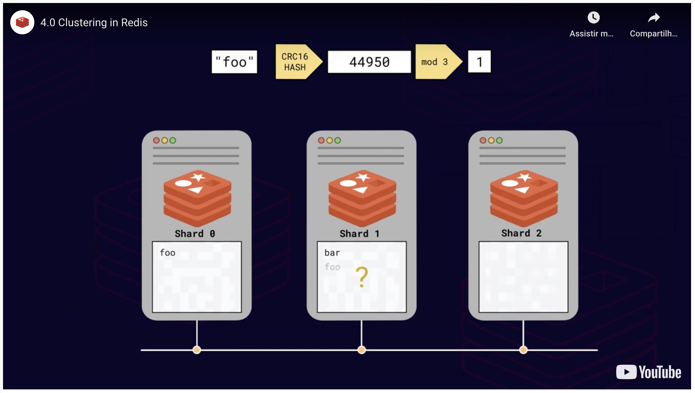
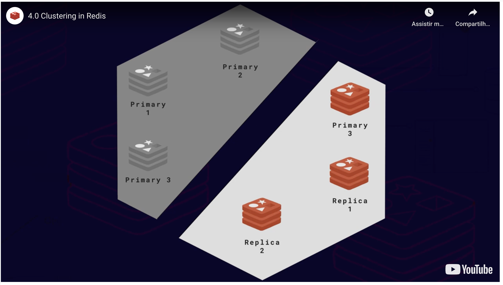
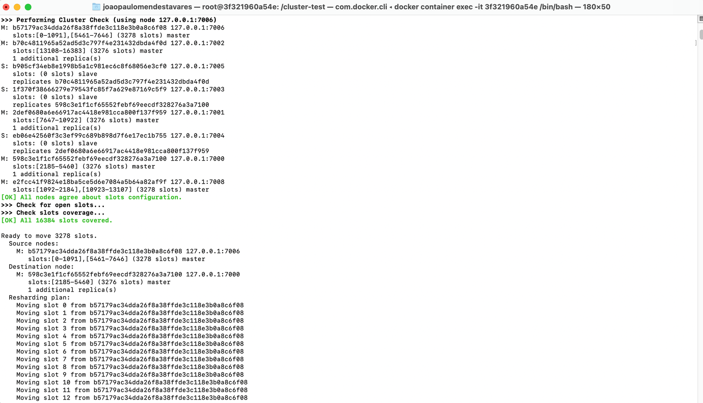

# Redis Cluster

## Visão geral
O Redis é single-threaded (Pelo menos até o momento em que esse documento é escrito). Uma única instância do Redis não pode fazer uso de vários núcleos da CPU para processamento. Se os dados forem distribuídos entre duas instâncias, nosso sistema pode processar solicitações em paralelo, efetivamente dobrando a taxa de transferência (throughput).
Esse padrão de divisão de dados entre vários servidores para fins de dimensionamento é chamado de sharding.
Se dividirmos e distribuirmos nossos dados em dois shards, que são apenas duas instâncias do Redis, como saberemos onde procurar cada chave? Precisamos ter uma maneira de mapear consistentemente uma chave para um shard específico. O que o Redis usa é chamado de "Algorithmic sharding".
O envio da chave para o shard ocorre da seguinte forma: É feito o hash da chave e, em seguida, devolvido o resultado do operador módulo pelo número total de shards.


Mas o que acontece se aumentarmos o número de shards? Digamos que um novo shard é adicionado. Quando um client tenta ler a chave foo, por exemplo, será executada a função hash e será devolvido o resultado do operador módulo pelo novo número total de shards. Desta vez o número de shards será diferente, de dois para três. Consequentemente o resultado poderá ser diferente, nos apontando para um shard incorreto.



Esse é um problema comum durante o processo de resharding. Isso pode ser resolvido refazendo todas as chaves na base, onde as mesmas serão movidas para o shard apropriado. Esta não é uma tarefa trivial, pois pode exigir tempo e recursos (O banco de dados pode não ser capaz de atingir seu pleno desempenho ou podem ficar indisponíveis).
Redis usa uma abordagem inteligente para resolver este problema -- uma unidade lógica que fica entre a chave e o shard, chamado de hashslot.


O número total de hashslots em um banco de dados é de 16384. Os hashslots são divididos entre os shards. Dessa forma slots de 0 a 8000 podem ser atribuídos ao shard 1 e os slots 8001 a 16384 podem ser atribuídos ao shard 2, por exemplo.
Em um cluster Redis, na verdade, modificamos pelo número de hashslots, não pelo número de shards. Cada chave é atribuída a um hashslot. Quando precisamos refragmentar(reshard), os hashslots são movidos de um shard para outro, distribuindo os dados conforme necessário nas diferentes instâncias do Redis.


Além do cluster Redis ser um sistema distribuído, o mesmo oferece alta disponibilidade. Alta disponibilidade refere-se à capacidade do cluster permanecer operacional mesmo diante de certas falhas. Por exemplo, o cluster pode detectar quando um shard primário falha e promove uma réplica como primário sem qualquer intervenção manual. Mas como isso é feito? Como é que um shard primário falhou? E como uma réplica é promovida à primária?
Digamos que exista uma réplica para cada shard primário. Se todos os dados forem distribuídos entre três instâncias Redis, precisaremos de um cluster de seis membros, com três shards primários e três réplicas. Todos os seis membros estão conectados entre si via TCP e constantemente se comunicam e trocam mensagens. Essas mensagens permitem que o cluster determine quais shards estão ativos. Quando shards suficientes relatam que um determinado shard primário não está respondendo a eles, eles podem concordar em acionar um failover e promover a réplica para se tornar a nova primária.
Quantos shards precisam concordar que um outro shard está offline antes do failover ser acionado? Bem, isso é configurável, mas há algumas diretrizes muito importantes que devem ser seguidas. Para evitar algo chamado split-brain em um cluster Redis, sempre mantenha um número ímpar de shards primários e duas réplicas por shard primário. Avalie a imagem à seguir...


O grupo do lado esquerdo não será capaz de falar com o grupo do lado direito. Portanto o cluster pensará que está off-line e acionará o failover, resultando em um lado esquerdo com todos os shards primários.



No lado direito os três membros também verão que os membros à esquerda estão offline e acionará um failover, resultando em um lado direito com todos os shards primários.
Ambos os lados, pensando que têm todas as primárias, continuarão recebendo solicitações de clientes que modificam dados. E isso é um problema, porque talvez o cliente **A** defina a chave foo do lado esquerdo, mas um cliente **B** define a mesma chave foo do lado direito. Quando a partição de rede for removida e os shards tentarem se unir, teremos um conflito, porque teremos dois shards contendo dados diferentes, alegando ser o principal, e não teremos condições de saber quais dados são válidos. Isso é chamado de split-brain e é um problema conhecido no mundo de sistemas distribuídos.
Uma solução popular é sempre manter um número ímpar de elementos em seu cluster. Mais uma vez, para evitar esse tipo de conflito, sempre mantenha o número ímpar de shards primários e duas réplicas por shard primário, conforme demonstrado na imagem abaixo.


## Tutorial

### Preparação do ambiente para a app (Opcional)
A preparação abaixo não é crucial para o funcionamento do Redis. O intuito da app é demonstrar a comunicação com o Redis Cluster e seu comportamento durante adição e remoção de nós, e redistribuição das chaves, por exemplo.

```bash
apt install ruby-full
gem install redis
mkdir cluster-test
cd cluster-test
wget https://github.com/antirez/redis-rb-cluster/archive/refs/heads/master.zip
unzip master.zip
rm -f master.zip
vi redis-rb-cluster-master/cluster.rb
..
require './redis-rb-cluster-master/crc16'
..
:wq
vi redis-rb-cluster-master/consistency-test.rb
..
require './redis-rb-cluster-master/cluster'
..
:wq
vi redis-rb-cluster-master/example.rb
..
require './redis-rb-cluster-master/cluster'

if ARGV.length != 2
    startup_nodes = [
        {:host => "127.0.0.1", :port => 7000},
        {:host => "127.0.0.1", :port => 7001}
    ]
else
    startup_nodes = [
        {:host => ARGV[0], :port => ARGV[1].to_i}
    ]
end
..
:wq
```

### Preparação do ambiente para o banco de dados
```bash
# Para instalação do Redis, consulte: https://github.com/tavaresdb/db/blob/main/redis/install/install_redis.sh
vi redis.conf
..
port 7000
cluster-enabled yes
cluster-config-file nodes.conf
cluster-node-timeout 5000
appendonly yes
appendfilename "persisted.aof"
:wq
mkdir 7000 7001 7002 7003 7004 7005 7006 7007 7008 7009
cp redis.conf 7000/
cp redis.conf 7001/
vi 7001/redis.conf
..
port 7001
..
:wq
cp redis.conf 7002/
vi 7002/redis.conf
..
port 7002
..
:wq
cp redis.conf 7003/
vi 7003/redis.conf
..
port 7003
..
:wq
cp redis.conf 7004/
vi 7004/redis.conf
..
port 7004
..
:wq
cp redis.conf 7005/
vi 7005/redis.conf
..
port 7005
..
:wq
cp redis.conf 7006/
vi 7006/redis.conf
..
port 7006
..
:wq
cp redis.conf 7007/
vi 7007/redis.conf
..
port 7007
..
:wq
cp redis.conf 7008/
vi 7008/redis.conf
..
port 7008
..
:wq
cp redis.conf 7009/
vi 7009/redis.conf
..
port 7009
..
:wq
rm -f redis.conf
cd 7000
redis-server redis.conf --daemonize yes
cd ../7001
redis-server redis.conf --daemonize yes
cd ../7002
redis-server redis.conf --daemonize yes
cd ../7003
redis-server redis.conf --daemonize yes
cd ../7004
redis-server redis.conf --daemonize yes
cd ../7005
redis-server redis.conf --daemonize yes
cd ../7006
redis-server redis.conf --daemonize yes
cd ../7007
redis-server redis.conf --daemonize yes
cd ../7008
redis-server redis.conf --daemonize yes
cd ../7009
redis-server redis.conf --daemonize yes
cd ..
ps aux | grep redis
```

Obs.: No parâmetro port especificamos a porta na qual o servidor será executado. No parâmetro cluster-enabled especificamos o valor yes para habilitar o uso do Redis Cluster. No parâmetro cluster-config-file especificamos o nome do arquivo onde o nó persistirá a configuração do cluster (Sempre que houver uma alteração no estado do cluster, por exemplo, tais modificações serão salvas no arquivo). No parâmetro cluster-node-timeout especificamos o tempo em ms que um nó pode ficar indisponível, sem ser considerada uma falha. Se o nó master não ficar acessível dentro do período informado, ocorrerá o failover. No parâmetro appendonly ativamos a [persistência de dados](https://github.com/tavaresdb/db/blob/main/redis/persistence/persistence.md) e no parâmetro appendfilename definimos o nome do arquivo AOF. Nesse tutorial não definimos explicitamente o parâmetro cluster-require-full-coverage, mas é importante ter ciência sobre o seu significado. O valor padrão é yes, ou seja, se um shard falhar, nós primário e réplica, todo o cluster ficará indisponível. Se definido como no, o cluster fica disponível, mas de forma que todas as chaves roteadas para o shard com falha resultem em um erro.

### Criação do cluster
Para fins didáticos será adicionada apenas uma réplica, entretanto em produção considere ter duas réplicas para cada shard, conforme mencionado anteriormente, para evitar split-brain.

```bash
redis-cli --cluster create 127.0.0.1:7000 127.0.0.1:7001 127.0.0.1:7002 127.0.0.1:7003 127.0.0.1:7004 127.0.0.1:7005 --cluster-replicas 1
```


### Execução da app
```bash
ruby ./redis-rb-cluster-master/example.rb
```


Obs.: Dedique a execução da app em uma sessão diferente do banco de dados.

### Checagem do cluster
```bash
redis-cli --cluster check 127.0.0.1:7000
```


### Adição de shards
```bash
redis-cli --cluster add-node 127.0.0.1:7006 127.0.0.1:7000
redis-cli --cluster add-node 127.0.0.1:7008 127.0.0.1:7000
```


### Adição de réplicas aos shards recém incluídos
```bash
redis-cli -p 7000 cluster nodes
redis-cli --cluster add-node 127.0.0.1:7007 127.0.0.1:7000 --cluster-slave --cluster-master-id UUID_PORT7006
redis-cli --cluster add-node 127.0.0.1:7009 127.0.0.1:7000 --cluster-slave --cluster-master-id UUID_PORT7008
redis-cli --cluster check 127.0.0.1:7000
```


### Rebalanceamento dos slots entre os shards
```bash
redis-cli --cluster rebalance 127.0.0.1:7006 --cluster-use-empty-masters
redis-cli --cluster check 127.0.0.1:7000
```


### Remoção de réplicas, para que posteriormente seja possível eliminar alguns shards
```bash
redis-cli --cluster del-node 127.0.0.1:7007 UUID_PORT7007
redis-cli --cluster del-node 127.0.0.1:7009 UUID_PORT7009
redis-cli --cluster check 127.0.0.1:7000
```


### Migração dos slots, do shard que será removido para um dos shards que permanecerá
```bash
redis-cli --cluster reshard 127.0.0.1:7006 \
--cluster-from UUID_PORT7006 \
--cluster-to UUID_PORT7000 \
--cluster-slots NRO_SLOTS_PORT7006 \
--cluster-yes
redis-cli --cluster reshard 127.0.0.1:7008 \
--cluster-from UUID_PORT7008 \
--cluster-to UUID_PORT7002 \
--cluster-slots NRO_SLOTS_PORT7008 \
--cluster-yes
redis-cli --cluster check 127.0.0.1:7000
```




### Rebalanceamento dos slots entre os shards
```bash
redis-cli --cluster rebalance 127.0.0.1:7000
redis-cli --cluster check 127.0.0.1:7000
```


### Remoção de shards
```bash
redis-cli --cluster del-node 127.0.0.1:7006 UUID_PORT7006
redis-cli --cluster del-node 127.0.0.1:7008 UUID_PORT7008
redis-cli --cluster check 127.0.0.1:7000
```


### Notas
Todas as operações acima podem ser realizadas sem interrupção do serviço Redis, no entanto o aplicativo deve usar os clientes/drivers/conectores compatíveis do Redis para que a solicitação possa ser redirecionada para os shards corretos enquanto o rebalanceamento ou o resharding estiver acontecendo.

Obs.: Quando usado o redis-cli para se conectar à um shard, essa conexão acessará apenas esse shard e não poderá acessar dados de outros shards. Ao tentar acessar as chaves do shard errado, será apresentado um erro MOVED. Existe um truque que podemos usar com o redis-cli para não precisar abrir conexões para todos os shards, onde o utilitário fará o trabalho de conexão e reconexão para nós. É o modo de suporte do cluster redis-cli, acionado pela opção -c (Por exemplo, redis-cli -p 7000 -c). No modo cluster, se o client receber uma resposta de erro '(error) MOVED XXXX 127.0.0.1:7002' do shard ao qual está conectado, ele simplesmente se reconectará ao endereço retornado na resposta de erro, neste caso 127.0.0.1:7002.

Durante o tutorial foi utilizada a app example.rb, entretanto a consistency-test.rb tende a ser mais interessante, pois é um verificador de consistência simples e é capaz de dizer se o cluster perdeu alguma gravação ou se aceitou uma escrita pela qual não temos reconhecimento. Abaixo, uma amostra:


## Referências:
- https://developer.redis.com/operate/redis-at-scale/scalability/lustering-in-redis/
- https://redis.io/docs/reference/cluster-spec/
- https://redis.io/docs/management/scaling/
- https://github.com/antirez/redis-rb-cluster/tree/master/
- https://severalnines.com/blog/hash-slot-resharding-and-rebalancing-redis-cluster/