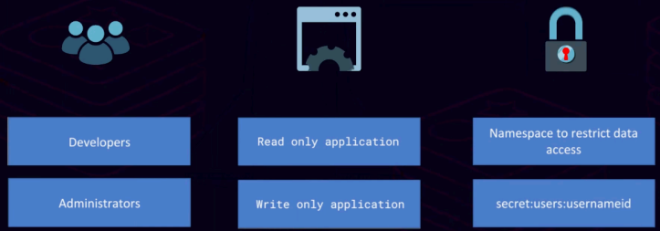
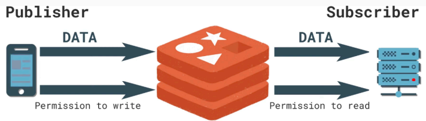
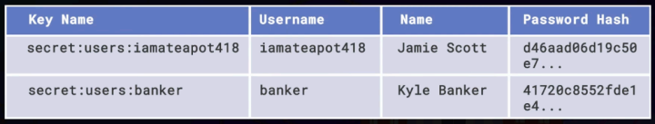

# Segurança

## Parâmetros básicos relacionados a segurança
Abaixo a relação de alguns parâmetros relacionados a segurança no arquivo redis.conf:

protected-mode :: O valor padrão é yes. Ao definir como no, será possível acessá-lo remotamente.

bind :: O valor definido especificará qual interface de rede o Redis escutará. Por padrão o Redis escuta em todas as interfaces de rede disponíveis. Quando configuramos o Redis para escutar em uma interface específica usando o parâmetro bind, restringimos as conexões apenas àquela interface. Isso pode ser útil para melhorar a segurança, limitando o acesso ao Redis apenas a certas interfaces de rede, especialmente em ambientes onde há várias interfaces de rede e desejamos garantir que o Redis só esteja acessível através de uma interface específica.

requirepass :: Antes do Redis 6 não havia o conceito de usuários, sendo a senha definida de forma global. Ao definir o valor pro parâmetro, a autenticação ocorrerá através dessa senha. Para surtir efeito será necessário reiniciar o Redis após definição da senha e ao iniciar uma nova conexão a autenticação será exigida, sendo necessário disparar o comando AUTH seguido da senha. À partir do Redis 6 há e por padrão há o usuário default. Abaixo iremos observar um exemplo de configuração, onde o usuário default através da senha especificada terá privilégio total:

```bash
vi /etc/redis/users.acl
..
user default on >passwordR3d15 allcommands allkeys
:q!
```

Obs. 1: Lembre-se, é apenas um exemplo, pois não é recomendável a senha ser exposta em texto simples. Além disso, adiante veremos que uma boa prática é desativar o usuário default, ou seja, não há necessidade de salvar a configuração acima. Se fosse salva, após reinicialização do Redis, ao estabelecer uma nova conexão seria exigida autenticação, sendo necessário disparar o comando AUTH default passwordR3d15.
Obs. 2: O arquivo editado refere-se ao especificado no parâmetro aclfile.

### Inicialização do Redis em background
```bash
# Para instalação do Redis, consulte: https://github.com/tavaresdb/db/blob/main/redis/instala%C3%A7%C3%A3o/install_source.sh
# Antes de iniciar o Redis certifique-se de ter ajustado alguns parâmetros, como por exemplo dir, logfile e aclfile, de modo que reflita os diretórios/arquivos criados durante o processo
runuser -u redis /usr/local/bin/redis-server /etc/redis/redis.conf &

ps aux | grep redis
redis-cli
127.0.0.1:6379> PING
```

## ACL


Antes do Redis 6 a autenticação do Redis era primitiva. Uma única senha protegia o Redis. Não havia suporte para vários usuários e senhas e também não havia suporte para permissões por usuário, o que podemos chamar de autorização.
As ACLs do Redis mudaram tudo isso. Agora podemos criar vários usuários Redis, cada um com sua própria senha. E podemos controlar as permissões de cada usuário. Isto é importante porque agora podemos efetivamente implementar o princípio do menor privilégio.
Usar ACLs para implementar o princípio do menor privilégio evita uma série de resultados ruins. Por exemplo, você não gostaria que um novo administrador descartasse acidentalmente o banco de dados. Nesse caso, uma ACL seria criada para impedir que o administrador execute os comandos FLUSHDB ou FLUSHALL. Da mesma forma, não gostaríamos que um invasor com credenciais comprometidas pudesse investigar ou roubar dados do banco de dados Redis. Um invasor com credenciais comprometidas provavelmente executaria o comando SCAN ou KEYS para descobrir quais chaves estão no banco de dados. Em seguida executaria o comando TYPE para ver quais comandos do Redis poderiam ser executados pra cada chave identificada. Se não for possível executar os comandos SCAN ou KEYS, o ataque se tornaria mais complexo. Portanto, como administrador, é interessante evitar que a maioria dos usuários executem os comandos SCAN, KEYS ou TYPE, a menos que façam parte do design do aplicativo.
Em geral, devemos fornecer aos usuários a menor quantidade de privilégios usada para realizar seu trabalho. Por exemplo, alguns aplicativos podem apenas ler do banco de dados e outros só podem gravar no banco de dados. Um bom exemplo disso é um aplicativo Pub/Sub. Em um padrão Pub/Sub, você tem um publicador e um assinante. Seus publicadores provavelmente precisarão apenas criar dados, enquanto seus assinantes provavelmente só precisarão de acesso de leitura aos canais em que estão inscritos.



Outra maneira de implementar o princípio do menor privilégio é restringir os dados com base em padrões, usando técnicas de namespace. Por exemplo, se não quisermos que um administrador acesse dados confidenciais, é possível prefixar todas as chaves que são sensíveis ao namespace secreto. Imagine que haja uma tabela de contas que contenha nomes de usuário, detalhes de usuário e hashes de senha. Podemos definir o namespace das chaves de cada usuário como secret:users e dar acesso apenas ao namespace secreto ao usuário do aplicativo.



Qualquer restrição nas chaves deve ser considerada cuidadosamente, pois elas devem ser incorporadas ao design de suas chaves ao implementar seus aplicativos.

### Tutorial - ACL
```bash
127.0.0.1:6379> ACL SETUSER user_dev on >passwordR3d15D3v allcommands -@dangerous +acl|whoami allkeys
127.0.0.1:6379> AUTH user_dev passwordR3d15D3v
127.0.0.1:6379> ACL WHOAMI
"user_dev"
127.0.0.1:6379> ACL LIST
(error) NOPERM this user has no permissions to run the 'acl' command or its subcommand
127.0.0.1:6379> KEYS *
(error) NOPERM this user has no permissions to run the 'keys' command or its subcommand
127.0.0.1:6379> CONFIG GET *
(error) NOPERM this user has no permissions to run the 'config' command or its subcommand
127.0.0.1:6379> SET foo bar
OK
127.0.0.1:6379> GET foo
"bar"
```

O usuário acima conseguirá executar todos os comandos, exceto os perigosos, e terá acesso a um comando específico (ACL WHOAMI) e a todas as chaves do banco de dados. Caso tenha interesse em descobrir os comandos considerados perigosos pelo Redis, execute o comando ACL CAT DANGEROUS à partir de um usuário que possua tal privilégio.

```bash
127.0.0.1:6379> ACL SETUSER user_admin on >passwordR3d154dm1n +@admin
127.0.0.1:6379> AUTH user_admin passwordR3d154dm1n
```

O usuário acima terá apenas privilégios administrativos.

```bash
127.0.0.1:6379> ACL SETUSER user_app on >passwordR3d154pp +set +get ~cache:*
127.0.0.1:6379> AUTH user_app passwordR3d154pp
127.0.0.1:6379> SET data:123 hello
(error) NOPERM this user has no permissions to access one of the keys used as arguments
127.0.0.1:6379> SET cache:123 hello
OK
127.0.0.1:6379> GET cache:123
"hello"
127.0.0.1:6379> KEYS *
(error) NOPERM this user has no permissions to run the 'keys' command or its subcommand
```

O usuário acima é um exemplo de usuário da aplicação. É concedido privilégio aos comandos SET e GET, cujo prefixo das chaves seja cache.

Obs. 1: Caso tenha interesse em excluir uma ACL, o comando é o seguinte: ACL DELUSER user_template.
Obs. 2: A senha não será armazenada em texto simples, ou seja, haverá o símbolo "#" antecedendo a senha criptografada.
Obs. 3: É recomendável a desativação do usuário default e a criação de outro usuário pra fins administrativos (Claro que o novo usuário administrativo deve existir
antes de desativar o default). A seguir a instrução que desativa tal usuário: ACL SETUSER default off.

Nos exemplos anteriores observamos as ACLs serem definidas (E até mesmo removidas) via linha de comando, entretanto há possibilidade de persistir todas as modificações das ACLs em um arquivo de configuração (Desde que configurado o parâmetro aclfile), emitindo os seguintes comandos respectivamente: ACL SAVE e ACL LOAD.

## TLS
Para estabelecer a criptografia, são necessários três arquivos:
- Server Certificate: Este arquivo contém a chave pública do servidor, que é assinada por uma autoridade certificadora;
- Issuing CA Certificate: Este arquivo é usado para assinar o certificado do servidor como um todo, garantindo sua autenticidade e integridade;
- Server Private Key: Este arquivo é usado para descriptografar informações criptografadas que foram codificadas usando a chave pública correspondente ao servidor.

Em um ambiente de produção o certificado emissor (Issuing CA Certificate) geralmente será fornecido por qualquer certificado autoridade que você usa. Para o propósito desta demonstração, que veremos à seguir, criaremos nosso próprio certificado emissor, então estaremos efetivamente agindo como nosso próprio certificado autoridade.

### Tutorial - TLS
1. Criação da chave privada do certificado emissor.
```bash
openssl genrsa -out ca.key 4096
cat ca.key
```

2. Chave recém criada será usada para criação do próprio certificado emissor.
```bash
openssl req -x509 -new -nodes -sha256 -key ca.key -days 3650 -subj '/O=Redislabs/CN=Redis Prod CA' -out ca.crt
```

3. Gerado o certificado emissor, iremos gerar o certificado para o Redis Server, iniciando pela chave privada.
```bash
openssl genrsa -out redis.key 2048
```

4. Com a chave privada e o certificado emissor, concluímos a geração do certificado para o Redis Server.
```bash
openssl req -new -sha256 -nodes -sha256 -key redis.key -subj '/O=Redislabs/CN=Production Redis' | openssl x509 -req -sha256 -CA ca.crt -CAkey ca.key -CAserial /etc/ssl/private/ca.txt -CAcreateserial -days 365 -out redis.crt
# Certificate request self-signature ok
# subject=O = Redislabs, CN = Production Redis

mv ca.key /etc/ssl/private
mv ca.crt /usr/local/share/ca-certificates
mv redis.key /etc/ssl/private
mv redis.crt /etc/ssl
update-ca-certificates
# Updating certificates in /etc/ssl/certs...
# rehash: warning: skipping ca-certificates.crt,it does not contain exactly one certificate or CRL
# 1 added, 0 removed; done.
# Running hooks in /etc/ca-certificates/update.d...
# done.
```

Obs.: No Ubuntu podemos informar ao sistema sobre novos certificados, conforme último comando executado.

```bash
chown redis:redis /usr/local/share/ca-certificates/ca.crt
chown redis:redis /etc/ssl/private/*.key
chown redis:redis /etc/ssl/redis.crt
chmod 400 /etc/ssl/private/*.key
chmod 644 /usr/local/share/ca-certificates/ca.crt
chmod 644 /etc/ssl/redis.crt
```

Obs.: Pode ser útil executar o comando ```su -s /bin/bash -c 'ls-lh/etc/ssl/private' redis``` para verificar se o usuário redis tem privilégio suficiente para acessar o diretório /etc/ssl/private/. Caso não, faça o ajuste necessário.

5. Configuração do servidor redis.
```bash
vi /etc/redis/redis.conf
..
port 0
tls-port 6379
tls-cert-file /etc/ssl/redis.crt
tls-key-file /etc/ssl/private/redis.key
tls-ca-cert-file /usr/local/share/ca-certificates/ca.crt
tls-auth-clients no
# tls-replication yes
# tls-cluster yes
tls-protocols "TLSv1.2 TLSv1.3"
tls-ciphers ECDHE-ECDSA-AES128-GCM-SHA256:ECDHE-RSA-AES128-GCMSHA256:ECDHE-ECDSA-AE256-GCM-SHA384:ECDHE-RSA-AE256-GCMSHA384:ECDHE-ECDSA-CHACHA20-POLY1305:ECDHE-RSA-CHACHA20-POLY1305:DHE-RSA-AE128-GCM-SHA256:DHE-RSA-AE256-GCM-SHA384
tls-ciphersuites TLS_AES_128_GCM_SHA256:TLS_AES_256_GCM_SHA384:TLS_CHACHA20_POLY1305_SHA256
tls-prefer-server-ciphers no
:wq
```

Obs. 1: Por padrão o Redis usa TLS mútuo e exige que os clientes se autentiquem com um certificado válido (Autenticado em CAs root confiáveis especificadas por cacert-file ou ca-cert-dir). Ao definir o parâmetro tls-auth-clients como no desabilitamos a autenticação do cliente.
Obs. 2: Os parâmetros tls-replication e tls-cluster não foram habilitados, pois o tutorial não aborda replicação e cluster, mas tenha em mente que é necessário habilitá-los à partir do momento que há replicação e/ou cluster.
Obs. 3: O parâmetro tls-ciphers determina o conjunto de cifras que pode ser usado quando um cliente solicitar conexão com TLS v1.2 e o parâmetro tls-ciphersuites determina o conjunto de cifras que pode ser usado quando um cliente solicitar conexão com TLS v1.3.
Obs. 4: Ao definir o parâmetro tls-prefer-server-ciphers como no indicamos que o servidor permite que os clientes escolham o conjunto de criptografia para conexões TLS.

6. Conexão via TLS
```bash
redis-cli --tls --cacert /usr/local/share/ca-certificates/ca.crt
127.0.0.1:6379> PING
```

...

O parâmetro tls-auth-clients foi definido como no, conforme dito anteriormente, entretanto o ideal é que esse valor seja definido como yes, para que os clientes se autentiquem com um certificado válido. Abaixo segue procedimento, desde a geração do certificado client até a autenticação do client:
```bash
openssl genrsa -out client.key 2048
openssl req -new -sha256 -key client.key -subj '/O=Redislabs/CN=Redis Client' | openssl x509 -req -sha256 -CA /usr/local/share/ca-certificates/ca.crt -CAkey /etc/ssl/private/ca.key -CAserial /etc/ssl/private/ca.txt -CAcreateserial -days 365 -out client.crt
# Certificate request self-signature ok
# subject=O = Redislabs, CN = Redis Client
mv client.* /etc/ssl/clients
chown app:app /etc/ssl/clients/*
```

Obs.: Consideramos aqui que há um usuário app, simulando o usuário da aplicação. Caso o nome seja diferente, adeque para refletir a realidade do ambiente.

```bash
chmod 400 /etc/ssl/clients/*
redis-cli --tls --cacert /usr/local/share/ca-certificates/ca.crt --cert /etc/ssl/clients/client.crt --key /etc/ssl/clients/client.key
127.0.0.1:6379> PING
```

## Referências:
- https://github.com/redislabs-training/ru330
- https://redis.io/docs/management/security/acl/
- https://redis.io/docs/management/security/encryption/